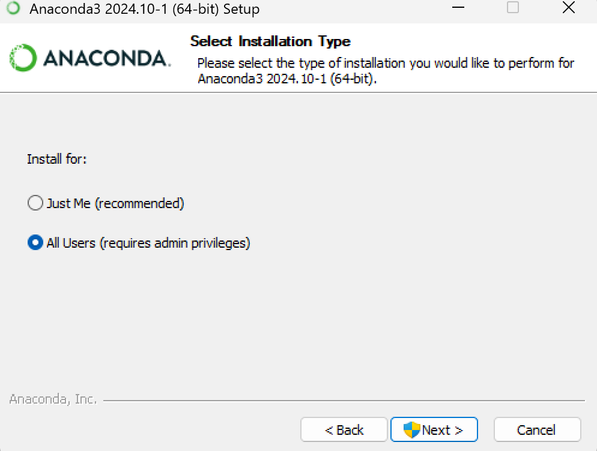
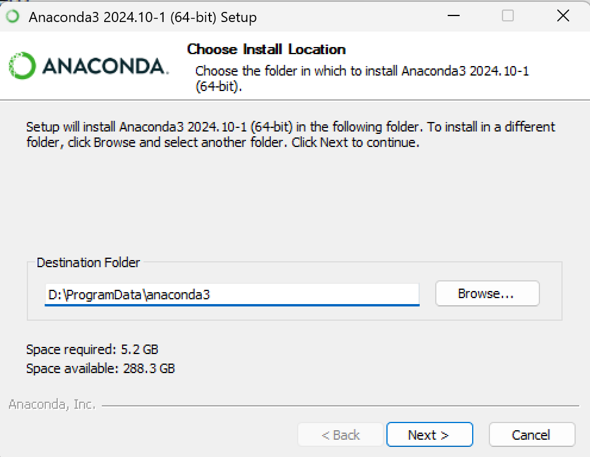
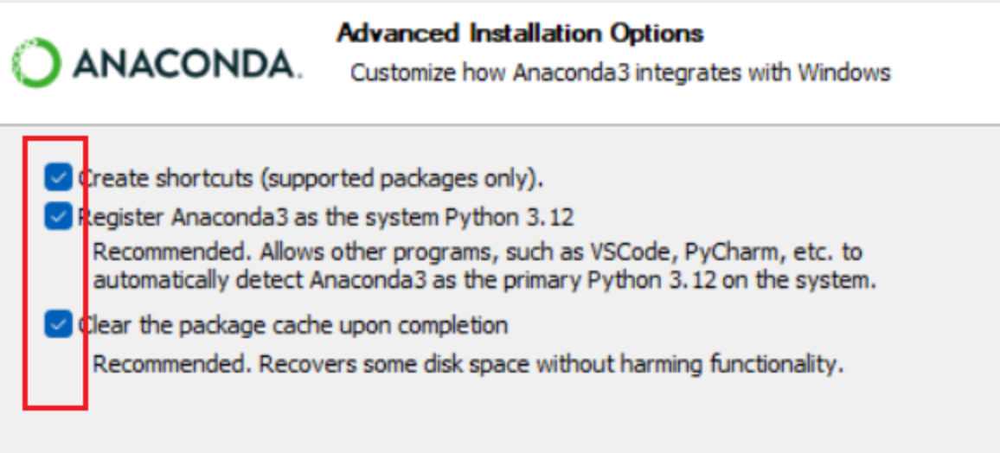
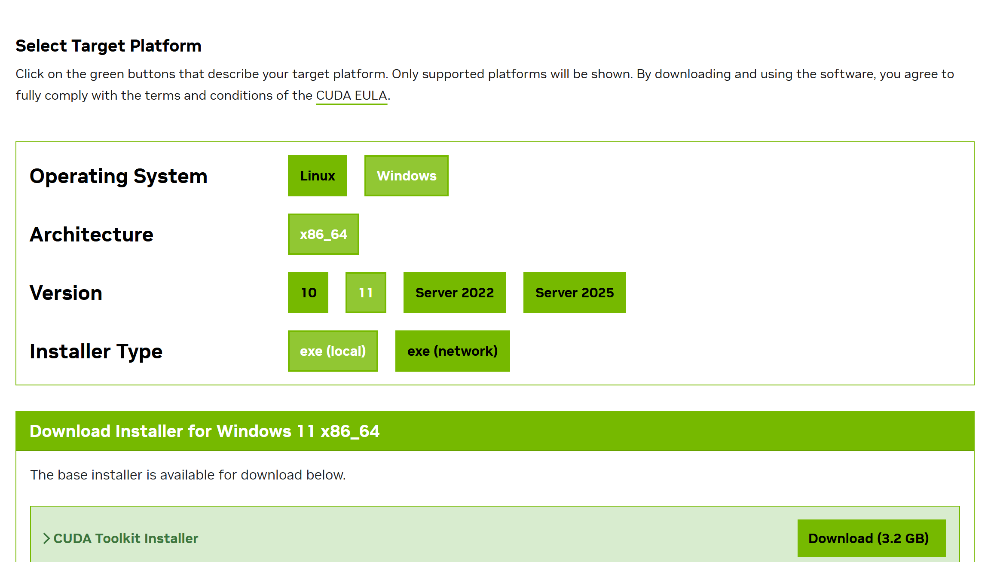
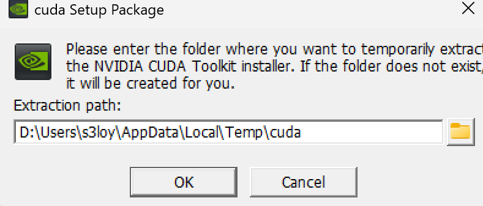
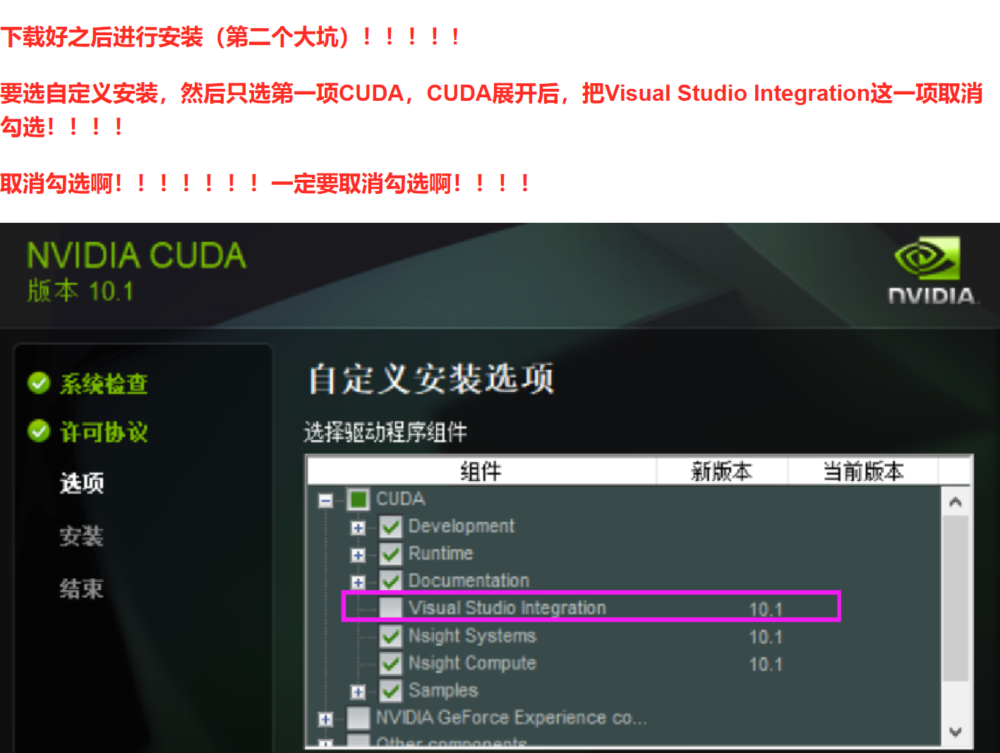
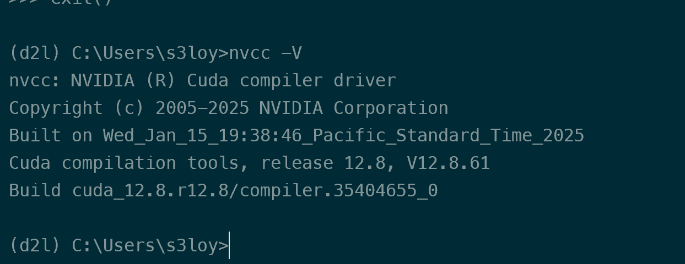
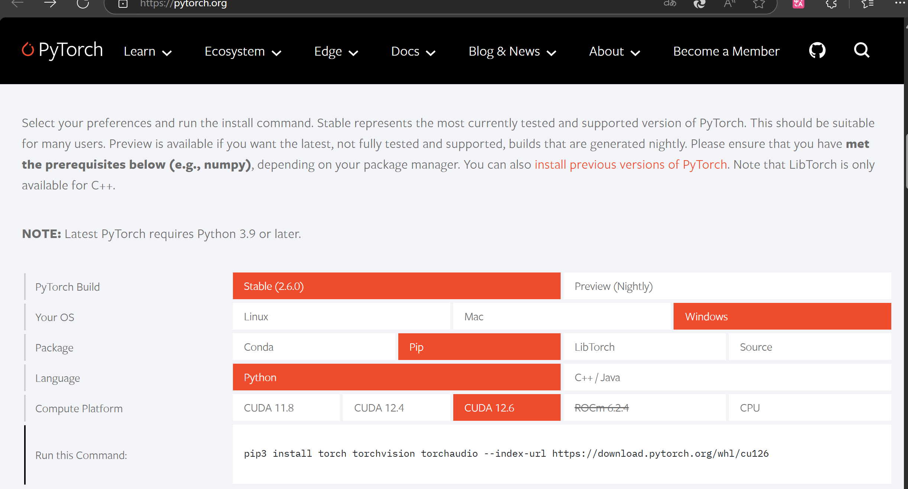
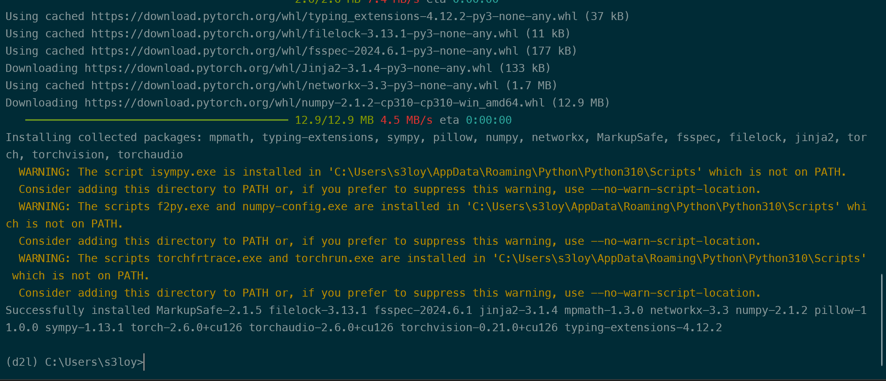
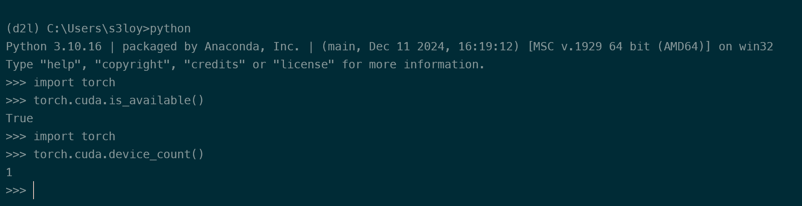

## 1.1. Step 1 安装Conda

[Download Now | Anaconda](https://www.anaconda.com/download/success)

`Anaconda`和`Miniconda`都可以，前者东西全一些，后者更为轻便。

展示的是`Anaconda`

~~此处下载推荐使用魔法~~

> 如果网络不支持那就使用[Index of /anaconda/archive/ | 清华大学开源软件镜像站 | Tsinghua Open Source Mirror](https://mirrors.tuna.tsinghua.edu.cn/anaconda/archive/?C=M&O=D)

`Anaconda3-2024.10-1-Windows-x86_64.exe`下载好之后打开

如果不想配置环境变量就选`All Users`吧。



然后推荐找个不是C盘的地方下





安装时间也许会比较长，别急。

装好之后可以测试一下`conda --version`,有这样的反应就好，版本不一定一样。

```powershell
conda --version
conda 25.1.1
```

因为我后面要玩`d2l`，所以就用`conda`创建了一个环境

`conda create -n d2l python=3.10`

这边`conda`是指令头，`-n` 是指定新环境的名称，`d2l` 是你想要为新环境指定的名称,`python=3.10`这部分指定了`python`的版本，不过其实不一定要`3.10`，`pytorch`官网上提示的是`Latest PyTorch requires Python 3.9 or later.`，加上学长爱用`3.10`，那就定了。~~ps:3.10和3.9到底谁大呢~~

创建完成会提示的，后面需要激活一下

`conda activate d2l`

顺利的话就能看到`(d2l)`在输入的前面。

用的差不多之后要回到原来的环境的话就

`conda deactivate`

这样就回去了，不过你直接关掉重开也不是不行（

## 1.2. Step 2 CUDA

笔记本电脑的GPU是`Nvidia 4060 laptop`

```cmd
>nvidia-smi
Wed Feb 19 00:07:11 2025
+-----------------------------------------------------------------------------------------+
| NVIDIA-SMI 571.96                 Driver Version: 571.96         CUDA Version: 12.8     |
|-----------------------------------------+------------------------+----------------------+
| GPU  Name                  Driver-Model | Bus-Id          Disp.A | Volatile Uncorr. ECC |
| Fan  Temp   Perf          Pwr:Usage/Cap |           Memory-Usage | GPU-Util  Compute M. |
|                                         |                        |               MIG M. |
|=========================================+========================+======================|
|   0  NVIDIA GeForce RTX 4060 ...  WDDM  |   00000000:01:00.0  On |                  N/A |
| N/A   39C    P8              3W /  115W |    1533MiB /   8188MiB |      0%      Default |
|                                         |                        |                  N/A |
+-----------------------------------------+------------------------+----------------------+

```

这边可以看到CUDA的版本

到[CUDA Toolkit download](https://developer.nvidia.com/cuda-downloads)里面去



然后根据版本选一下，本地跑别乱选`network`

然后点`Download`就行了



下载好的ok就行了，这步只是解压不是安装。

网上看教程说



我确实没勾这个，但是我下面的几个选项还是都装了。

安装好之后理论上环境变量是在的，可以先验证一下

在C:\Program Files\NVIDIA GPU Computing Toolkit\CUDA\v12.8  (你安装的位置，默认是这样)打开终端

按顺序输入

`cd .\extras\demo_suite`

`.\bandwidthTest.exe`

`.\deviceQuery.exe`

回车测试

```powershell
# cd .\extras\demo_suite
# .\bandwidthTest.exe
[CUDA Bandwidth Test] - Starting...
Running on...

 Device 0: NVIDIA GeForce RTX 4060 Laptop GPU
 Quick Mode

 Host to Device Bandwidth, 1 Device(s)
 PINNED Memory Transfers
   Transfer Size (Bytes)        Bandwidth(MB/s)
   33554432                     12883.8

 Device to Host Bandwidth, 1 Device(s)
 PINNED Memory Transfers
   Transfer Size (Bytes)        Bandwidth(MB/s)
   33554432                     12835.4

 Device to Device Bandwidth, 1 Device(s)
 PINNED Memory Transfers
   Transfer Size (Bytes)        Bandwidth(MB/s)
   33554432                     196311.5

Result = PASS

NOTE: The CUDA Samples are not meant for performance measurements. Results may vary when GPU Boost is enabled.
# .\deviceQuery.exe
C:\Program Files\NVIDIA GPU Computing Toolkit\CUDA\v12.8\extras\demo_suite\deviceQuery.exe Starting...

 CUDA Device Query (Runtime API)

Detected 1 CUDA Capable device(s)

Device 0: "NVIDIA GeForce RTX 4060 Laptop GPU"
  CUDA Driver Version / Runtime Version          12.8 / 12.8
  CUDA Capability Major/Minor version number:    8.9
  Total amount of global memory:                 8188 MBytes (8585216000 bytes)
MapSMtoCores for SM 8.9 is undefined.  Default to use 128 Cores/SM
MapSMtoCores for SM 8.9 is undefined.  Default to use 128 Cores/SM
  (24) Multiprocessors, (128) CUDA Cores/MP:     3072 CUDA Cores
  GPU Max Clock rate:                            2370 MHz (2.37 GHz)
  Memory Clock rate:                             8001 Mhz
  Memory Bus Width:                              128-bit
  L2 Cache Size:                                 33554432 bytes
  Maximum Texture Dimension Size (x,y,z)         1D=(131072), 2D=(131072, 65536), 3D=(16384, 16384, 16384)
  Maximum Layered 1D Texture Size, (num) layers  1D=(32768), 2048 layers
  Maximum Layered 2D Texture Size, (num) layers  2D=(32768, 32768), 2048 layers
  Total amount of constant memory:               zu bytes
  Total amount of shared memory per block:       zu bytes
  Total number of registers available per block: 65536
  Warp size:                                     32
  Maximum number of threads per multiprocessor:  1536
  Maximum number of threads per block:           1024
  Max dimension size of a thread block (x,y,z): (1024, 1024, 64)
  Max dimension size of a grid size    (x,y,z): (2147483647, 65535, 65535)
  Maximum memory pitch:                          zu bytes
  Texture alignment:                             zu bytes
  Concurrent copy and kernel execution:          Yes with 1 copy engine(s)
  Run time limit on kernels:                     Yes
  Integrated GPU sharing Host Memory:            No
  Support host page-locked memory mapping:       Yes
  Alignment requirement for Surfaces:            Yes
  Device has ECC support:                        Disabled
  CUDA Device Driver Mode (TCC or WDDM):         WDDM (Windows Display Driver Model)
  Device supports Unified Addressing (UVA):      Yes
  Device supports Compute Preemption:            Yes
  Supports Cooperative Kernel Launch:            Yes
  Supports MultiDevice Co-op Kernel Launch:      No
  Device PCI Domain ID / Bus ID / location ID:   0 / 1 / 0
  Compute Mode:
     < Default (multiple host threads can use ::cudaSetDevice() with device simultaneously) >

deviceQuery, CUDA Driver = CUDART, CUDA Driver Version = 12.8, CUDA Runtime Version = 12.8, NumDevs = 1, Device0 = NVIDIA GeForce RTX 4060 Laptop GPU
Result = PASS
```

如果有这样的就说明成功了

试一下`nvcc -V`



## 1.3. Step 3 安装Pytorch

这个安装靠的是`conda`虚拟环境下的`pip3`安装的完整`pytorch`,并没有使用`docker`镜像来部署,不过如果到了需要租显卡的时候，就需要再去学习使用`docker`来部署了。

先`conda activate d2l` 激活一下自己的环境  *别笨到自己环境名字都没改，当然你也叫d2l那我没意见*

[PyTorch](https://pytorch.org/)打开这个网站，



选好要下载的，复制好下面这个`Run this Command`

到前面准备好的`conda`环境去安装

~~需要魔法，否则可能会给你装疯，而且在查阅资料的时候发现用镜像有概率不能识别pytorch，即使你的pytorch是你的pytorch，但是你的pytorch不是你的pytorch~~



报警告不用慌张，不影响使用。如果是这样就安装好了。

下面就测试一下`pytorch`的使用情况

`python`

`>>> import torch`

第一次应该会等很久，别乱动就是了

`>>> torch.cuda.is_available()`

返回`true`

`>>> import torch`

`>>> torch.cuda.device_count()`

返回`1`

代表识别到一张显卡

大概就活了。



`exit()`退出去

简单的`pytorch`就装好了
