## 网络全貌 / Network Overview

### 网络定义 / Network Definition

:::note
**Concept: 什么是网络 (Network)?**
**网络**是指一组通过物理介质互连、遵循共同的**标准 (Standards)** 与 **协议 (Protocols)** 从而能够相互交换数据的计算机和其他设备
Core：**网络 = 物理互连 + 通信协议**
:::

为什么学习计算机网络？
~~至少让自己不单单当一个调包侠~~
想学而不是不得不学

### 物理连接 / Physical Connection

要实现通信，首先需要物理层面的连通

- **物理介质 (Physical Media)**: 双绞线（网线）、光纤、无线电波等，用于承载信号
- **连通性 (Connectivity)**: 物理介质将设备连接在一起，形成通路

在网络拓扑中，我们定义以下角色：

- **节点 (Nodes)**: 网络中的任何可寻址设备
- **主机 (Host) / 端系统 (End System)**: 网络的边缘，运行应用程序（如 PC、手机、服务器）
- **中间设备 (Intermediary Device)**: 网络的核心，负责数据转发（如路由器 Router、交换机 Switch）
- **链路 (Links)**: 连接节点的物理通道

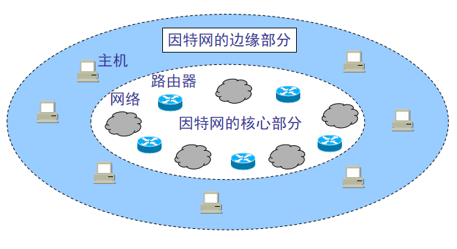

### 逻辑规则 / Logical Rules

物理连接只是基础，设备之间还需要懂得对方的“语言”，这就需要**网络协议(Network Protocol)**

:::tip
为了方便讲解，后续的**协议**指的都是**网络协议**
:::

:::note
**Definition: 协议 (Protocol)**
协议是通信双方为了进行数据交换而建立的规则、标准或约定的集合
一个完整的协议通常包含三个要素：

1. **语法 (Syntax)**: 数据与控制信息的结构或格式（例如：前8位是地址，后8位是数据）
2. **语义 (Semantics)**: 发出何种控制信息，完成何种动作以及做出何种响应（例如：收到 "RST" 包表示重置连接）
3. **时序 (Timing)**: 事件实现顺序的详细说明（例如：先握手，再传数据）

:::
协议 = 语法 + 语义 + 时序

### 数据交换 / Packet Switching

有了物理连接和逻辑协议，数据究竟是如何在网络中传输的？互联网采用的是革命性的**分组交换**技术

#### 数据包与封装 / Data Packets & Encapsulation

在计算机网络中，应用数据并不是以连续的流（Stream）一次性传输的，而是被切割成更小的数据块
:::note
**Definition: 数据包 (Data Packet)**
数据包是网络传输的最小逻辑单位。它由两部分组成：

1. **首部 (Header)**: 包含控制信息（如源地址、目的地址、序列号、校验和）
2. **负载 (Payload)**: 实际要传输的用户数据

:::

**封装 (Encapsulation)** 是分层架构的核心机制：

- 每一层协议在发送数据时，都会在上一层数据的前面加上自己的 **Header**
- **关键**: 对于下层协议而言，上层传递下来的整个数据包（Header + Payload），都仅仅是下层的 **Payload**

每一层都在给数据贴标签，这层贴完给下一层，下一层根本不看里面的内容，只看标签办事
> 在此处一定要记住这个概念，在见到没见过的东西你可以安慰自己说它是封装很好（

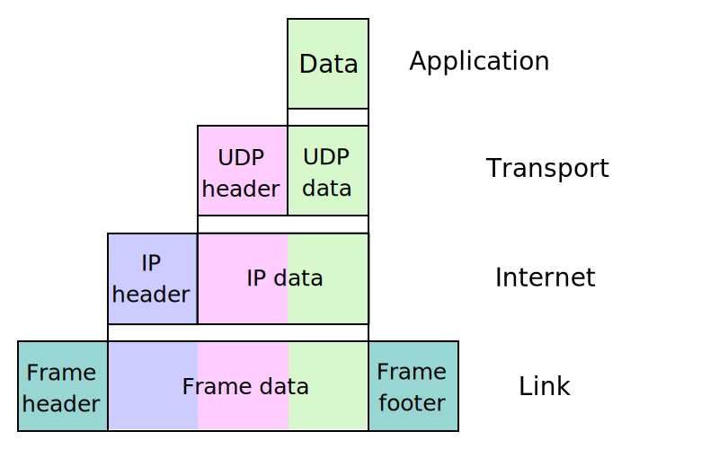

#### 分组交换 / Packet Switching

现代互联网（Internet）的基础设计思想是分组交换，它区别于传统电话网的电路交换

:::note
**Concept: 分组交换 vs. 电路交换**
**电路交换 (Circuit Switching)**: 通信前必须建立一条**独占**的物理通路，论是否通话，资源都被占用，效率低下
**分组交换 (Packet Switching)**: 数据被切分成多个包，每个包独立寻找路径到达目的地
:::

分组交换具有两个核心特征：
**1. 统计多路复用 (Statistical Multiplexing)**
链路带宽资源不是按固定时隙分配给用户的，而是**按需分配**

- 多个用户的数据流交织在同一条链路中传输。这极大提高了带宽利用率，但也引入了拥塞的可能性

**2. 存储转发 (Store-and-Forward)**
路由器（交换节点）在向下一跳转发数据包之前，必须**完整地接收**该数据包

- **过程**:
    1. **Store**: 路由器先将整个包接收并存储在缓存（Buffer）中
    2. **Process**: 检查 Header（查路由表、校验错误）
    3. **Forward**: 将包推送到正确的输出链路
- **代价**: 这一机制是网络**时延 (Latency)** 的主要物理来源之一。如果链路拥塞，包会在路由器的缓存队列中排队，产生**排队时延**

### 性能指标 / Performance Metrics

> 在这只是一个知识补充

那如何衡量网络性能？

#### 速率与带宽 / Rate & Bandwidth

单位时间内传输的数据量（bps）

#### 时延 / Latency

数据从一端传送到另一端所需的时间

- 发送时延（推数据）
- 传播时延（光速跑）
- 处理时延（路由器检查）
- 排队时延（路由器堵车）

#### 吞吐量 / Throughput

实际通过网络的有效数据速率（受带宽和拥塞控制影响）

#### 丢包率 / Packet Loss

**丢包率**（Packet Loss Rate）是指在数据传输过程中，丢失的数据包数量占所发送数据包总数的比率。它是衡量网络性能的重要指标之一。丢包率的计算公式为：
>丢包率 = [(输入报文 - 输出报文) / 输入报文] * 100%

### 分层模型 / Layered Architecture

网络极其复杂，为了降低复杂度，我们采用**分层**的设计思想

为了把协议标准化，历史上出现了两种主要模型：

#### OSI 七层模型 / OSI Model

学术界的“理想国”，分得非常细，非常完美，但太复杂，实现困难

1. **物理层**：传比特流 (Bit)
2. **数据链路层**：传帧 (Frame)，管网卡MAC地址
3. **网络层**：传包 (Packet)，管IP地址，选路
4. **传输层**：管端到端连接 (TCP/UDP)
5. **会话层**：管理会话状态。（TCP/IP中无）
6. **表示层**：数据加密、压缩、编码。（TCP/IP中无）
7. **应用层**：直接服务用户

#### TCP/IP 模型 / TCP/IP Model

工业界的事实标准，更加实用.它把 OSI 繁琐的 5、6、7 层合并了

1. **网络接口层** (对应 OSI 的 1, 2)
2. **网际层** (对应 OSI 的 3)
3. **传输层** (对应 OSI 的 4)
4. **应用层** (对应 OSI 的 5, 6, 7)

> **注意**: 在 TCP/IP 模型中，会话管理（Session）和数据表示（Presentation）的功能被下放给应用程序开发者自行实现，操作系统内核不负责这两层

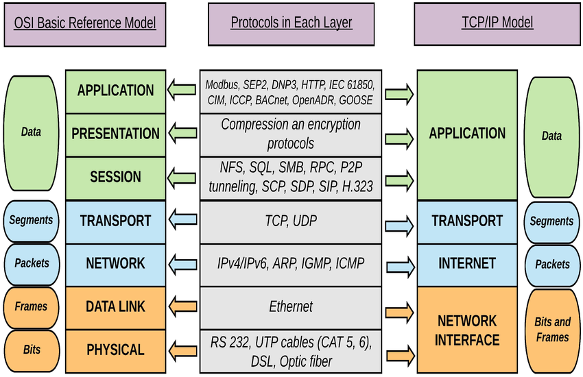

## 应用层 / Application Layer

:::note
**Definition: 应用层**
应用层是网络应用程序及其应用层协议驻留的地方。它是协议栈的顶层，直接为用户进程提供服务
:::
需要知道的是，应用程序!=应用层

### 应用架构 / Application Architectures

谁来做服务端？谁来做客户端？

#### 大型机模式 / Mainframe Model

很老的东西，又称为分时共享模式，面向终端的多用户计算机系统

#### 客户-服务器架构 / Client-Server Architecture

客户端（Client）间歇性连接，IP 可变
固定的服务器（Server），一直开机，IP 固定
现在非常常用
在客户机发出命令，在服务器中处理并返回结果

#### 对等网络架构 / P2P Architecture

没有中心服务器，任意端系统之间直接通信
虽然这个方法扩展性强，但难以管理
`BitTorrent` 就是使用了这个架构
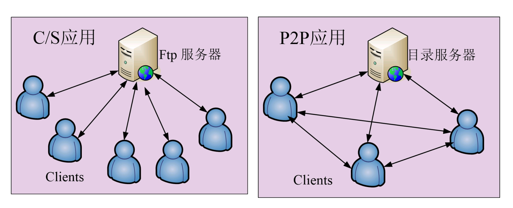

#### 浏览器-服务器架构 / B/S Architecture

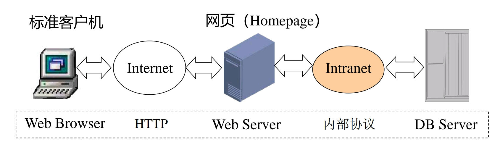

### 进程寻址 / Process Addressing

> 网络很大，我怎么找到你？

应用层通信的本质是**进程(Process)** 之间的通信

#### 端口号 / Port Number

- **定义**：一个 16 位的整数，用于标识主机上运行的特定进程
- **分类**：熟知端口（0-1023，如 HTTP 80, HTTPS 443, ssh 22），注册端口（1024-49151），动态端口（49152-65535）

#### 套接字 / Socket

1. **套接字地址 (Socket Address)**: IP 地址 : 端口号。这是网络中进程的唯一标识
2. **套接字 API (Socket API)**: 操作系统内核提供给应用程序的**编程接口**
    - 在 Linux/Unix 中，Socket 表现为一个**文件描述符 (File Descriptor)**
    - 应用程序通过读写这个“文件”来与网络另一端的进程通信，而无需关心底层的 TCP/IP 传输细节

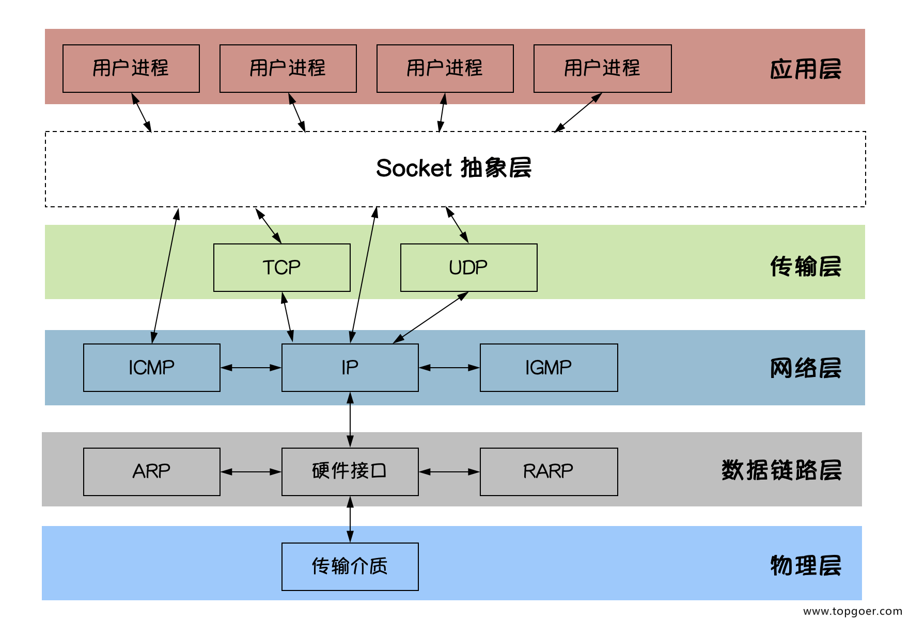

### 基础设施 / Infrastructure

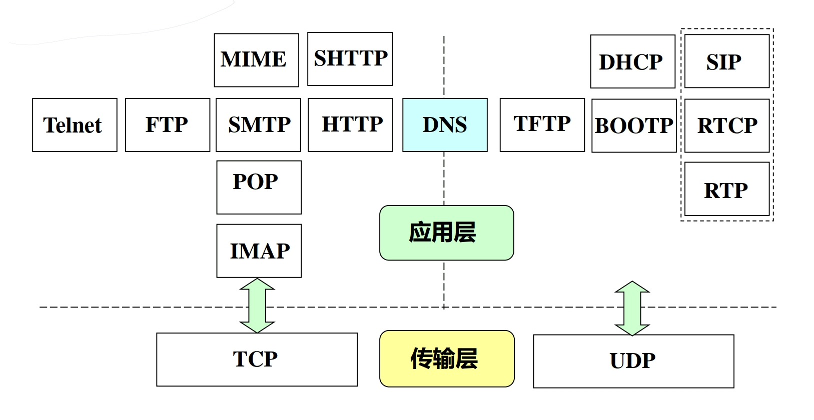

#### DNS域名系统 / DNS

> **Why DNS?**
> 网络设备只认识 IP 地址，但人类习惯记忆字符串
> DNS 是连接这两者的桥梁

DNS 是一个**分层的 (Hierarchical)**、**基于域的 (Domain-based)** 命名方案，以及一个实现主机名到 IP 地址转换的**分布式数据库 (Distributed Database)** 系统
三个要点：*分布*、*分层*、*缓存*

- **为什么是分布式的？** 全球几十亿台设备，如果只靠一台服务器记账，它会瞬间崩溃（单点故障、流量过载）。所以 DNS 将数据分散在全球各地

##### DNS 查询过程 / Query Process

当访问 `www.example.com` 时：

1. **浏览器缓存** -> **OS Hosts 文件** -> **本地 DNS 服务器 (Local DNS)**
2. 若未命中，Local DNS 发起**迭代查询 (Iterative Query)**:
    - 问 **根服务器 (Root)** -> 得到 .com TLD 服务器 IP
    - 问 **TLD 服务器** -> 得到 example.com 权威服务器 IP
    - 问 **权威服务器 (Authoritative)** -> 得到 `www.example.com` 的最终 IP

DNS 不止存 IP，还存别的东西：

- **A 记录**: 域名 -> IPv4 地址
- **AAAA 记录**: 域名 -> IPv6 地址
- **CNAME 记录**: 别名。比如 `www.a.com` 其实是 b.com 的小号。（**CDN 的核心实现机制**）
- **MX 记录**: 邮件交换。告诉邮件服务器邮件该发给谁
- **NS 记录**: 域名服务器。告诉别人这块地盘归哪台 DNS 服务器管

##### nslookup & dig DNS

来自己看看DNS吧!
可以使用`nslookup`工具来查看

```shell
$ nslookup www.bilibili.com
Server:         127.0.0.53            <-- 1. 你的本地 DNS 服务器
Address:        127.0.0.53#53

Non-authoritative answer:             <-- 2. 非权威应答
www.bilibili.com        canonical name = a.w.bilicdn1.com.
Name:   a.w.bilicdn1.com              <-- 3. 这里验证了 CNAME 机制，B站把请求转给了 CDN
Address: 223.111.252.67               <-- 4. 最终的 A 记录 (IP 地址)
Name:   a.w.bilicdn1.com              这就是DNS的缓存机制
Address: 117.169.96.199               这里出现了多个 IP，验证了 DNS 负载均衡
... #太多了我就省略了
;; Truncated, retrying in TCP mode.
Name:   a.w.bilicdn1.com
Address: 2409:8c38:c40:100::2
Name:   a.w.bilicdn1.com
Address: 2409:8c38:c40:100::3
Name:   a.w.bilicdn1.com
Address: 2409:8c38:c40:100::241
...
```

如果想要更完整的内容，可以使用`dig`工具

```shell
$ dig www.bilibili.com

;; ANSWER SECTION:
www.bilibili.com.       600     IN      CNAME   a.w.bilicdn1.com.
# 解释: CNAME 记录显示 B 站将域名指向了 CDN 域名 (a.w.bilicdn1.com)

a.w.bilicdn1.com.       600     IN      A       223.111.252.67
a.w.bilicdn1.com.       600     IN      A       117.169.96.199
...
# 解释: 这里返回了多个 A 记录 (IP 地址)，这验证了 DNS 负载均衡 (Load Balancing) 机制
# 客户端可以随机选择一个 IP 进行连接

;; Query time: 10 msec  <-- 极快的响应时间暗示了命中缓存
```

Q：为什么这下面不仅仅有一个 IP 地址，而是有好几个？
A：**负载均衡**

:::note
**What is 负载匀衡?**
负载均衡 (Load Balancing)是指在多个计算资源（如计算机集群、网络连接、CPU、磁盘驱动器）之间分配工作负载（Workloads）的技术

- 核心组件：负载均衡器 (Load Balancer)。它是位于客户端与后端服务器组（Backend Server Pool）之间的一个**反向代理 (Reverse Proxy)** 或网络设备。
- 基本功能：接收来自客户端的入站流量 (Inbound Traffic)，并根据指定的算法将其转发到后端某台特定的服务器 (Upstream Server) 上。

~~如果以后开nginx或者caddy的课可能会详细讲讲？~~
:::

#### 内容分发网络 / CDN

如果你在中国，服务器在美国，物理距离导致的**延迟**就无法通过加宽带解决
所以出现了CDN技术
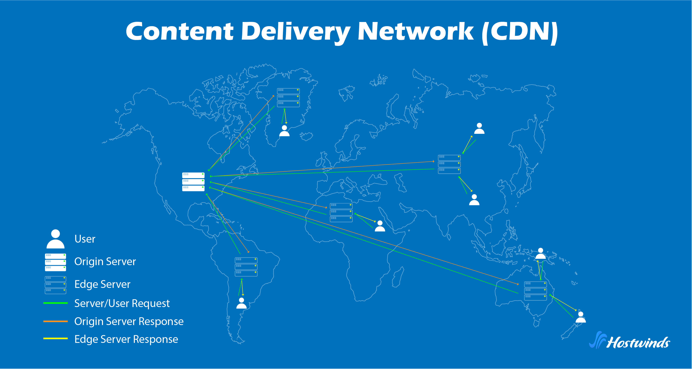

- **核心原理**:
  - **边缘服务器 (Edge Server)**: 部署在全球各地的节点
  - **重定向机制**: 利用 DNS 的 **CNAME** 记录，将用户对 `www.bilibili.com` 的解析请求重定向到 CDN 的负载均衡器，进而返回距离用户物理距离最近、负载最低的边缘节点 IP
  - **缓存 (Caching)**: 静态资源（图片、视频、CSS/JS）被缓存在边缘节点。回源（Back-to-Source）仅在缓存未命中时发生

> 这是现代互联网视频流畅播放、网页秒开的基石

### 万维网与 HTTP / Web & HTTP

#### HTTP 协议 / HTTP

##### What is HTTP?

> 该部分内容涉及到下一层的知识点，在后面会讲，别着急

:::note
**Definition: HTTP**
HTTP 是一个**无状态 (Stateless)** 的应用层协议，定义了客户端（用户代理）与服务器之间交换超文本资源（HTML, 图片等）的格式与语义
:::
它基于“请求-响应” (Request-Response) 模式
还记得前面讲的“协议=语法+语义”吗？HTTP 的语法非常直观

> - **请求 (Request)**: 动词 路径 协议版本 (例如: GET /index.html HTTP/1.1)
> - **响应 (Response)**: 协议版本 状态码 状态短语 (例如: HTTP/1.1 200 OK 或 404 Not Found)
> - **响应体 (Body)**

http有这两个特点:

- 传输层依赖：
  - HTTP 默认使用 TCP 端口 80
  - 可靠性：HTTP 自身不提供数据可靠性机制，完全依赖 TCP 提供的可靠数据传输服务（无丢失、无差错、按序到达）
- RTT (Round-Trip Time) 开销：
  - HTTP 通信前必须先建立 TCP 连接。TCP 三次握手引入了初始延迟
  - 在非持久连接（Non-Persistent Connection）模式下，每个对象的传输都需要独立的 TCP 握手，导致显著的时延累积

根据 RFC 7231 标准，常见方法定义如下：

- GET: 请求获取 Request-URI 所标识的资源
- POST: 向指定资源提交数据进行处理请求（如提交表单或上传文件）。数据包含在请求体中
- PUT: 向服务器发送数据，用以替换目标资源当前的表示
- DELETE: 请求服务器删除 Request-URI 所标识的资源

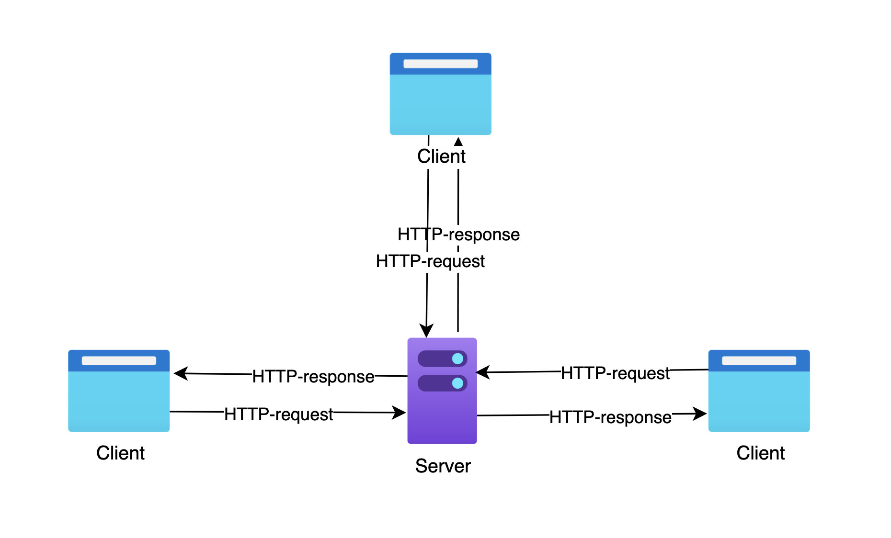

由于 HTTP 协议的无状态性 (Statelessness)，服务器无法仅凭协议层面的信息识别连续请求是否来自同一客户端
为此，引入了 **Cookie** 机制（RFC 6265）：

1. 状态生成：服务器在 HTTP 响应首部中包含 `Set-Cookie` 字段，向客户端下发状态标识
2. 状态存储：用户代理（User Agent，如浏览器）将 Cookie 保存至本地（内存或磁盘）
3. 状态回传：后续向同一域发送请求时，用户代理会自动在请求首部中包含 `Cookie` 字段，从而实现会话维持（Session Maintenance）

~~在现在的时代，**JWT (JSON Web Token)** 这个词很常见呢~~

##### Take a look at HTTP with telnet

```shell
$ telnet www.baidu.com 80
Trying 36.152.44.132...
Connected to www.baidu.com.
Escape character is '^]'. 

# --- [手动输入部分] ---
GET / HTTP/1.1
Host: www.baidu.com
# (此处按两次回车发送请求)
# --------------------

# --- [服务器响应部分] ---
HTTP/1.1 200 OK                     <-- 状态行
Server: BWS/1.1                     <-- Server Header: 百度自研服务器
Content-Type: text/html             <-- 告诉终端：这是网页代码
Content-Length: 29506               <-- 实体长度
Connection: keep-alive              <-- 关键：持久连接，TCP 未断开
Set-Cookie: BAIDUID=0E91...; expires=Thu, 31-Dec-37...
# 解释: Set-Cookie 头部
# expires=2037年: 这是一个持久化 Cookie，用于长期的用户追踪

<!DOCTYPE html>
<html>... (响应体 HTML 代码)
```

```text
GET / HTTP/1.1
Host: www.baidu.com
```

这是我们发送的request：

1. GET /: 请求方法，告诉服务器“根路径 /给我”
2. HTTP/1.1: 协议版本，指示客户端支持 HTTP/1.1 标准
3. Host:www.baidu.com : **HTTP/1.1 强制要求的首部**。指定目标服务器的域名
4. 回车两次: 协议中的 `\r\n\r\n` (CRLF)

```text
HTTP/1.1 200 OK
```

- 200 OK
这里暴露了服务器的很多“隐私”：
- Server: BWS/1.1:
  - 通常这里会写 nginx 或 Apache
  - 但这里是 BWS (Baidu Web Server)。百度为了高性能，自己魔改的服务器软件
- Date: Sun, 23 Nov 2025 ...: 服务器现在时间
- Content-Type: text/html: 告诉你的终端接受内容是什么(MIME 类型)
- Content-Length: 29506: 预告接下来的网页内容一共有 29,506 个字节

```text
Connection: keep-alive
```

还记得 HTTP/1.1 的持久连接吗？

- 服务器发完数据后并没有断开TCP
- 如果你现在继续在这个窗口里输入 `GET /favicon.ico HTTP/1.1 ...`，它会立刻响应，不需要重新握手
- 这也意味着由于连接没断，你需要手动用 `Ctrl+]` 然后 `quit` 才能退出 telnet
这是 HTTP 克服“健忘症”的铁证：

```text
Set-Cookie: BAIDUID=...; expires=Thu, 31-Dec-37...
Set-Cookie: BIDUPSID=...
Set-Cookie: PSTM=...
```

- 百度一口气给你发了好几个身份证（Cookie）。
  - BAIDUID: 这是百度用来追踪你的核心 ID。
  - expires=Thu, 31-Dec-37
    - 除非你手动清空浏览器缓存，否则这十几年里，百度只要看到这个 ID，就知道“哦，还是 2025 年那个用 Telnet 连我的家伙”
    - 这就是为什么广告能精准投放、搜索记录能被保存的原因
- X-Xss-Protection: 1;mode=block: 告诉浏览器打开防 XSS 攻击的护盾（虽然现代浏览器大多已经弃用这个头了，但百度为了兼容老浏览器还留着）
- Vary: Accept-Encoding

然后后面的就是响应体(Body)

```html
<!DOCTYPE html>
<html>
<head>...
```

#### HTTPS 协议 / HTTPS

> **Why HTTPS?**
> HTTP 是**明文**传输的。你在公共场合连 Wi-Fi 登录 HTTP 网站，嘿壳抓包能直接看到你的密码
> HTTPS = HTTP + **SSL/TLS**

HTTPS 并非一种全新的协议，而是 **HTTP over SSL/TLS**。它在应用层（HTTP）和传输层（TCP）之间插入了一个安全层——**TLS (Transport Layer Security)** 或其前身 SSL (Secure Sockets Layer)

HTTPS 解决了三个核心安全问题（CIA 模型）：

1. **机密性 (Confidentiality)**: 防止窃听 (Eavesdropping)。通过加密算法对数据负载进行编码，确保只有拥有密钥的接收方才能解密
2. **完整性 (Integrity)**: 防止篡改 (Tampering)。通过**消息摘要 (Message Digest)** 算法（如 SHA-256）生成数字指纹，确保数据在传输过程中未被修改
3. **身份认证 (Authentication)**: 防止伪装 (Spoofing)。通过**数字证书 (Digital Certificate)** 和 **PKI (公钥基础设施)** 验证服务器的真实身份

TLS 协议混合使用了两种加密方式以平衡安全性与性能：

- **非对称加密 (Asymmetric Encryption)**:
  - **原理**: 使用一对密钥（公钥 Public Key 和 私钥 Private Key）。公钥加密的数据只能由私钥解密，反之亦然
  - **用途**: 仅用于 **TLS 握手阶段**，用于安全地交换“会话密钥”
  - **算法**: RSA, ECC (Elliptic Curve Cryptography), Diffie-Hellman
- **对称加密 (Symmetric Encryption)**:
  - **原理**: 通信双方持有相同的密钥，加密和解密使用同一把钥匙
  - **用途**: 用于 **应用数据传输阶段**（握手完成后），因为其计算速度远快于非对称加密
  - **算法**: AES-GCM, ChaCha20-Poly1305

**CA (Certificate Authority)** 是信任的锚点

- **信任链验证**: 浏览器利用内置的 **Root CA** 公钥，逐级验证服务器证书的签名

##### openssl证书链观测

我们可以使用openssl来看看证书

```shell
$ openssl s_client -connect www.bilibili.com:443 -showcerts
Connecting to 223.111.252.67...
# [Part 1: 证书链验证过程]
# OpenSSL 从服务器收到了证书链，并尝试逐级验证
depth=2 OU=GlobalSign Root CA - R3, O=GlobalSign, CN=GlobalSign
verify return:1  # depth=2: 根证书 (Root CA)

depth=1 C=BE, O=GlobalSign nv-sa, CN=GlobalSign RSA OV SSL CA 2018
verify return:1  # depth=1: 中间证书 (Intermediate CA)

depth=0 C=CN, ST=上海, L=上海, O=上海幻电信息科技有限公司, CN=*.bilibili.com
verify return:1  # depth=0: 服务器证书 (Leaf Certificate)

---
# [Part 2: 证书链详情]
Certificate chain
 # 0号证书：服务器实体证书
 0 s:C=CN, ST=上海, L=上海, O=上海幻电信息科技有限公司, CN=*.bilibili.com  # s (Subject): 证书持有者
   i:C=BE, O=GlobalSign nv-sa, CN=GlobalSign RSA OV SSL CA 2018  # i (Issuer): 颁发者
   a:PKEY: RSA, 2048 (bit); sigalg: sha256WithRSAEncryption # 签名算法

 # 1号证书：中间 CA 证书
 1 s:C=BE, O=GlobalSign nv-sa, CN=GlobalSign RSA OV SSL CA 2018 # Subject
   i:OU=GlobalSign Root CA - R3, O=GlobalSign, CN=GlobalSign # Issuer (指向 Root)

 # 2号证书：根 CA 证书 (通常由 OS 内置，服务器可发可不发)
 2 s:OU=GlobalSign Root CA - R3, O=GlobalSign, CN=GlobalSign
   i:C=BE, O=GlobalSign nv-sa, OU=Root CA, CN=GlobalSign Root CA # Issuer (通常是自签名)
---
Server certificate
...
---
# [Part 3: 握手结果]
SSL handshake has read 4424 bytes and written 1642 bytes
Verification: OK # 核心结果：信任链验证通过
---
New, TLSv1.3, Cipher is TLS_AES_256_GCM_SHA384  # 协议版本 TLS 1.3，使用 AES-256-GCM 对称加密
Protocol: TLSv1.3
Server public key is 2048 bit
...
```

#### HTTP 演进 / HTTP Evolution

##### HTTP/1.1

- **机制**: 文本协议，支持持久连接
- **缺陷**: **应用层队头阻塞 (HOL Blocking)**。请求必须串行排队，前一个请求未完成，后续请求只能等待
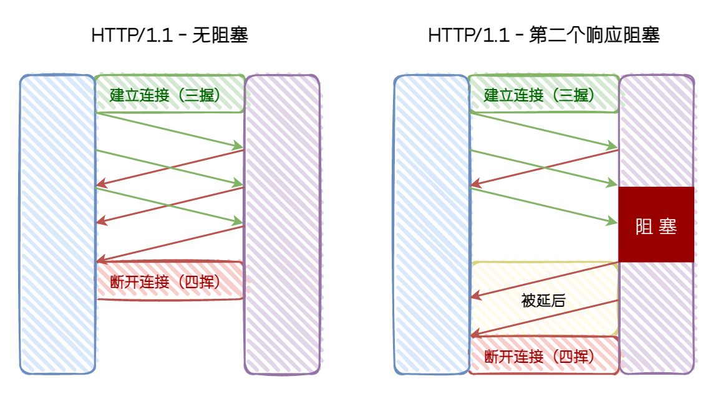

##### HTTP/2

因此进化出了HTTP/2：
HTTP/2 依然基于 TCP，但对其传输机制进行了重构，旨在解决应用层 HOL 阻塞

- **机制**: **二进制分帧** + **多路复用**
- **改进**:
  - **流 (Stream)**: 允许在同一个 TCP 连接中并发传输多个请求/响应
  - **HPACK**: 头部压缩，节省带宽
  - **Server Push**: 服务端主动推送资源

现在绝大部分地方都停留在了HTTP/2
就用b站为例子

```shell
$ curl -v -I https://www.bilibili.com
...
# [Step 1: ALPN 协商 (Application-Layer Protocol Negotiation)]
# 在 TLS 握手的同时，客户端告知服务器：“我支持 HTTP/2 (h2) 和 HTTP/1.1”
* ALPN: curl offers h2,http/1.1
* TLSv1.3 (OUT), TLS handshake, Client hello (1):
...
* TLSv1.3 (IN), TLS handshake, Server hello (2):
* TLSv1.3 (IN), TLS handshake, Encrypted Extensions (8):
...
# 服务器在 TLS 握手结束时确认：“好的，我们使用 h2 (HTTP/2)”
* ALPN: server accepted h2
* Server certificate:
...
* Connected to www.bilibili.com (2409:8c20:5624::55) port 443

# [Step 2: HTTP/2 流与伪首部]
* using HTTP/2
# 开启 1 号流 (Stream ID 1) 用于传输请求
* [HTTP/2] [1] OPENED stream for https://www.bilibili.com/
# 发送 HEADERS 帧。注意：HTTP/2 使用“伪首部字段” (Pseudo-Header Fields，以冒号开头)
* [HTTP/2] [1] [:method: HEAD]        # 对应 HTTP/1.1 的 GET/HEAD 方法
* [HTTP/2] [1] [:scheme: https]       # 协议
* [HTTP/2] [1] [:authority: www.bilibili.com] # 对应 HTTP/1.1 的 Host 头部
* [HTTP/2] [1] [:path: /]             # 路径
* [HTTP/2] [1] [user-agent: curl/8.15.0]
* [HTTP/2] [1] [accept: */*]
> HEAD / HTTP/2
> Host: www.bilibili.com
> User-Agent: curl/8.15.0
> Accept: */*
>
* Request completely sent off

# [Step 3: 接收响应]
< HTTP/2 200
< date: Sun, 23 Nov 2025 08:29:57 GMT
< content-type: text/html; charset=utf-8
...
* Connection #0 to host www.bilibili.com left intact
```

##### HTTP/3

HTTP/2 解决了应用层的阻塞，但无法解决 **TCP 层面的队头阻塞 (Transport-Layer HOL Blocking)**

- **TCP 的局限**: TCP 是字节流协议，要求数据按序到达。如果 TCP 窗口中的一个包丢失，操作系统内核会挂起整个 TCP 连接，等待重传，导致所有流（Stream）都被阻塞

HTTP/3 弃用 TCP，改用基于 UDP 的 **QUIC 协议 (Quick UDP Internet Connections)**

- **基于 UDP**: UDP 无连接、不可靠，但 QUIC 在应用层实现了可靠传输机制（重传、拥塞控制）
- **流的独立性 (Stream Independence)**:
  - QUIC 中的流是真正的独立。如果流 A 的一个 UDP 包丢失，只会影响流 A，流 B 和 流 C 继续传输，不受影响
- **连接迁移 (Connection Migration)**:
  - TCP 依赖四元组（源IP, 源端口, 目的IP, 目的端口）标识连接。网络切换（Wi-Fi -> 4G）会导致 IP 改变，连接断开
  - QUIC 使用 **Connection ID (CID)** 标识连接。只要 CID 不变，即使 IP 变了，连接依然保持，无需重新握手
- **0-RTT 握手**: 结合 TLS 1.3，允许在恢复会话时直接发送数据

> QUIC 是在 **用户态 (User Space)** 实现的可靠传输，而不是内核态，这是它迭代快的原因

### 实时通信 / Real-Time Communication

在上一节我们看到，HTTP 的本质是“请求-响应”模式。这种模式有一个致命的缺陷：**被动性**
服务器就像一个仅仅会应答的机器，客户端不问，它就永远不能说话

这对于浏览网页没问题，但对于**即时通讯 (IM)**、**股票行情**或**多人在线游戏**来说，是无法接受的。为了让服务器能“主动”发消息，最早的开发者只能使用**轮询 (Polling)**，即让浏览器每隔几秒就发一个 HTTP 请求问：“有新消息吗？”。这不仅制造了大量无效的 HTTP 请求，还带来了无法消除的延迟

我们需要一种真正的双向通信机制

#### WebSocket 协议 / WebSocket

WebSocket 的出现解决了这个问题。它允许在单个 TCP 连接上进行**全双工 (Full-Duplex)** 通信——即双方都可以同时向对方发送数据，不需要谁先问谁

有趣的是，WebSocket 并不是另起炉灶，它是**寄生**在 HTTP 之上的。建立一个 WebSocket 连接，必须经历一次“协议升级”的过程

我们可以抓包或使用 `curl` 模拟这个过程，你会发现它始于 HTTP，终于二进制流：

```bash
$ curl --http1.1 -i -N \
    -H "Connection: Upgrade" \
    -H "Upgrade: websocket" \
    -H "Sec-WebSocket-Key: SGVsbG8sIHdvcmxkIQ==" \
    -H "Sec-WebSocket-Version: 13" \
    https://echo.websocket.org
```

服务器会返回 `HTTP/1.1 101 Switching Protocols`
它标志着 TCP 连接的**所有权**发生了转移，建立了一条原始的 TCP 管道，直接传输 WebSocket 的**二进制帧 (Frame)**
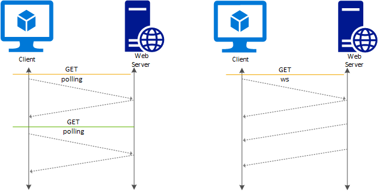

#### WebTransport 协议 / WebTransport

WebSocket 虽然解决了双向通信，但它依然基于 **TCP**

**WebTransport** 是基于 **HTTP/3 (QUIC)** 构建的新一代 API。由于底层换成了基于 UDP 的 QUIC，它能够提供一种名为 **Datagrams (数据报)** 的传输模式。在这种模式下，数据包是可以丢弃、可以乱序的。对于实时性要求极高的场景，丢几帧画面远比卡顿几秒要好得多

### 远程管理 / Remote Management

如何管理远程服务器？也许你可以看看ssh

#### SSH 协议 / SSH

早期的 **Telnet** (TCP 23) 协议极其简陋，它在网络上仅仅是建立了一个虚拟终端。最可怕的是，它默认**明文传输**
当你通过 Telnet 登录服务器时，你输入的每一个字符（包括 root 密码）都会以明文形式流经所有的路由器。任何中间人（MITM）都能截获你的权限

**SSH (Secure Shell, TCP 22)** 的出现终结了 Telnet
SSH 不仅仅是一个远程 Shell，它本质上是一个**加密的隧道协议**。它在 TCP 连接建立后，会立即进行密钥交换（Key Exchange），在不安全的网络中协商出一个对称密钥。此后传输的所有数据，都是经过高强度加密的乱码

#### 网络监控 / Network Monitoring

除了控制，我们还需要监控
传统的监控协议 **SNMP** 采用的是 **“拉模式 (Pull)”**：管理端每隔几秒钟问一次路由器：“现在的 CPU 占用率是多少？”
这种方式不仅效率低下，而且存在**盲区**——如果流量在两次轮询的间隙瞬间暴涨又消失（微突发），SNMP 是完全无感知的

随着 Linux 内核的发展，**eBPF** 技术正在颠覆这一领域
不同于 SNMP 的外部询问，eBPF 允许我们在操作系统内核中植入安全的、**事件驱动**的“探针”。每当有一个数据包经过网卡，或者发生一次系统调用，eBPF 程序就会被触发。这种从**内核视角**进行的毫秒级实时观测，让网络监控从“看大概”进化到了“看显微镜”

### 文件传输 / File Transfer

#### FTP 与 SFTP / FTP & SFTP

搬运文件看似简单，但在复杂的现代网络环境中，古老的协议却显得格格不入。这其中最典型的反面教材就是 **FTP**

FTP 是互联网早期的产物，它设计了独特的**双端口机制**：一个端口（TCP 21）用于发送指令，另一个端口（TCP 20）用于传输数据

这种设计在当年没有问题，但在 **NAT (网络地址转换)** 普及的今天，它简直是灾难。在 FTP 的**主动模式**下，客户端需要告诉服务器：“请连接我的内网 IP:端口 给我发数据”。但在公网上的服务器根本无法反向连接进你的内网。虽然 FTP 后来推出了“被动模式”试图补救，但由于它需要服务器开放海量随机端口，这又成了防火墙的噩梦

因此，FTP 已基本被淘汰，取而代之的是 **SFTP**
SFTP 并不是 FTP 的加密版，它是 **SSH 协议的一个子系统**，直接复用 SSH 的 22 端口。不需要额外配置防火墙，且天然具备高安全性

### 你先别急 / You No Hurry

在继续深入之前，我们需要解决一个核心疑问：**应用层是如何工作的？**  
我们在写 HTTP 或 SSH 程序时，似乎只需要调用一个 `send()` 函数，数据就神奇地到达了地球另一端。我们并不关心网线断没断、路由器堵不堵

这是因为**传输层 (Transport Layer)** 向应用层提供了一个 **“黑盒服务模型”**

- **应用层的视角**：我把数据扔进这个黑盒，告诉它“送到 IP:Port”
- **黑盒的承诺**：我会搞定所有的传输细节

但是，这个黑盒提供了两种截然不同的**服务套餐**：一种是“快但不保修”（UDP），一种是“慢但包邮包退”（TCP）。接下来，我们就拆开这个黑盒，看看里面的齿轮是如何转动的

## 传输层 / Transport Layer

> **Concept: 核心使命：从主机到进程**
> 网络层 (IP) 只能把数据送到**主机**。传输层负责把数据分发给主机上具体的**进程**
> 这种复用与分用，依靠的是 **端口号 (Port Number)**

在这一层，主要有两个性格迥异的协议：**UDP** 和 **TCP**。它们代表了网络设计中两种截然不同的哲学

### UDP 协议 / UDP

**UDP** 是黑盒提供的第一种套餐。它的哲学是：**“尽最大努力交付” (Best Effort)**

我们来看看一个真实的 UDP 数据包。你会发现它的结构**十分干净**，没有复杂的握手序列，头部只有区区 **8 个字节**。
这是[SampleCaptures - Wireshark Wiki](https://wiki.wireshark.org/SampleCaptures)上下载下来的一个[Fetching Title#3h26](https://wiki.wireshark.org/uploads/e2b98423e5f0dc85e0b1228ebbd044e2/protobuf_udp_addressbook.pcapng)
我们可以用`wireshark`这个软件打开它看看，安装自己去弄[Wireshark • Go Deep \| Download](https://www.wireshark.org/download.html)
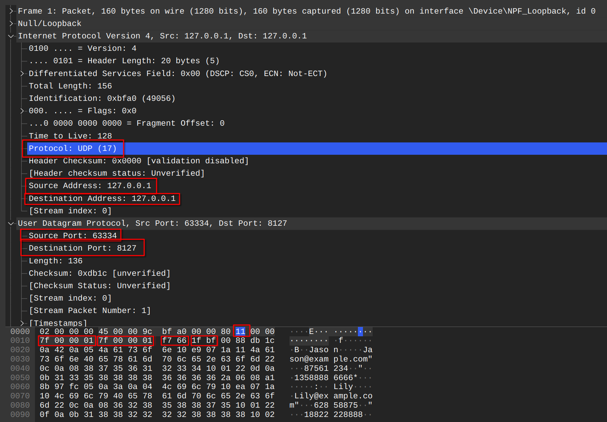

你会发现它的头部极其干净，只有区区 **8 个字节**：

- **源端口** & **目的端口**: 负责送给正确的进程
- **长度**: 告诉接收方这包有多长
- **校验和 (Checksum)**: 这是 UDP 唯一的底线

**为什么校验和如此重要？**
这是 UDP 唯一的可靠性措施。如果数据包在传输中出现了比特翻转，UDP会直接**丢弃**这个包，并且**不会**通知发送方
**在 IPv4 中，UDP 校验和是可选的（虽然通常都开），但在 IPv6 中是强制的**

> “既然这么不靠谱，为什么还要用它？”

在**实时性**要求极高的场景，**延迟**是最大的敌人。如果使用 TCP，一旦丢包就会暂停画面等待重传，导致卡顿。而UDP允许偶尔丢包，保证了整体流程的顺畅

### TCP 协议 / TCP

**TCP** 是互联网的基石
它的任务极其艰巨：**在不可靠的 IP 层之上，构建一个可靠的传输通道**。为了实现“无差错、不丢失、不乱序”的承诺，TCP 被设计成了一个极其复杂的**有限状态机 (FSM)**
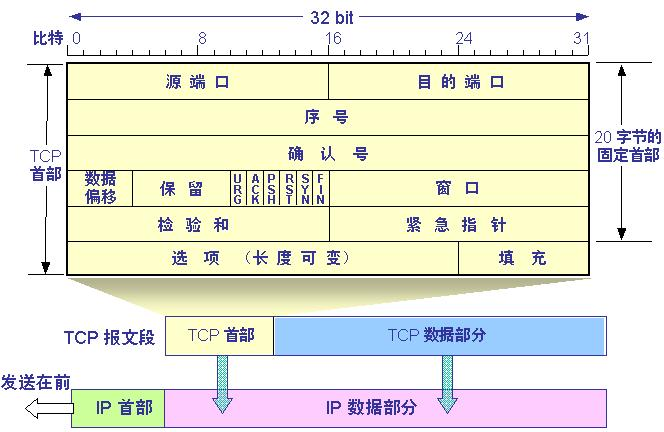

#### 三次握手 / Three-Way Handshake

TCP 是面向连接的，通信前必须先“打通电话”。这不仅仅是打个招呼，更是为了**同步双方的初始序列号 (ISN)**

- TCP 是双工的，A 要告诉 B 它的 ISN，B 也要告诉 A 它的 ISN，且都需要确认
- SYN(A) -> SYN(B) + ACK(A) -> ACK(B)
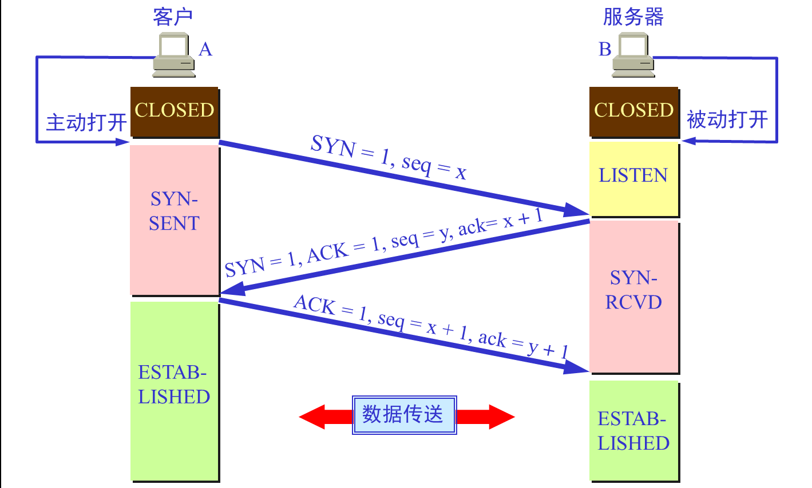
**为什么要三次？**
这主要是为了防止**已失效的连接请求**突然又传到了服务端，导致服务端错误地建立连接，浪费资源

#### 可靠性与流量控制 / Reliability & Flow Control

TCP 并没有采用“发一个包，等一个确认”的低效模式，而是采用了**流水线**机制
**滑动窗口 (Sliding Window)** 是 TCP 效率的关键。接收方在回复 ACK 时，会带上一个 `Window` 字段，告诉发送方：“我的接收缓冲区还能存 4096 字节，你别发太快”。发送方会根据这个反馈，动态调整自己的发送量。这被称为**流量控制 (Flow Control)**

#### 四次挥手 / Four-Way Wave

当数据传输结束，断开连接的过程也充满了设计的智慧
注意，TCP 是**全双工**的（双向独立通道），所以关闭时需要两个方向分别关闭
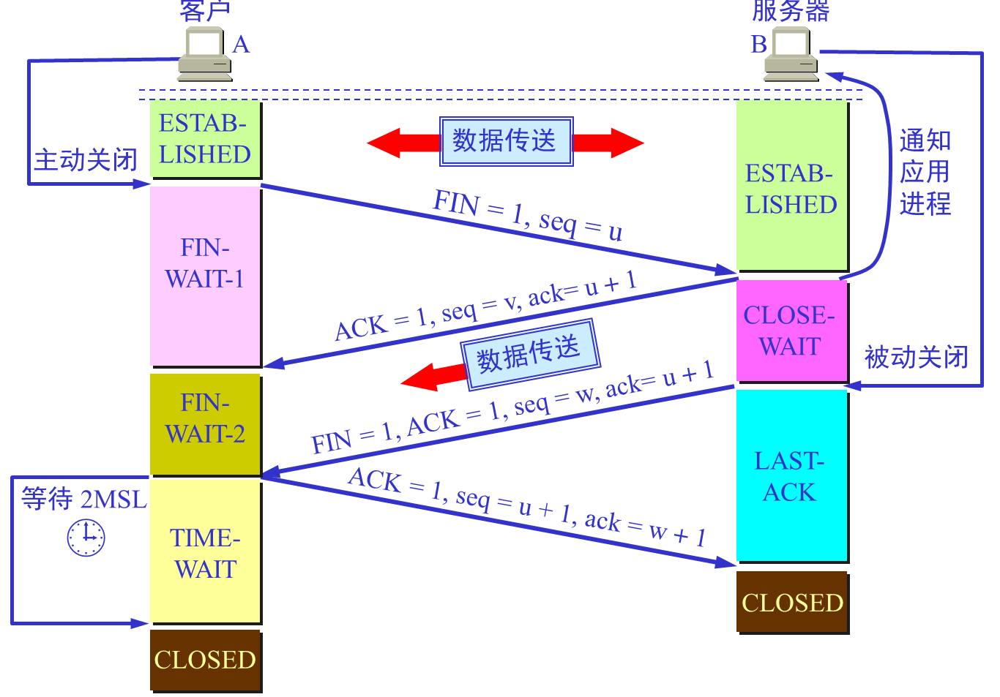

1. 客户端发 `FIN`：“我没数据发了。”
2. 服务器回 `ACK`：“知道了。”（此时连接处于**半关闭**状态，服务器可能还有数据没传完）
3. 服务器传完后发 `FIN`：“我也没数据了。”
4. 客户端回 `ACK`：“再见。”

**TIME_WAIT 的深意**
在客户端发出最后一个 ACK 后，它并不会立即关闭，而是会进入一个叫 `TIME_WAIT` 的状态，等待 **2MSL** (Maximum Segment Lifetime,约 2 分钟)。这是为了防备最后一个 ACK 丢包。如果服务器没收到最后的 ACK，会重发 FIN，客户端必须“活着”才能补发 ACK

#### 拥塞控制 / Congestion Control

如果接收方处理得很快，但**网络中间的路由器**堵车了怎么办？流量控制对此无能为力
TCP 必须具备感知网络拥堵的能力。它维护着一个**拥塞窗口 (cwnd)**：

1. **慢启动**: 连接刚建立时，发送速度指数级增长，试探网络负载
2. **拥塞避免**: 达到阈值后，线性增长
3. **急刹车**: 一旦检测到丢包，立即大幅削减窗口，给网络“让路”

这边就不详细展开了，内容太多了

##### Take a look at TCP

我们可以看看这样一个完整的tcp流程
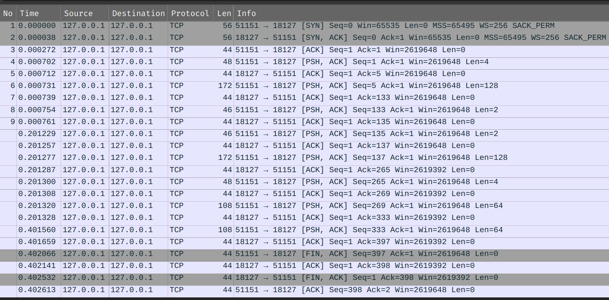

## 网络层 / Network Layer

网络层位于协议栈的核心位置，其主要职责是实现**主机到主机 (Host-to-Host)** 的逻辑通信。与数据链路层关注相邻节点间的帧传输不同，网络层必须解决如何在复杂的、由异构网络互连的互联网中，找到从源主机到目的主机的最佳路径

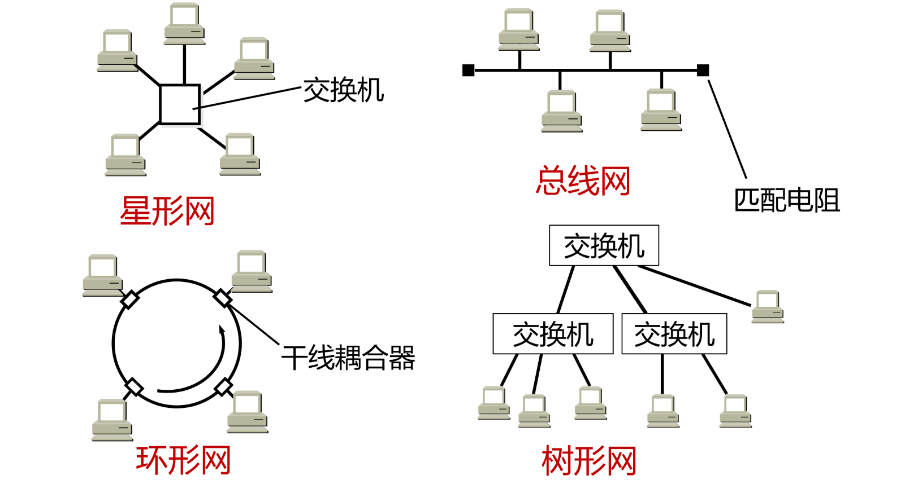

### IP 服务模型 / IP Service Model

网际协议 (IP) 提供的是一种**不可靠 (Unreliable)**、**无连接 (Connectionless)** 的**尽最大努力交付 (Best Effort)** 服务。这种设计意味着 IP 路由器在转发分组时，不维护关于后续分组的状态信息，也不保证分组不丢失、不重复或按序到达。这种看似“不负责任”的设计简化了网络核心设备的复杂性，降低了造价，并将数据传输的可靠性控制交由网络边缘的主机（即上层的传输层，如 TCP）来处理

#### IPv4 数据报 / IPv4 Datagram

IPv4 数据报由**首部**和**数据部分**组成。首部的前 20 字节是固定的，包含了网络传输所需的最关键控制信息。深入理解这些字段是掌握网络层机制的基础
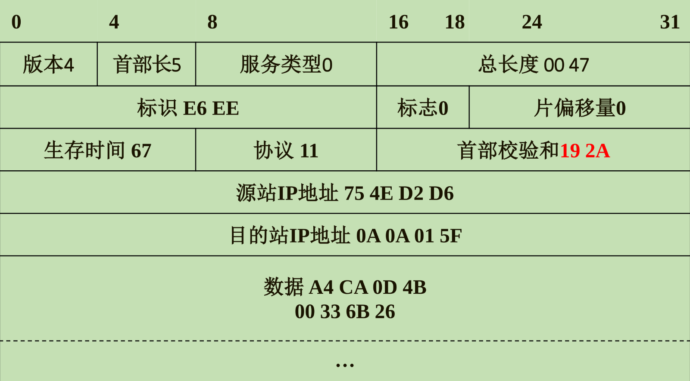

**基础控制字段**
首部的开始部分包含版本号与长度信息。**版本 (Version)** 字段占 4 位，对于 IPv4 来说该值为 4
紧接着是 **首部长度 (IHL)**，它以 4 字节为单位记录首部的总长度。由于 IP 首部可能包含可变长度的“选项”字段，因此需要该字段来确定数据部分的起始位置
**区分服务 (Type of Service)** 字段用于标记数据报的优先级，以支持 QoS（服务质量）
**总长度 (Total Length)** 字段占 16 位，指明了首部加上数据部分的总字节数，这意味着 IP 数据报的最大理论长度为 65,535 字节

**分片与重组字段**
由于底层物理网络存在**最大传输单元 (MTU)** 的限制（如以太网 MTU 为 1500 字节），过大的数据报必须被切分
**标识 (Identification)** 字段是一个计数器，用于标记属于同一个原始数据报的所有分片。**标志 (Flags)** 字段占 3 位，其中最低位 MF (More Fragments) 为 1 表示后面还有分片，中间位 DF (Don't Fragment) 为 1 表示禁止分片。**片偏移 (Fragment Offset)** 指出该分片在原数据报中的相对位置，以 **8 字节**为单位。路由器利用这些字段进行分片，而目的主机利用它们完成重组
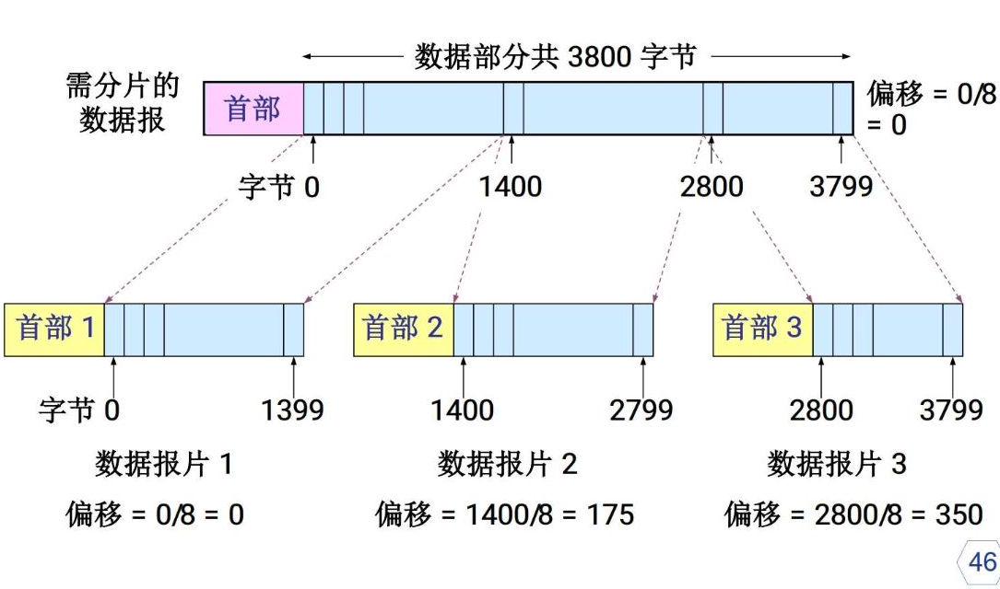

**生命周期与协议分用**
**生存时间 (TTL)** 字段至关重要，它代表数据报在网络中允许经过的最大跳数。每经过一个路由器，TTL 减 1，减为 0 时数据报被丢弃，从而防止路由环路。**协议 (Protocol)** 字段指示 IP 数据报的数据部分封装了何种上层协议（如 TCP=6, UDP=17, ICMP=1）。该字段实现了网络层的**分用**功能，告诉接收端应将数据上交给哪个模块

**校验与寻址**
**首部校验和 (Header Checksum)** 仅检测首部是否出错，不检测数据部分。每经过一个路由器，由于 TTL 发生变化，校验和都需要重新计算。最后是 **源地址** 和 **目的地址**，各占 32 位，这是 IP 协议实现逻辑寻址的核心

#### 子网与 CIDR / Subnetting & CIDR

##### 分类编址 (Classful Addressing)

在 ARPANET 的早期，IP 地址的设计非常简单粗暴——给每一个物理网络分配一个网络号。我们将 IP 分为 A、B、C、D、E 五类

| 类别 | 前导位 | 网络号范围 (第一字节) | 默认掩码 | 网络数量 | 单个网络最大主机数 |
| :---: | :--- | :--- | :--- | :--- | :--- |
| **A 类** | `0` | 1 - 126 | /8 | 126 ($2^7-2$) | 16,777,214 ($2^{24}-2$) |
| **B 类** | `10` | 128 - 191 | /16 | 16,384 | 65,534 |
| **C 类** | `110` | 192 - 223 | /24 | 2,097,152 | 254 |

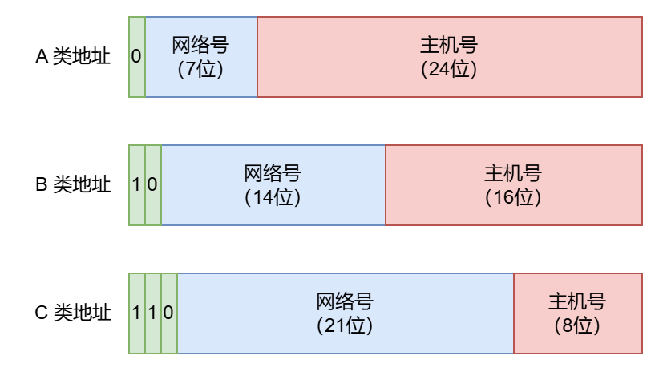

:::warning

1. **127.x.x.x** 也是 A 类，但它被保留作为**环回地址 (Loopback)**
2. **D 类 (224-239)** 用于组播 (Multicast)，**E 类** 保留科研

:::

这种设计存在严重问题：

- **地址浪费**：如果一个公司有 300 台主机，C 类（254个）不够用，分一个 B 类（6万多个）又太浪费
- **路由表膨胀**：每个网络都要占一行路由表，路由器压力山大

##### 划分子网 (Subnetting)

为了解决利用率低的问题，聪明的人们引入了**子网**的概念
**核心思想**：从**主机号**借用几位作为**子网号**

> **子网掩码 (Subnet Mask)**：用于指示 IP 地址中哪些位是网络位，哪些位是主机位
> 这里的逻辑运算是：`网络地址 = IP 地址 AND 子网掩码`

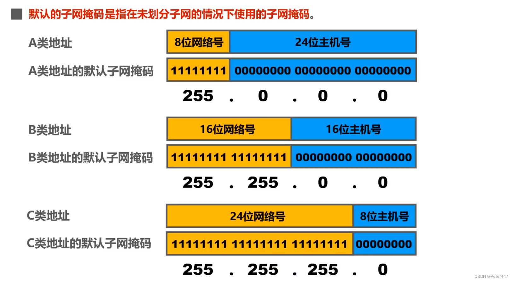

##### CIDR

CIDR 消除了传统的 A 类、B 类和 C 类地址以及划分子网的概念，但网络地址长度更加灵活可变，因而可以更加有效地分配 IPv4 的地址空间
CIDR使用各种长度的“**网络前缀”(network-prefix)** 来代替分类地址中的网络号和子网号
无分类的两级编址的记法是：
> IP地址 ::= {<网络前缀>, <主机号>}

CIDR 还使用“斜线记法”：
即在IP地址后面加上一个斜线“/”，后面写上网络前缀所占的比特数，如20.5.0.0/10，还可简写为20.5/10
CIDR 将网络前缀相同的连续的 IP 地址组成“CIDR地址块”

在**计算机基础知识竞赛**里面有这样一个题目：
> 需要将192.168.1.0/24 网络划分成4个大小相同的子网，每个子网需要容纳相同数量的主机
>
> - 则每个子网的子网掩码是：
> - 每个子网可用的主机数量是：

*IP地址*为*192.168.1.0*,也就是*1100'0000.1010'1000.0000'0001.0000'0000*
*CIDR*是`/24`，也就是*1111'1111.1111'1111.1111'1111.0000'0000*
如果你想要划分不同的子网，那么前 24 位是不动的，最后面的 **8位** (0000'0000) 本来全是留给主机的
$2^n = 4$
So `n = 2`
也就是我们需要 **2位** 来表示这 4 个子网（00, 01, 10, 11所以，我们要从原本属于主机的 8 位里，**“抢”** 走最左边的 2 位给网络
*1111'1111.1111'1111.1111'1111.1100'0000*
也就是`/26`，255.255.255.192

借走 2 位后，主机位还剩：$8 - 2 = 6$ 位

- 总 IP 数：$2^6 = 64$。
- **可用 IP 数**：我们要减去 **网络地址** (全0) 和 **广播地址** (全1)
- $64 - 2 = 62$

|子网索引|二进制借位 (SS)|剩下的主机范围 (HHHHHH)|对应十进制范围|
|--------|----------|----------------|-----------|
|**子网 1**|**00**|000000 ~ 111111|.0 ~ .63|
|**子网 2**|**01**|000000 ~ 111111|.64 ~ .127|
|**子网 3**|**10**|000000 ~ 111111|.128 ~ .191|
|**子网 4**|**11**|000000 ~ 111111|.192 ~ .255|

在路由查找过程中，如果一个目的地址匹配了路由表中的多个表项，路由器将遵循**最长前缀匹配 (Longest Prefix Match)** 原则，选择网络前缀最长（即子网掩码最长）的那一项进行转发，因为该路由指向的网络更具体、更精准

#### IPv6 协议 / IPv6

IPv6 并非仅仅是扩展了地址空间，它对报文首部进行了彻底的重新设计，以适应现代高速网络的需求

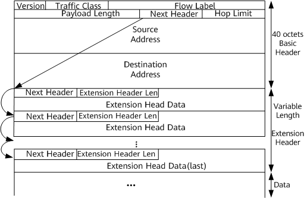
**地址空间的飞跃**
IPv6 最显著的变化是将地址长度从 32 位扩展到了 **128 位**，从根本上解决了地址耗尽问题。这使得我们可以为地球上的每一粒沙子分配一个 IP 地址

**简化的基本首部**
IPv6 采用了固定的 **40 字节**基本首部，去除了 IPv4 中许多不常用的字段以提高处理效率

1. **取消了首部长度字段**：因为首部长度固定为 40 字节。
2. **取消了首部校验和字段**：现代链路层（如以太网、光纤）已具备很强的差错检测能力，传输层也有校验机制。去除该字段消除了路由器每跳重新计算校验和的开销，显著提升了转发速度
3. **取消了分片字段**：IPv6 规定**分片仅在源主机进行**。如果路由器收到大于 MTU 的包，直接丢弃并回送 ICMPv6“分组过大”报文。这减轻了中间路由器的负担
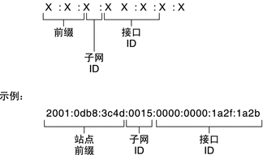
**灵活的扩展机制**
IPv4 中的“协议”字段在 IPv6 中被**下一个首部 (Next Header)** 字段取代
它不仅可以指向 TCP 或 UDP，还可以指向各种**扩展首部**（如逐跳选项、路由选择、分片扩展等）
这种链式结构使得 IPv6 具有极强的扩展性，能够灵活支持未来的新功能
其他关键字段还包括**流标号 (Flow Label)**，用于支持实时音视频等需要特殊服务质量的数据流

### DHCP 与 NAT / DHCP & NAT

#### 动态主机配置协议 / DHCP

Q:为什么现在连上NJUPT之后你不手动配置ip就可以上网？
A:DHCP 服务器自动给连入网络的设备分配 IP 地址、子网掩码、网关和 DNS 地址

DHCP协议是一个局域网网络协议，使用 UDP 协议（67/68 端口）

- **DORA 流程**:
    1. **Discover**: 客户端广播“有没有 DHCP 服务器？”
    2. **Offer**: 服务器广播“我有 IP 192.168.1.100，你要吗？”
    3. **Request**: 客户端广播“我要用 192.168.1.100。”
    4. **Acknowledge**: 服务器广播“确认分配，租期 24 小时。”

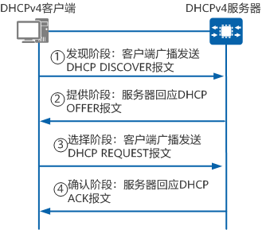

#### 网络地址转换 / NAT

NAT 通过将私有 IP 转换为公网 IP，延缓了 IPv4 的耗尽
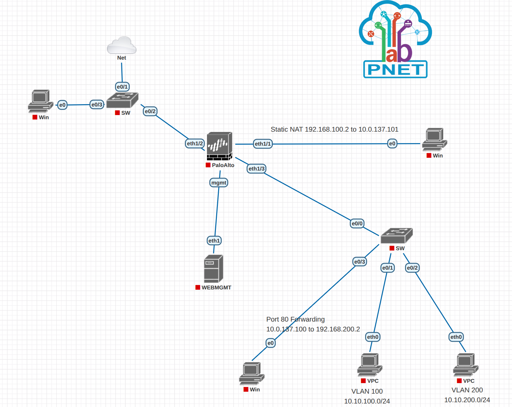

> **Tip**
> 这个软件是PNETlab
> 如果对网络模拟器感兴趣可以使用这个
> [PNETLab : Lab is Simple](https://pnetlab.com/pages/main)

### ICMP 协议 / ICMP

**ICMP**：Internet Control Message Protocol，因特网控制报文协议
方向：主机/路由器 -> 源站(发送方)

`ICMP` 报文分为两大类:
`差错报告报文`和`提供信息的报文(询问报文)`

- 差错报告报文 (`Error Report Messages`)
  - `3` 目的不可达 `Destination Unreachable`
  - `4` 源抑制 `Source Quench`
  - `5` 路由重定向 `Redirect (change a route)`
  - `11` 数据报超时 `Time Exceeded for a Datagram`
  - `12` 数据报参数问题 `Parameter Problem on a Datagram`
- 提供信息的报文 (询问报文) (`Information Request/Inquiry Messages`)
  - `0` 回显应答 `Echo Reply`
  - `8` 回显请求 `Echo Request`
  - `9` 路由器广告 `Router Advertisement`
  - `10` 路由器请求 `Router Solicitation`
  - `13` 时间戳请求 `Timestamp Request`
  - `14` 时间戳应答 `Timestamp Reply`
  - `17` 地址掩码请求 `Address Mask Request`
  - `18` 地址掩码应答 `Address Mask Reply`
其中`3`、`11`、`0`、`8`常用

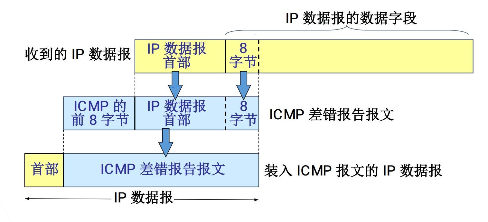

#### PING(Packet InterNet Groper)

PING 用来测试两个主机之间的连通性（可到达）
使用了 ICMP 回送请求与回送回答报文
PING 是应用层直接使用网络层 ICMP 的例子，它没有通过传输层的 TCP 或UDP
~~现在也有TCPing哦~~

当网络中存在网关或防火墙时，由于其防护和数据
包过滤功能，连通性测试结果可能不正确。

### 路由器体系结构 / Router Architecture

路由器是网络层的核心专用计算机，其功能逻辑分为控制平面和数据平面
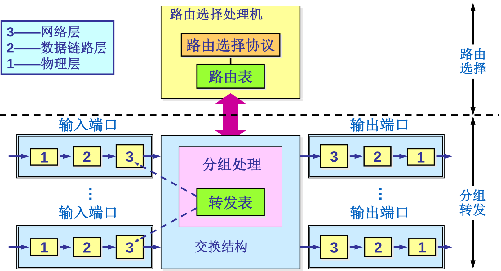
**控制平面**负责运行路由协议（如 OSPF、BGP），计算并生成路由表。**数据平面**则负责根据转发表，将输入端口到达的数据报通过交换结构，以线速交换到合适的输出端口

### 路由选择协议 / Routing Protocols

互联网被划分为许多**自治系统 (AS)**，路由协议因此分为内部网关协议 (IGP) 和外部网关协议 (EGP)

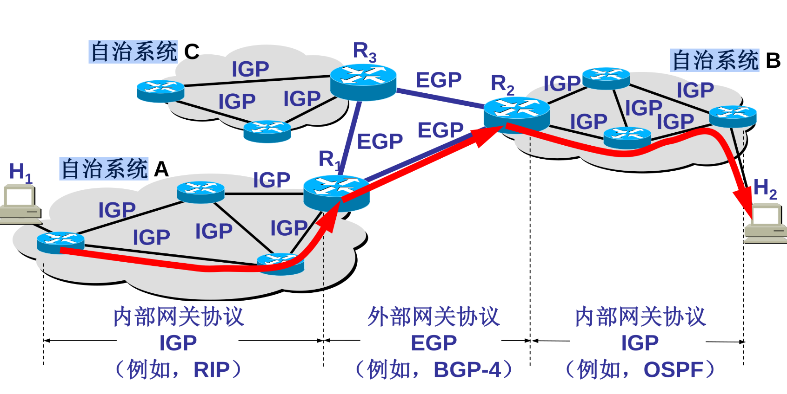

**内部网关协议 (IGP)** 主要处理 AS 内部路由。**RIP** 基于距离向量算法，受限于 15 跳，存在“坏消息传得慢”的问题。**OSPF** 基于链路状态算法，通过泛洪链路状态构建全网拓扑，并利用 **Dijkstra 算法** 计算最短路径，收敛快，适合大型网络

**外部网关协议 (EGP)** 主要处理 AS 之间路由。**BGP** 是互联网的骨干协议，基于路径向量算法。它交换的是“可达性”信息，核心目标是控制**路由策略**（如政治、经济因素）而非单纯追求速度

## 数据链路层 / Data Link Layer

数据链路层位于物理层与网络层之间，其核心职责是在**相邻节点 (Node-to-Node)** 之间提供可靠的帧传输服务。物理层传输的是非结构的比特流，而数据链路层通过**封装成帧 (Framing)**、**差错检测**和**介质访问控制**，将物理信道转变为逻辑上无差错的数据链路。在以太网 (Ethernet) 架构中，MAC 地址是该层识别设备的核心标识

### 封装成帧 / Framing

数据链路层将网络层传递下来的数据报（Packet）添加首部和尾部，封装成**帧 (Frame)**。帧不仅是数据链路层的传输单元，也界定了数据的起止位置（帧同步）
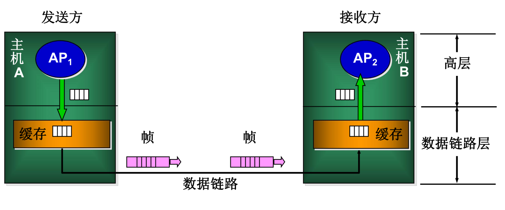

**透明传输机制**
为了防止数据载荷中出现的特定比特组合被误判为帧定界符（即“假标志”），必须采取透明传输措施：

- **字符填充法**：在面向字节的协议（如 PPP）中，如果数据中出现控制字符，通过插入转义字符进行区分
- **零比特填充法**：在面向比特的协议（如 HDLC）中，若数据中连续出现 5 个“1”，则自动插入一个“0”，接收端执行逆操作。这确保了帧定界符（如 `01111110`）在数据流中的唯一性

### 差错控制 / Error Control

物理信道受噪声影响可能产生比特差错
数据链路层主要通过**循环冗余校验 (CRC)** 技术进行差错检测。发送端根据生成多项式计算出帧检验序列 (FCS) 并附加在帧尾；接收端通过模 2 运算验证数据的完整性

值得注意的是，现代以太网通常仅提供**无差错接受**（即凡是校验错误的帧直接丢弃，不负责重传），可靠传输通常由上层传输层（TCP）或特定的链路层协议（如无线链路）通过**自动重传请求 (ARQ)** 机制（包括停止-等待协议、后退 N 帧协议、选择重传协议）来实现

### 介质访问控制 / MAC

在广播信道（如总线型以太网或无线局域网）中，多个设备共享同一物理介质。为了解决多设备同时发送数据导致的**冲突 (Collision)**，必须采用介质访问控制协议

#### 载波监听多点接入 / CSMA

**CSMA/CD (载波监听多点接入/碰撞检测)**
有线以太网早期采用的随机接入协议。其工作流程遵循“先听后说，边听边说”原则：

1. **载波监听**：发送前检测信道是否空闲
2. **碰撞检测**：发送过程中监控信道电压变化。一旦检测到冲突，立即停止发送并广播干扰信号
3. **二进制指数退避算法**：发生冲突后，节点随机等待一段时间后重传。随着冲突次数增加，等待时间的随机范围呈指数级扩大，以降低再次冲突的概率

**CSMA/CA (载波监听多点接入/碰撞避免)**
无线局域网 (Wi-Fi) 由于无法在发送时准确检测碰撞（隐蔽站问题），采用了**碰撞避免**机制，通过帧间间隔 (IFS) 和预约信道（RTS/CTS 握手）来降低冲突概率

### MAC 地址与以太网帧 / MAC Address & Ethernet Frame

**MAC 地址 (Media Access Control Address)**
MAC 地址是烧录在网络接口控制器 (NIC) 上的 48 位全球唯一标识符，属于**物理地址**。与 IP 地址（逻辑地址）不同，MAC 地址是扁平化的，不具备层次结构，仅用于在局域网内部区分不同的硬件设备

**以太网帧结构**
标准的以太网 V2 帧包含目的 MAC 地址、源 MAC 地址、类型字段（标识上层协议，如 IP）、数据载荷及帧检验序列 (FCS)。以太网规定了**最大传输单元 (MTU)**，通常为 1500 字节，限制了数据载荷的最大长度

### 地址解析协议 / ARP

在实际通信中，发送方通常仅知晓目标的 IP 地址。ARP 协议解决了从 IP 地址到 MAC 地址的动态映射问题

#### ARP 工作流程

1. **广播请求**：源主机在局域网内广播发送 ARP 请求分组，询问特定 IP 地址对应的 MAC 地址
2. **单播响应**：目标主机收到请求后，识别出自身的 IP 地址，并以单播形式返回包含自身 MAC 地址的 ARP 响应分组
3. **ARP 缓存**：源主机收到响应后，将映射关系存入本地 ARP 高速缓存表，并设定老化时间，以避免重复广播

我们可以用`arp -a`来看看arp自己电脑的arp表

```shell
$ arp -a
? (192.168.101.146) at c8:d3:ff:0f:70:0e [ether] on wlp4s0
? (192.168.101.42) at 74:9e:f5:d7:f4:bb [ether] on wlp4s0
...
```

### 交换机与 VLAN / Switch & VLAN

#### 交换机原理 / Switching

传统的集线器工作在物理层，单纯转发比特，无法隔离冲突。交换机则是工作在数据链路层的多端口网桥

- **自学习算法**：交换机通过分析进入端口的帧的**源 MAC 地址**，构建并维护 MAC 地址转发表
- **帧转发**：交换机根据**目的 MAC 地址**查找转发表，将帧精确转发至目标端口（若地址未知则泛洪）
- **隔离冲突域**：交换机的每个端口都是一个独立的冲突域，支持全双工通信，显著提升了网络性能

#### 虚拟局域网 / VLAN

虽然交换机隔离了冲突域，但所有端口仍属于同一个**广播域**。为了控制广播风暴和增强安全性，引入了 VLAN 技术（IEEE 802.1Q 标准）
通过在以太网帧中插入 **VLAN Tag（标签）**，管理员可以在逻辑上将物理网络划分为多个独立的广播域。不同 VLAN 之间的通信无法直接通过二层交换实现，必须经过第三层设备（路由器或三层交换机）进行路由转发

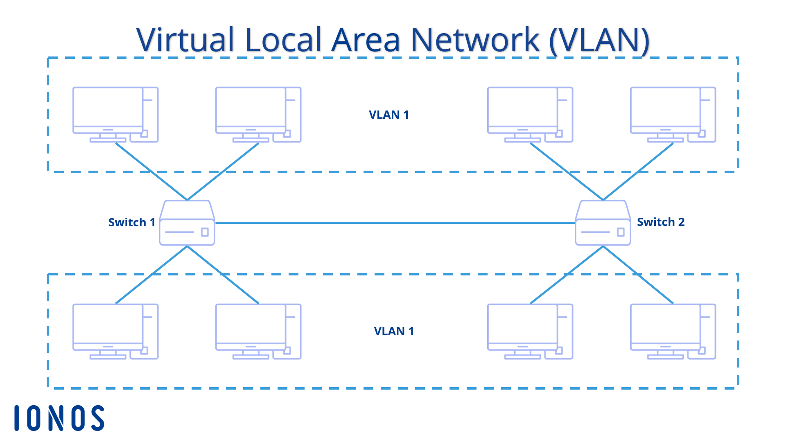
> 小知识点

- 集线器 (Hub)：既不隔离冲突，也不隔离广播
- 交换机 (Switch)：隔离冲突，**不**隔离广播
- 路由器 (Router) / VLAN：隔离冲突，**也**隔离广播

### 广域网链路控制 / WAN Link Control

与局域网不同，广域网 (WAN) 通常使用点对点连接，无需解决介质访问冲突问题，主要关注点对点的封装效率

- **PPP (Point-to-Point Protocol)**：目前最广泛使用的广域网协议。它支持多种网络层协议，提供错误检测、链路配置（LCP）和网络控制（NCP）。PPP 是面向字节的，采用字节填充法实现透明传输
- **HDLC (High-Level Data Link Control)**：一种面向比特的同步数据链路层协议，采用零比特填充法。虽然具有较高的理论价值，但在实际互联网应用中已被 PPP 取代

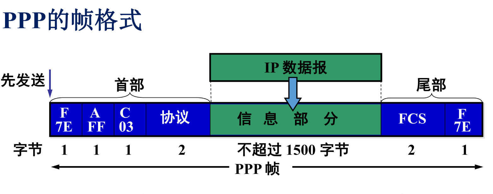

## 物理层 / Physical Layer

物理层位于协议栈的最底层，其核心任务是确定传输介质的机械、电气、功能和过程特性，以便在物理媒体上透明地传输**比特流 (Bit stream)**

### 信号调制 / Signal Modulation

计算机内部的数字信号需要转换为适合物理信道传输的模拟信号，这一过程称为调制

- **基带传输**：直接传输数字基带信号的电压脉冲，通常用于近距离传输（如局域网）。
- **频带传输**：利用载波将数字信号搬移到较高的频段。常见的调制方法包括调幅 (ASK)、调频 (FSK) 和调相 (PSK)

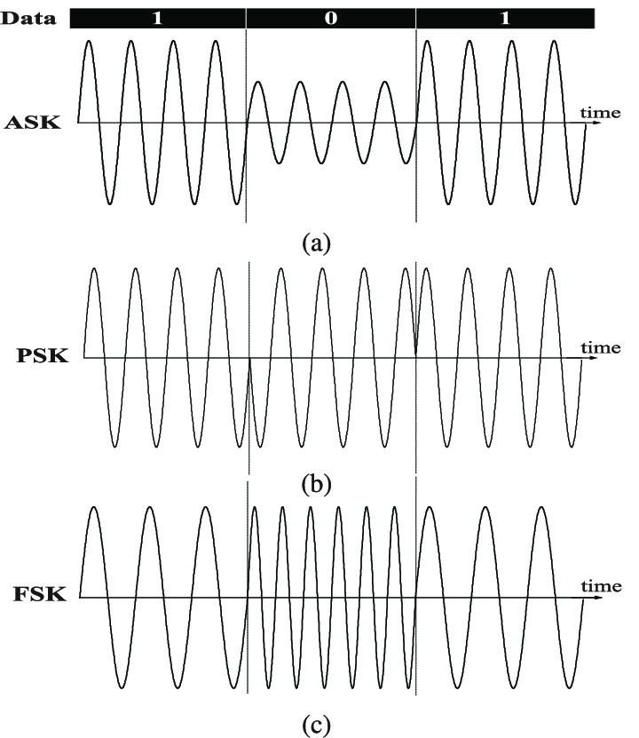

### 奈奎斯特定理 / Nyquist Theorem

1924 年，奈奎斯特推导出了在**理想低通（无噪声）** 信道下的极限数据传输速率。该定理指出，为了避免**码间串扰 (ISI)**，信道的最高码元传输速率受限于信道带宽

公式表达为：
$$ C_{max} = 2W \times \log_2 V $$
其中 $W$ 为信道带宽 (Hz)，$V$ 为信号电平的离散等级数。该定理揭示了在无噪声环境下，提升数据传输率的唯一途径是采用更高阶的调制技术（增加 $V$），从而使每个码元携带更多的比特信息

### 香农定理 / Shannon Theorem

1948 年，香农进一步提出了在**高斯白噪声**干扰下的信道容量极限。该定理定义了数据传输速率的绝对物理上限

公式表达为：
$$ C = B \times \log_2(1 + \frac{S}{N}) $$
其中 $B$ 为带宽，$S/N$ 为信噪比（功率比）。香农定理表明，在噪声不可避免的实际信道中，通过无限增加信号电平级数并不能无限提升速率，因为过密的电平会被噪声淹没

> **实际信道的极限传输速率由奈奎斯特定理和香农定理计算结果的较小值决定**

### 数据编码 / Data Encoding

数据编码涉及将比特转换为具体的信号波形，重点在于时钟同步与频谱效率

**非归零编码 (NRZ)**
NRZ 用高低电平直接表示 1 和 0。其主要缺陷是缺乏自同步能力，长串的连续 0 或 1 会导致接收端时钟漂移，且存在直流分量

**曼彻斯特编码 (Manchester)**
曼彻斯特编码规定每个比特周期的中心必须发生电压跳变。这种跳变既代表数据（例如低到高为 0，高到低为 1），也作为时钟信号供接收端同步。虽然它实现了**自同步**，但其代价是频带宽度需求加倍（调制速率是数据率的 2 倍）

**差分曼彻斯特编码**
这是一种抗干扰能力更强的编码。它同样在位中心跳变用于同步，但利用**位开始边界**是否发生跳变来表示数据（如无跳变表示 1，有跳变表示 0）
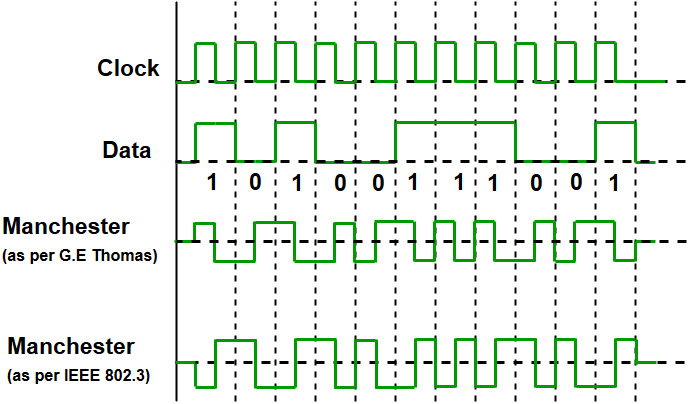

### 传输介质与模式 / Media & Modes

物理层的传输介质主要分为导引型（如双绞线、光纤）和非导引型（如无线电波）。光纤利用光的全反射原理传输，其中**单模光纤**因纤芯极细、无模间色散而适用于长距离主干传输；**多模光纤**则适用于短距离传输
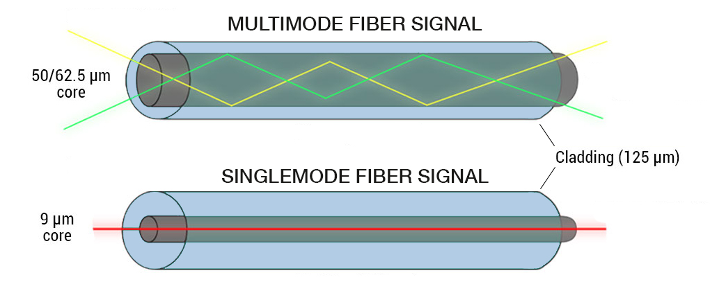

在通信交互方式上，分为三种模式：

- **单工**：仅允许单方向传输
- **半双工**：允许双向传输，但某一时刻只能单向进行
- **全双工**：允许通信双方同时进行双向传输
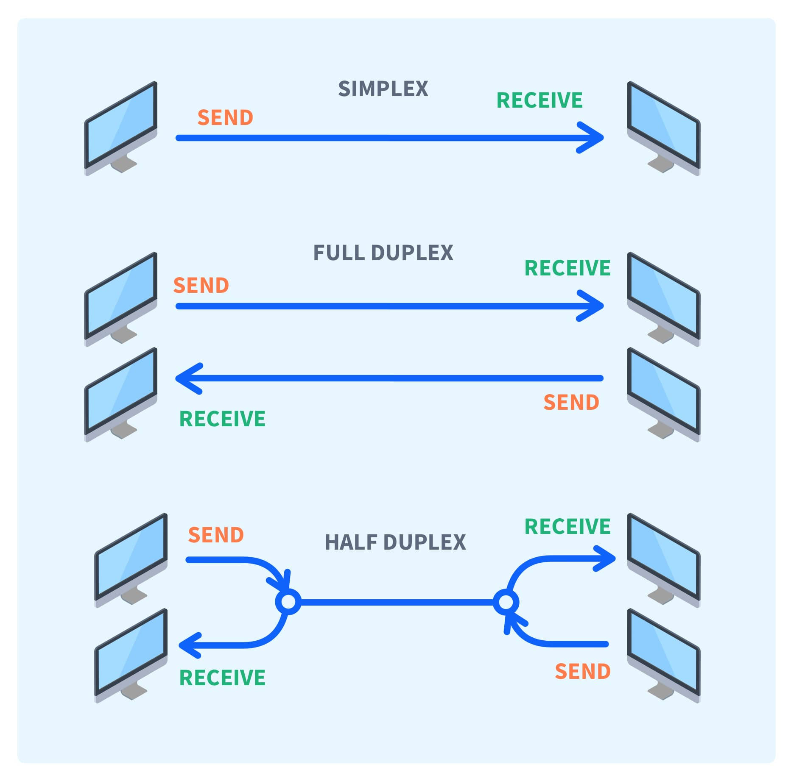

### 互连设备 / Interconnection Devices

物理层设备主要包括中继器和集线器
**中继器 (Repeater)** 的作用是对衰减的信号进行**整形与再生**，以恢复波形并延长传输距离
**集线器 (Hub)** 实质上是一个多端口中继器。由于它将输入信号广播到所有端口，导致所有连接设备处于同一个**冲突域**，总带宽由所有用户共享，且网络效率随节点增加而急剧下降

## more

其实挺悲哀的，写了几天的文档结果根本没人在意
