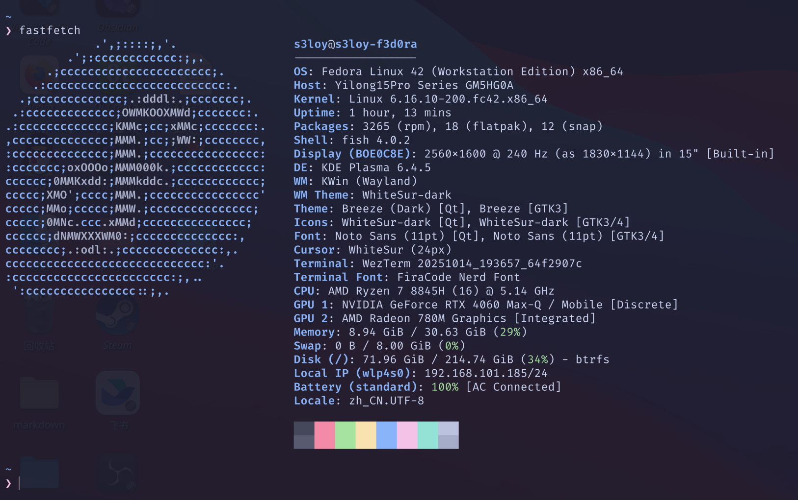
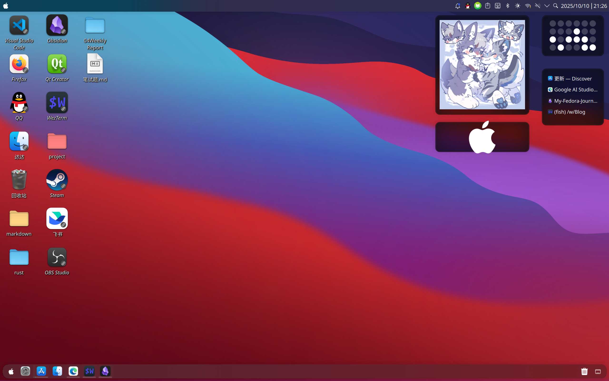

> 冷知识:
> - F2是机械革命翼龙15pro开bios的按键
> - fedora是rpm系，可以直接用dnf install xxx.rpm
> - fedora不是arch
> - fedora的重音是这样的 fe'dora
> 叠甲：仅限个人使用，有错误是正常的

## 1. Desktop(KDE plasma 6)::stop using GNOME!

前端本来用的是默认的`GNOME`，因为没有桌面很难受所以换成了`KDE plasma`
```shell
$ sudo dnf install @kde-desktop-environment
```

后面可以在登录页面切换桌面前端

### 1.1. 配置
s3是果粉
- `显示和监视器配置-显示器配置-旧式应用程序(X11)` 一定要选 `由应用程序进行缩放`
- `颜色和主题-全局主题`：WhiteSur-Dark
- `颜色和主题-全局主题-颜色`有问题，不能自动下下来暗色配色，要去[WhiteSur Color - KDE Store](https://store.kde.org/p/1398831)手动下载，然后 从文件安装 选择`WhiteSurDark.colors`
- `颜色和主题-全局主题-光标`：Breeze微风深色    官方这个很好看了
- `颜色和主题-全局主题-应用程序外观样式`：Breeze微风
- `颜色和主题-全局主题-应用程序外观样式-配置GNOME/GTK应用程序外观样式`：WhiteSur-Dark
- `文字和字体-文字`：FiraCode Nerd Font 11pt   （有没有推荐的好字体awa）
**`动效`**
- 窗口打开/关闭：按比例缩放
- 窗口最大化：拉伸动效
- 窗口最小化：最小过渡动画(收缩)
- 窗口全屏：拉伸效果
- 虚拟桌面切换器：滑动
点一下`更多效果设置`来到`窗口管理-桌面特效`
以下只写出我勾选的选项
- 外观增强-无响应窗口灰化
- 外观增强-窗口背景虚化
- 外观增强-窗口透明度-常规透明度设置-仅仅稍微降低了一点`移动中窗口`的透明度
- 外观增强-高亮显示屏幕和周围四角
- 窗口管理功能-桌面概览
### 1.2. 桌面优化
- `下方面板设置：`对齐：居中;宽度：填满宽度;显示/隐藏：总是显示;不透明度：自适应;悬浮：面板和小程序;面板高度：40
> 添加的组件：右侧：虚拟桌面切换器，暂时显示桌面
- 上方面板设置：对齐：靠左;宽度：填满宽度;显示/隐藏：总是显示;不透明度：自适应;悬浮：已禁用;面板高度：32
> 添加的组件：左侧：应用程序启动器
> 右侧从右到左：数字时钟-搜索-系统托盘
- `桌面添加组件`:媒体相框，二进制时钟，窗口列表，网络速度（修改成了内存使用率）
> Fedora 43默认使用的已经变成了KDE plasma
> 去掉了X11
> Do you like Wayland?
### 1.3. Tricks
在`KDE plasma`上，有一些功能你会很喜欢的
#### 1.3.1. 窗口分屏
快捷键`Meta`+`键盘左键和右键和上下键`
当然也可以直接拖动窗口到左右边缘也可以分屏
#### 1.3.2. KRunner
快捷键`alt`+`空格`
全局搜索和应用启动等等等等
功能可以自行探索
#### 1.3.3. 切换虚拟桌面
快捷键`ctrl`+`Meta`+`键盘左右键`
如果配置了桌面循环切换食用更佳a
#### 1.3.4. 切换应用
快捷键`Meta`+`tab`或者`alt`+`tab`
#### 1.3.5. 桌面视图
快捷键`Meta`+`G`
使用起来很方便
## 2. Boot(rEFInd)::UEFI Boot Manager
因为电脑上是双系统，因此需要一个折中的启动方案
没有选择使用grub引导启动，而是使用了`rEFInd`
```shell
$ sudo dnf install rEFInd

$ sudo refind-install
ShimSource is none
Installing rEFInd on Linux....
ESP was found at /boot/efi using vfat

CAUTION: Your computer appears to be booted with Secure Boot, but you haven't
specified a valid shim.efi file source. Chances are you should re-run with
the --shim option. You can read more about this topic at
http://www.rodsbooks.com/refind/secureboot.html.

Do you want to proceed with installation (Y/N)? n

```
在这看出来问题了，脚本并不能自主识别本地efi在哪个地方
因此使用了`sudo refind-install --shim /boot/efi/EFI/fedora/shimx64.efi`

```shell
$ sudo refind-install --shim /boot/efi/EFI/fedora/shimx64.efi
ShimSource is /boot/efi/EFI/fedora/shimx64.efi
Installing rEFInd on Linux....
ESP was found at /boot/efi using vfat
Installing driver for ext4 (ext4_x64.efi)
Storing copies of rEFInd Secure Boot public keys in //etc/refind.d/keys
Copied rEFInd binary files

Copying sample configuration file as refind.conf; edit this file to configure
rEFInd.

Creating new NVRAM entry
rEFInd is set as the default boot manager.
Creating //boot/refind_linux.conf; edit it to adjust kernel options.
The appropriate Secure Boot key is already enrolled.

Installation has completed successfully.

```
这边看起来说都弄好了，结果我到MoK那边去找的时候傻眼了，发现这个keys目录是空的啊！
折腾死了，最后还是选择关掉了`Secure Boot`
目前配置仍有问题，自动的识别会多出来很多的启动项
不过确实可以自动扫到windows和fedora,能统一启动是事实，但目前体验感不好

> 最新消息：
> 使用默认主题选到不需要的启动项可以使用Del按键选择隐藏，因此可以修改好之后再启动

同时如果类似fedora这种可以扫出来很多内容，要注意保留的是什么，我就用我自己扫到的举个例子
- Boot Microsoft EFI boot from EFI System Partition
- Boot EFI\fedora\grubx64.efi from EFI System Partition
- Boot EFI\fedora\gcdx64.efi from EFI System Partition
- Boot Fallback boot loader from EFI System Partition
- Boot vmlinuz-6.16.12-200.fc42.x86_64 from 1024 MiB ext4 Volume

这边只需要保留`Microsoft EFI boot`和最后一个 `vmlinuz`

使用的主题是
[GitHub - catppuccin/refind: 🔄 Soothing pastel theme for rEFInd](https://github.com/catppuccin/refind)

> 知识拓展
### 2.1. UEFI & BIOS

BIOS(**Basic Input/Output System**)
1. **POST (Power-On Self-Test，开机自检)**：
    - 它会先清点一遍家当，快速检查所有核心硬件是否连接正常并能工作。如果发现严重问题（比如没插内存条），它就会通过鸣叫来报警。
2. **寻找“交接手册”**：
    - 自检通过后，老管家需要找到操作系统的“启动说明书”。它不知道 Windows 或 Linux 是什么，但它知道要去一个**固定的地方**找。这个地方就是硬盘的**第一个扇区**，一个仅有 512 字节的微小空间，被称为**主引导记录 (MBR - Master Boot Record)**。
3. **加载并执行**：
    - BIOS 会把 MBR 里的这段代码加载到内存中，然后把计算机的控制权完全交给它。BIOS 的任务到此基本结束。
4. **交接班**：
    - 从 MBR 开始，后续的引导加载程序会一步步接力，最终将整个操作系统加载到内存中并运行起来。

> 在几十年的时间里，BIOS 工作得非常出色。它简单、可靠、标准化。但随着计算机技术爆炸式发展，这位老管家开始显得力不从心，他的几个“老毛病”越来越严重：
- **视野太窄（2.2TB 硬盘限制）**：MBR 使用 32 位地址来记录分区，这导致它能管理的最大硬盘容量只有 2.2TB。在今天 4TB、8TB 硬盘普及的时代，这成了一个无法逾越的障碍。
- **启动太慢**：BIOS 只能以 16 位的“老模式”运行，内存寻址能力只有 1MB，并且它是一个个地初始化硬件，效率低下。
- **不够安全**：BIOS 没有任何安全校验机制。黑客可以制造一种叫“Bootkit”的病毒，在操作系统启动前就感染 MBR，从而获得最高控制权，极难被发现和清除。
- **界面古老** 

在老式的 BIOS 启动方式下，电脑启动时会去硬盘的主引导记录 MBR 寻找启动代码，这种方法较为死板，因此聪明的人们就想到了另一种启动方式：UEFI
UEFI 统一可扩展固件接口启动方式，它不依赖于某个固定位置，而是规定硬盘上必须有一个特殊的小分区，这就是 ESP(**EFI System Partition**)

ESP的特点：
- **格式特殊**：它必须是 FAT32 格式。这是为了确保所有操作系统和 UEFI 固件都能无障碍地读写它
- **功能专一**：它的唯一作用就是存放**引导加载程序 (Bootloader)**

**ESP 是所有已安装操作系统的启动程序的存放地和调度中心**


UEFI 的革命性优势
1. **全新的启动方式：GPT 分区与 ESP 分区**
    - **告别 MBR，拥抱 GPT**：UEFI 不再使用 MBR，而是使用全新的 **GPT (GUID Partition Table)** 分区方案。GPT 使用 64 位地址，理论上可以支持高达 9.4 ZB (94 亿 TB) 的硬盘，彻底解决了容量限制问题。同时，它还支持多达 128 个主分区。
    - **告别固定位置，启用 ESP**：UEFI 不再去硬盘的第一个扇区找启动代码。而是在硬盘上建立一个标准化的 **EFI 系统分区 (ESP)**。所有操作系统的引导加载程序（.efi 文件）都以普通文件的形式存放在这个分区里。UEFI 固件会扫描并读取这些文件，生成一个启动菜单。这就像从“在门缝下塞纸条”升级到了“拥有一个标准的公告板”。
2. **安全启动 (Secure Boot)**
    - 这是 UEFI 最核心的优势之一。它建立了一个“信任链”。主板固件内置了一些受信任的公钥（通常是微软和硬件厂商的）。
    - 在启动时，UEFI 会校验引导加载程序（如 gcdx64.efi）的数字签名。如果签名无效或被篡改，UEFI 会拒绝执行它，从而从根源上杜绝了 Bootkit 病毒的入侵。
3. **现代化的人机交互**
    - UEFI 拥有**图形化界面**，支持鼠标操作，分辨率更高，设置选项也更丰富、更人性化。
    - 它是一个可扩展的平台，主板厂商可以在 UEFI 界面中内置各种高级功能，比如硬件诊断工具、在线固件更新，甚至是一个简易的网页浏览器。
4. **无与伦比的性能和速度**
    - UEFI 以 32 位或 64 位模式运行，可以访问全部系统内存，没有 1MB 的限制。
    - 它可以并行初始化硬件设备，大大缩短了开机自检时间，实现了“秒速开机”。
5. **强大的扩展性**
    - UEFI 可以加载独立的硬件驱动程序。这意味着它在操作系统启动前就能识别并使用更多的硬件，比如网卡（实现网络启动或远程诊断）。

### 2.2. efi里面的xdx
Boot EFI\fedora\grubx64.efi from EFI System Partition
我们以这个为例子，这是grub，Fedora 的主要引导加载程序 GRUB2(*GRand Unified Bootloader*)

Boot EFI\fedora\gcdx64.efi from EFI System Partition
这个是为了兼容**Secure Boot** 功能而存在的特殊程序**Secure Boot Shim**。安全启动是 UEFI 的一个安全特性，它要求所有启动代码都必须有受信任的数字签名，以防止恶意软件在操作系统启动前运行
grubx64.efi 没有微软的签名，而这个使用了shim来签名，很多时候这个都是默认的启动方式

Boot Fallback boot loader from EFI System Partition
这是**备用/应急引导加载程序**，UEFI 规范定义了一个标准的、通用的启动路径：EFI\BOOT\BOOTX64.EFI。如果因为某些原因（比如系统配置错误、NVRAM 记录丢失），UEFI 找不到为系统设置的特定启动项，它会最后尝试去寻找这个“备用路径”。

Boot vmlinuz-6.16.12-200.fc42.x86_64 from 1024 MiB ext4 Volume
这是直接从 Linux 文件系统启动 Linux 内核。现代 Linux 内核支持一种叫 EFISTUB 的技术，允许 UEFI 固件像运行一个 .efi 程序一样，直接加载并运行内核文件
我目前开机使用的就是这个，因为它确实快一些
## 3. System(fedora)::maybe U should know something about this
```shell

$ sudo dnf update

$ sudo dnf upgrade --refresh

$ sudo dnf search htop # 搜索包

$ sudo dnf remove htop # 删除

$ sudo dnf list installed # 查看安装的包

$ sudo dnf autoremove    # 删除孤立的依赖包

$ sudo dnf clean all    # 清理 DNF 缓存

$ ls -lha # 以更易读的格式 (-h) 显示详细信息 (-l)，包括隐藏文件 (-a)。
$ cd /etc/nginx # cd .. cd ~ or cd：
$ pwd # 康康你在哪里口牙
$ mkdir Projects

$ cp source.txt destination.txt
$ cp -r source_folder/ destination_folder/：-r 表示递归复制整个文件夹。

$ sudo journalctl --vacuum-time=2weeks   # 仅保留两周日志

$ flatpak uninstall --unused  # flatpak 不使用的包


$ du -sh ~/.cache
6.2G    /home/s3loy/.cache
$ rm -rf ~/.cache/*
```

不想写，用什么查什么吧
如果有的指令可以看看[运维组第一次授课 虚拟机和命令行 - 飞书云文档](https://njupt-sast.feishu.cn/wiki/OU2Ow2GxuiG2tVkPfLvcmfWxnEd)

## 4. Optimization(sudo)::using sudo without password
因为每次用`sudo`都需要密码觉得太麻烦了，所以修改了一下
```shell
$ sudo visudo
```

修改了这一行
`%wheel ALL=(ALL)       NOPASSWD: ALL`
然后保存就行了，因为本身用户就在wheel用户组内

## 5. Optimization(auto login)::login without password
系统设置-外观和样式-颜色和主题-全局主题-登录屏幕(SDDM)-右上角的“行为...”-自动登录 选择账户和前端并输入密码

## 6. Optimization(super .desktop)::快捷方式书写

`~/.local/share/applications/feishu.desktop`

```desktop
[Desktop Entry]
Version=1.0
Name=飞书
Comment=Feishu | Lark, a work collaboration platform
Exec=/opt/bytedance/feishu/feishu %U
Icon=/opt/bytedance/feishu/product_logo_256.png
Terminal=false
Type=Application
Categories=Network;Office;InstantMessaging;
```

## 7. Optimization(tlp)::Battery
```shell
$ sudo dnf install tlp tlp-rdw

$ sudo systemctl enable tlp.service
```


```shell
$ sudo dnf copr enable sunwire/envycontrol

$ sudo dnf install python3-envycontrol

$  sudo envycontrol -q
hybrid

$ sudo envycontrol --switch integrated # 集成显卡模式
$ sudo envycontrol --switch hybrid # 混合模式
$ sudo envycontrol --switch discrete # 独显直连模式
```

## 8. Optimization(blueman)::Bluetooth
```shell
$ sudo dnf install bluez gnome-bluetooth
仓库更新和加载中:
仓库加载完成。
Package "bluez-5.84-2.fc42.x86_64" is already installed.
Package "gnome-bluetooth-1:47.1-2.fc42.x86_64" is already installed.

Nothing to do.
```

但发现仍然识别不到耳机，
于是使用另外一个包
```shell
$ sudo dnf install blueman
```
连接成功

## 9. Tool(neofetch)::Show your OS
`fedora`的官方仓库里面是没有neofetch的，但是可以
`sudo dnf install fastfetch`
作为替代
但是官方其实也有给出解决方案
[Installation · dylanaraps/neofetch Wiki · GitHub](https://github.com/dylanaraps/neofetch/wiki/Installation#fedora--rhel--centos--mageia--openmandriva)

## 10. Tool(bleachbit)::Rubbish Sorting
```shell
$ sudo dnf install bleachbit
```

## 11. Tool(wezTerm+fish)::Come and use wezTerm!

默认的终端应用是`konsole`,有一点不满意，于是换成了**wezTerm**+**fish**+**oh my fish**

```shell
$ sudo dnf copr enable wezfurlong/wezterm-nightly

$ sudo dnf install wezterm

$ chsh -s /usr/bin/fish
```

在[nerd fonts](https://www.nerdfonts.com/font-downloads)
下载了FiraCode Nerd Font,解压到了`~/.fonts`文件夹
```shell
$ fc-cache -fv

$ nano ~/.wezterm.lua
```

```lua
local wezterm = require 'wezterm'
local config = {}
if wezterm.config_builder then
  config = wezterm.config_builder()
end

config.font = wezterm.font_with_fallback({
  'FiraCode Nerd Font',
  'Noto Color Emoji',
})

config.harfbuzz_features = {'calt=1', 'clig=1', 'liga=1'}

config.color_scheme = 'Catppuccin Mocha'

config.window_background_opacity = 0.95

config.window_padding = {
  left = 15,
  right = 15,
  top = 15,
  bottom = 10,
}


config.hide_tab_bar_if_only_one_tab = true


config.default_cursor_style = 'BlinkingBar'
config.enable_scroll_bar = false


config.keys = {
  -- 关闭当前窗格 (Pane)
  {
    key = 'w',
    mods = 'ALT',
    action = wezterm.action.CloseCurrentPane { confirm = true },
  },

  -- 关闭当前标签页 (Tab)
  {
    key = 'w',
    mods = 'CTRL|SHIFT',
    action = wezterm.action.CloseCurrentTab { confirm = false },
  },

  -- 水平分割窗格 (左右)
  {
    key = '-',
    mods = 'ALT',
    action = wezterm.action.SplitHorizontal { domain = 'CurrentPaneDomain' },
  },

  -- 垂直分割窗格 (上下)
  {
    key = '=',
    mods = 'ALT',
    action = wezterm.action.SplitVertical { domain = 'CurrentPaneDomain' },
  },
}


return config
```

```shell
$ curl https://raw.githubusercontent.com/oh-my-fish/oh-my-fish/master/bin/install | fish

$ omf install pure

$ sudo dnf install fzf
$ sudo dnf install grc

$ omf install fzf
$ omf install grc
$ omf install nvm
$ omf install z

```

使用的是`pure`主题

> 主题预览


## 12. Tool(Fcitx5)::Input method
一开始使用了`IBus` 
其中碰到的问题例如Obsidian不能使用中文输入法
在启动命令行参数里面添加了
`--enable-features=UseOzonePlatform --ozone-platform=wayland --enable-wayland-ime`
但是修改之后qq又不能输入了
然后又换回了`Fcitx5`

```shell
$ sudo dnf install fcitx5 fcitx5-chinese-addons fcitx5-configtool fcitx5-gtk fcitx5-qt
```

看有推荐使用Fcitx5 rime的，还没进行尝试

使用主题：[GitHub - thep0y/fcitx5-themes-candlelight: fcitx5的简约风格皮肤——烛光。](https://github.com/thep0y/fcitx5-themes-candlelight)
里面的winter
它的mac主题遮罩都有明显问题，观感不好不推荐使用

配置修改：
- 临时在当前和第一个输入法之间切换 绑定 `Shift` 可以方便适应
- 开启云拼音，把后端改成百度
- 去拼音里面把前后鼻音啥的纠错打打开

> 已知问题：
> 在使用qq的时候智能使用默认的双行输入而不是单行 即使通过`ctrl`+`alt`+`P` 也不可以更改输入模式


后续问题：
漏字
```shell
# /etc/environment
GTK_IM_MODULE=fcitx

XMODIFIERS=@im=fcitx

SDL_IM_MODULE=fcitx

```
添加了如下环境变量

## 13. Tool(snapper)::Backup
```shell
$ sudo dnf install snapper python3-dnf-plugin-snapper

$ sudo snapper -c root create-config /

# 它会自动进行备份
$ sudo snapper list
# │ 类型   │ 前期 # │ 日期                               │ 用户 │ 清空     │ 描述
     │ 用户数据
──┼────────┼────────┼────────────────────────────────────┼──────┼──────────┼──────────┼─────────
0 │ single │        │                                    │ root │          │ current  │
1 │ single │        │ 2025年10月21日 星期二 19时00分00秒 │ root │ timeline │ timeline │
2 │ single │        │ 2025年10月21日 星期二 20时00分00秒 │ root │ timeline │ timeline │
3 │ single │        │ 2025年10月21日 星期二 21时00分00秒 │ root │ timeline │ timeline │

```

可以参考[通过 Snapper 进行系统恢复和快照管理 \| 管理指南 \| SLES 12 SP5](https://documentation.suse.com/zh-cn/sles/12-SP5/html/SLES-all/cha-snapper.html)

`sudo snapper create --description "进行重要操作前的备份"`

后编：
`btrfs`下`snapper`保存快照太狠了，s3一看发现`df -h `和 `du -h`两边差距非常大，电脑出现了几十个G的幽灵文件
这一看`sudo snapper list` 发现存爆了都
所以需要删除
```shell
$ sudo snapper delete --sync 1-97
$ sudo snapper create --type single --description "手动备份-准备清理旧快照"

$ sudo snapper set-config "TIMELINE_LIMIT_HOURLY=0"
$ sudo snapper set-config "TIMELINE_LIMIT_DAILY=7"
$ sudo snapper set-config "TIMELINE_LIMIT_MONTHLY=3"
```
一下子干净多了
qaq

## 14. Tool(vscode)::米奇妙妙物
```shell
$ sudo rpm --import https://packages.microsoft.com/keys/microsoft.asc

$ sudo sh -c 'echo -e "[code]\nname=Visual Studio Code\nbaseurl=https://packages.microsoft.com/yumrepos/vscode\nenabled=1\ngpgcheck=1\ngpgkey=https://packages.microsoft.com/keys/microsoft.asc" > /etc/yum.repos.d/vscode.repo'

$ sudo dnf check-update
$ sudo dnf install code
```
插件: 还没有分类
- Better Comments Next
- bis
- Bookmarks
- Chinese (Simplified) (简体中文) Language Pack for Visual Studio Code
- Code Spell Checker
- CodeLLDB
- Container Tools
- Dependi
- Dev Containers
- Dotenv
- Dotenv Official +Vault
- Easy CodeSnap
- Even Better TOML
- Git Graph v3
- GitHub Copilot
- GitHub Copilot Chat
- Go
- Golang Tools
- Kubernetes
- LLDB DAP
- Makefile Tools
- Markdown All in One
- markdownlint
- Prettier - Code format
- Pylance
- Python
- Python Debugger
- Python Environments
- Remote - SSH
- Remote - SSH: Editing
- Remote - Tunnels
- Remote Development
- Remote Explorer
- Rust Syntax
- rust-analyzer
- Slidev
- Svelte for VS Code
- Swift
- TODO Highlight
- YAML
## 15. Tool(virtualization)::Visual Machine
```shell
$ sudo dnf install @virtualization
```
要关防火墙
```shell
$ sudo systemctl stop firewalld
```
ps：这个防火墙真的很烦人啊
然后还可以使用VMware Workstation
## 16. Tool(Termius)::ssh helper
官方只提供了`.deb`包，因此使用snap仓库内的包
```shell
$ sudo snap install termius-app
```

> 此处不推荐使用flatpak,因为文件不共享会导致SFTP不好用

然后就可以去应用程序那边找到了
`termius` 可以白嫖学生认证，用github账户关联下就可以了

ssh 连接服务器，然后爽用

```shell
$ sudo dnf install openssh-server

$ sudo systemctl start sshd

$ sudo systemctl enable sshd

$ systemctl daemon-reload
```


## 17. Workshop(Obsidian+Gdrive+rclone)::working with different workspaces
方案：
- markdown：**Obsidian+OneDrive**
- coding：**github&gitlab**
- [ ] TODO： CI/CD

[OneDrive for linux](https://github.com/abraunegg/onedrive/blob/master/docs/install.md)
```shell
$ sudo dnf install onedrive
```
OneDrive失败，**南邮管理员没开启认证**

> 切换方案 Google Drive

[**rclone**](https://rclone.org/)
```shell
$ sudo -v ; curl https://rclone.org/install.sh | sudo bash
...
rclone v1.71.1 has successfully installed.
Now run "rclone config" for setup. Check https://rclone.org/docs/ for more details.

```

```shell
$ rclone config

# 后续可以参考https://www.cnblogs.com/Undefined443/p/18615701
```
使用方法:
> 我的本地config命名就是 **work_space** ()
> 所以如果config命名不一样救修改 " : "前面的那个work_space即可
> 位置要根据自己文件存放的位置使用


```shell
# 从上游拉下来
$ rclone sync -P work_space:work_space /workshop/work_space/
# 从本地提交上去
$ rclone sync -P /workshop/work_space/ work_space:work_space
# 查询
$ rclone lsd work_space:work_space   
$ rclone ls work_space:work_space   
# blog备份
$ rclone sync -P /workshop/Blog/source/_posts  work_space:work_space/s3_workshop/Blogs  
```

```shell
$ rclone sync -P work_space: /workshop/work_space/ --drive-root-folder-id 1gQg-FNNg2kLR8vnQMV9b5-Mqpro2roMN #下载

$ rclone sync -P /workshop/work_space/ work_space: --drive-root-folder-id 1gQg-FNNg2kLR8vnQMV9b5-Mqpro2roMN #上传
```

> 新的方法：
> 使用了fish的自定义函数，创建了一个workshop指令

```sh
function workshop --description "Sync local workshop directory with Google Drive"
    set filter_file ~/.config/rclone/filter-rules.txt
    
    set rclone_opts --checkers=16 --transfers=2 --low-level-retries=20

    switch $argv[1]
        case pull
            echo (set_color green)"⬇️  Syncing from Google Drive to local..."(set_color normal)
            rclone sync -P work_space: /workshop/work_space/ --drive-root-folder-id 1gQg-FNNg2kLR8vnQMV9b5-Mqpro2roMN --filter-from $filter_file $rclone_opts
            echo (set_color green)"✅ Pull complete."(set_color normal)

        case push
            echo (set_color cyan)"⬆️  Syncing from local to Google Drive..."(set_color normal)
            rclone sync -P /workshop/work_space/ work_space: --drive-root-folder-id 1gQg-FNNg2kLR8vnQMV9b5-Mqpro2roMN --filter-from $filter_file $rclone_opts
            echo (set_color cyan)"✅ Push complete."(set_color normal)

        case '*'
            echo "Usage: workshop [subcommand]"
            echo ""
            echo "Subcommands:"
            echo (set_color green)"  pull"(set_color normal)"   Download changes from Google Drive"
            echo (set_color cyan)"  push"(set_color normal)"   Upload local changes to Google Drive"
    end
end
```

## 18. Environment(rust)::加入rust神教喵喵加入rust神教

`curl --proto '=https' --tlsv1.2 -sSf https://sh.rustup.rs | sh  `

```shell
$ curl --proto '=https' --tlsv1.2 -sSf https://sh.rustup.rs | sh  
info: downloading installer  
  
Welcome to Rust!  
  
This will download and install the official compiler for the Rust  
programming language, and its package manager, Cargo.  
  ...
  
1) Proceed with standard installation (default - just press enter)  
2) Customize installation  
3) Cancel installation
```

直接回车就好了
```shell
info: default toolchain set to 'stable-x86_64-unknown-linux-gnu'  
  
 stable-x86_64-unknown-linux-gnu installed - rustc 1.90.0 (1159e78c4 2025-09-14)  
  
  
Rust is installed now. Great!  
  
To get started you may need to restart your current shell.  
This would reload your PATH environment variable to include  
Cargo's bin directory ($HOME/.cargo/bin).  
  
To configure your current shell, you need to source  
the corresponding env file under $HOME/.cargo.  
  
This is usually done by running one of the following (note the leading DOT):  
. "$HOME/.cargo/env"            # For sh/bash/zsh/ash/dash/pdksh  
source "$HOME/.cargo/env.fish"  # For fish  
source $"($nu.home-path)/.cargo/env.nu"  # For nushell
```

```shell
s3loy@fedora:~$ rustc --version
rustc 1.90.0 (1159e78c4 2025-09-14)
s3loy@fedora:~$ cargo --version
cargo 1.90.0 (840b83a10 2025-07-30)
```

## 19. Environment(c/c++)::NJUPT wanted

```shell
sudo dnf group install development-tools

sudo dnf install gcc-c++
```

```shell
$ gdb --version
GNU gdb (Fedora Linux) 16.3-1.fc42
Copyright (C) 2024 Free Software Foundation, Inc.
License GPLv3+: GNU GPL version 3 or later <http://gnu.org/licenses/gpl.html>
This is free software: you are free to change and redistribute it.
There is NO WARRANTY, to the extent permitted by law.
$ g++ --version
g++ (GCC) 15.2.1 20250808 (Red Hat 15.2.1-1)
Copyright © 2025 Free Software Foundation, Inc.
本程序是自由软件；请参看源代码的版权声明。本软件没有任何担保；
包括没有适销性和某一专用目的下的适用性担保。
$ gcc --version
gcc (GCC) 15.2.1 20250808 (Red Hat 15.2.1-1)
Copyright © 2025 Free Software Foundation, Inc.
本程序是自由软件；请参看源代码的版权声明。本软件没有任何担保；
包括没有适销性和某一专用目的下的适用性担保。

```

Something U can use.
```shell
sudo dnf install cmake

sudo dnf install qt6-qtbase-devel qt6-qtsvg-devel qt6-qttools-devel

sudo dnf install qt-creator
```

## 20. Environment(Front-end)::nonononode_module

```shell
sudo dnf install nodejs npm

sudo dnf install google-chrome

curl -o- https://raw.githubusercontent.com/nvm-sh/nvm/v0.39.7/install.sh | bash

source ~/.bashrc

nvm install --lts
nvm use --lts
nvm alias default lts/*

npm install -g pnpm@latest-10
```

```shell
$ pnpm -v
10.17.1
$ npm -v
11.6.1
$ nvm -v
0.39.7
$ node -v
v22.20.0
```

## 21. Environment(docker)::Container
[Install Docker Engine on Fedora](https://docs.docker.com/engine/install/fedora/)

```shell
$ sudo dnf upgrade --refresh

$ sudo dnf -y install dnf-plugins-core

$ sudo dnf remove docker \
                  docker-client \
                  docker-client-latest \
                  docker-common \
                  docker-latest \
                  docker-latest-logrotate \
                  docker-logrotate \
                  docker-selinux \
                  docker-engine-selinux \
                  docker-engine

$ sudo dnf -y install dnf-plugins-core

$ sudo dnf-3 config-manager --add-repo https://download.docker.com/linux/fedora/docker-ce.repo

$ sudo dnf install docker-ce docker-ce-cli containerd.io docker-buildx-plugin docker-compose-plugin

# sudo systemctl enable --now docker 
# 如果你要自启用这个
$ sudo systemctl start docker

$ sudo docker run hello-world
```

```shell
$ sudo systemctl enable --now docker
Created symlink '/etc/systemd/system/multi-user.target.wants/docker.service' → '/usr/lib/systemd/system/docker.service'.
$ sudo systemctl start docker
$ sudo docker run hello-world
Unable to find image 'hello-world:latest' locally
latest: Pulling from library/hello-world
17eec7bbc9d7: Pull complete
Digest: sha256:54e66cc1dd1fcb1c3c58bd8017914dbed8701e2d8c74d9262e26bd9cc1642d31
Status: Downloaded newer image for hello-world:latest

Hello from Docker!
This message shows that your installation appears to be working correctly.

To generate this message, Docker took the following steps:
 1. The Docker client contacted the Docker daemon.
 2. The Docker daemon pulled the "hello-world" image from the Docker Hub.
    (amd64)
 3. The Docker daemon created a new container from that image which runs the
    executable that produces the output you are currently reading.
 4. The Docker daemon streamed that output to the Docker client, which sent it
    to your terminal.

To try something more ambitious, you can run an Ubuntu container with:
 $ docker run -it ubuntu bash

Share images, automate workflows, and more with a free Docker ID:
 https://hub.docker.com/

For more examples and ideas, visit:
 https://docs.docker.com/get-started/
```

## 22. Environment(k8s)::Container
```shell
$ curl -LO https://storage.googleapis.com/minikube/releases/latest/minikube-latest.x86_64.rpm
$ sudo rpm -Uvh minikube-latest.x86_64.rpm

$ minikube start

$ minikube kubectl -- get pods -A

$ kubectl completion fish | source
fish: kubectl: 未找到命令...
提供此文件的软件包是：
'kubernetes1.29-client'
'kubernetes1.30-client'
'kubernetes1.31-client'
'kubernetes1.32-client'
'kubernetes1.33-client'
'kubernetes1.34-client'

$ sudo dnf install kubernetes1.34-client
$ kubectl completion fish | source
```
### 22.1. k8s简单实验：nginx服务器

```shell
$ minikube start
$ kubectl create deployment nginx-deployment --image=nginx

$ kubectl get deployment
NAME               READY   UP-TO-DATE   AVAILABLE   AGE
nginx-deployment   1/1     1            1           43s

$ kubectl get pods
NAME                                READY   STATUS    RESTARTS   AGE
nginx-deployment-7457467ffd-6fxtv   1/1     Running   0          87s

$ kubectl expose deployment nginx-deployment --type=NodePort --port=80
service/nginx-deployment exposed

$ kubectl get service nginx-deployment
NAME               TYPE       CLUSTER-IP     EXTERNAL-IP   PORT(S)        AGE
nginx-deployment   NodePort   10.98.106.65   <none>        80:31891/TCP   18s

$ minikube service nginx-deployment
┌───── ┬─────────┬────── ┬───────────── ┐
│ NAMESPACE │       NAME       │ TARGET PORT │            URL            │
├───── ┼─────────┼────── ┼───────────── ┤
│ default   │ nginx-deployment │ 80          │ http://192.168.49.2:31891 │
└───── ┴─────────┴────── ┴───────────── ┘
🎉  正通过默认浏览器打开服务 default/nginx-deployment...
# 你怎么歪了
$ curl http://192.168.49.2:31891/ 
<!DOCTYPE html>
<html>
<head>
<title>Welcome to nginx!</title>
<style>
html { color-scheme: light dark; }
body { width: 35em; margin: 0 auto;
font-family: Tahoma, Verdana, Arial, sans-serif; }
</style>
</head>
<body>
<h1>Welcome to nginx!</h1>
<p>If you see this page, the nginx web server is successfully installed and
working. Further configuration is required.</p>

<p>For online documentation and support please refer to
<a href="http://nginx.org/">nginx.org</a>.<br/>
Commercial support is available at
<a href="http://nginx.com/">nginx.com</a>.</p>

<p><em>Thank you for using nginx.</em></p>
</body>
</html>
```
二则 多容器实验
```shell
$ kubectl scale deployment nginx-deployment --replicas=3
deployment.apps/nginx-deployment scaled

$ kubectl get pods
NAME                                READY   STATUS    RESTARTS   AGE
nginx-deployment-7457467ffd-489qf   1/1     Running   0          25s
nginx-deployment-7457467ffd-6fxtv   1/1     Running   0          7m5s
nginx-deployment-7457467ffd-b6km2   1/1     Running   0          25s

$ kubectl delete service nginx-deployment
service "nginx-deployment" deleted from default namespace

$ kubectl delete deployment nginx-deployment
deployment.apps "nginx-deployment" deleted from default namespace

$ curl http://192.168.49.2:31891/
curl: (7) Failed to connect to 192.168.49.2 port 31891 after 0 ms: Could not connect to server

$ kubectl get pods
No resources found in default namespace.

$ minikube stop
✋  正在停止节点 "minikube" ...
🛑  正在通过 SSH 关闭“minikube”…
🛑  1 个节点已停止。

$ minikube delete
🔥  正在删除 docker 中的“minikube”…
🔥  正在删除容器 "minikube" ...
🔥  正在移除 /home/s3loy/.minikube/machines/minikube…
💀  已删除所有关于 "minikube" 集群的痕迹。
```
三则 多节点创建
```shell
$ minikube start --nodes 3 -p multi-node-cluster
😄  Fedora 42 上的 [multi-node-cluster] minikube v1.37.0
✨  自动选择 docker 驱动。其他选项：podman, qemu2, none, ssh
📌  使用具有 root 权限的 Docker 驱动程序
👍  在集群中 "multi-node-cluster" 启动节点 "multi-node-cluster" primary control-plane
🚜  正在拉取基础镜像 v0.0.48 ...
❗  minikube was unable to download gcr.io/k8s-minikube/kicbase:v0.0.48, but successfully downloaded docker.io/kicbase/stable:v0.0.48@sha256:7171c97a51623558720f8e5878e4f4637da093e2f2ed589997bedc6c1549b2b1 as a fallback image
🔥  创建 docker container（CPU=2，内存=3072MB）...
🐳  正在 Docker 28.4.0 中准备 Kubernetes v1.34.0…
🔗  配置 CNI (Container Networking Interface) ...
🔎  正在验证 Kubernetes 组件...
    ▪ 正在使用镜像 gcr.io/k8s-minikube/storage-provisioner:v5
🌟  启用插件： storage-provisioner, default-storageclass

👍  在集群中 "multi-node-cluster" 启动节点 "multi-node-cluster-m02" worker
🚜  正在拉取基础镜像 v0.0.48 ...
🔥  创建 docker container（CPU=2，内存=3072MB）...
🌐  找到的网络选项：
    ▪ NO_PROXY=192.168.49.2
🐳  正在 Docker 28.4.0 中准备 Kubernetes v1.34.0…
    ▪ env NO_PROXY=192.168.49.2
🔎  正在验证 Kubernetes 组件...

👍  在集群中 "multi-node-cluster" 启动节点 "multi-node-cluster-m03" worker
🚜  正在拉取基础镜像 v0.0.48 ...
🔥  创建 docker container（CPU=2，内存=3072MB）...
🌐  找到的网络选项：
    ▪ NO_PROXY=192.168.49.2,192.168.49.3
🐳  正在 Docker 28.4.0 中准备 Kubernetes v1.34.0…
    ▪ env NO_PROXY=192.168.49.2
    ▪ env NO_PROXY=192.168.49.2,192.168.49.3                                                                                                                                         🔎  正在验证 Kubernetes 组件...
🏄  完成！kubectl 现在已配置，默认使用"multi-node-cluster"集群和"default"命名空间

$ kubectl get nodes
NAME                     STATUS   ROLES           AGE     VERSION
multi-node-cluster       Ready    control-plane   3m21s   v1.34.0
multi-node-cluster-m02   Ready    <none>          3m8s    v1.34.0
multi-node-cluster-m03   Ready    <none>          2m58s   v1.34.0

$ minikube status -p multi-node-cluster
multi-node-cluster
type: Control Plane
host: Running
kubelet: Running
apiserver: Running
kubeconfig: Configured

multi-node-cluster-m02
type: Worker
host: Running
kubelet: Running

multi-node-cluster-m03
type: Worker
host: Running
kubelet: Running

$ kubectl create deployment nginx-deployment --image=nginx
deployment.apps/nginx-deployment created

$ kubectl scale deployment nginx-deployment --replicas=6
deployment.apps/nginx-deployment scaled

$ kubectl get pods -o wide
NAME                                READY   STATUS    RESTARTS   AGE   IP           NODE                     NOMINATED NODE   READINESS GATES
nginx-deployment-7457467ffd-67tv9   1/1     Running   0          54s   10.244.2.2   multi-node-cluster-m03   <none>           <none>
nginx-deployment-7457467ffd-6vt69   1/1     Running   0          54s   10.244.2.3   multi-node-cluster-m03   <none>           <none>
nginx-deployment-7457467ffd-8wsmk   1/1     Running   0          54s   10.244.1.3   multi-node-cluster-m02   <none>           <none>
nginx-deployment-7457467ffd-g9ngm   1/1     Running   0          54s   10.244.0.4   multi-node-cluster       <none>           <none>
nginx-deployment-7457467ffd-gjk49   1/1     Running   0          75s   10.244.1.2   multi-node-cluster-m02   <none>           <none>
nginx-deployment-7457467ffd-vffxz   1/1     Running   0          54s   10.244.0.3   multi-node-cluster       <none>           <none>

$ minikube profile list
┌──────────┬────┬──── ┬───────┬──── ┬────┬─── ┬────────┬──────────┐
│      PROFILE       │ DRIVER │ RUNTIME │      IP      │ VERSION │ STATUS │ NODES │ ACTIVE PROFILE │ ACTIVE KUBECONTEXT │
├──────────┼────┼──── ┼───────┼──── ┼────┼─── ┼────────┼──────────┤
│ multi-node-cluster │ docker │ docker  │ 192.168.49.2 │ v1.34.0 │ OK     │ 3     │                │ *                  │
└──────────┴────┴──── ┴───────┴──── ┴────┴─── ┴────────┴──────────┘

$ kubectl expose deployment nginx-deployment --type=NodePort --port=80

$ minikube ip -p multi-node-cluster
192.168.49.2

$ curl 192.168.49.2
curl: (7) Failed to connect to 192.168.49.2 port 80 after 0 ms: Could not connect to server
$ kubectl get service nginx-deployment
NAME               TYPE       CLUSTER-IP       EXTERNAL-IP   PORT(S)        AGE
nginx-deployment   NodePort   10.106.236.139   <none>        80:32530/TCP   3m38s

$ curl http://192.168.49.2:32530/
<!DOCTYPE html>
<html>
<head>
<title>Welcome to nginx!</title>
<style>
html { color-scheme: light dark; }
body { width: 35em; margin: 0 auto;
font-family: Tahoma, Verdana, Arial, sans-serif; }
</style>
</head>
<body>
<h1>Welcome to nginx!</h1>
<p>If you see this page, the nginx web server is successfully installed and
working. Further configuration is required.</p>

<p>For online documentation and support please refer to
<a href="http://nginx.org/">nginx.org</a>.<br/>
Commercial support is available at
<a href="http://nginx.com/">nginx.com</a>.</p>

<p><em>Thank you for using nginx.</em></p>
</body>
</html>

$ kubectl delete service nginx-deployment
service "nginx-deployment" deleted from default namespace
$ kubectl delete deployment nginx-deployment
deployment.apps "nginx-deployment" deleted from default namespace
$ minikube delete -p multi-node-cluster
🔥  正在删除 docker 中的“multi-node-cluster”…
🔥  正在删除容器 "multi-node-cluster" ...
🔥  正在删除容器 "multi-node-cluster-m02" ...
🔥  正在删除容器 "multi-node-cluster-m03" ...
🔥  正在移除 /home/s3loy/.minikube/machines/multi-node-cluster…
🔥  正在移除 /home/s3loy/.minikube/machines/multi-node-cluster-m02…
🔥  正在移除 /home/s3loy/.minikube/machines/multi-node-cluster-m03…
💀  已删除所有关于 "multi-node-cluster" 集群的痕迹。
```
### 22.2. k8s概念简单解析和minikube使用方法
#### 22.2.1. k8s内重要概念
- Pod (最小工作单元)
> Pod 是 K8s 中可以创建和管理的最小部署单元。一个 Pod 包含一个或多个紧密相关的容器（比如一个主应用容器和一个日志收集容器）。这些容器共享同一个网络环境和存储卷，可以把它们看作一个整体。
> 通常使用更高层管理。
- Deployment (部署)
> 确保指定数量的 Pod 正在运行。副本管理，滚动更新，回滚三大功能。
- Service (服务)
> 服务发现，会自动跟踪其后端 Pod 的变化；负载均衡，将请求优先发送到健康 Pod
- Namespace (命名空间)
> 资源进行逻辑上的隔离,创建的 Deployment、Service 等资源都属于某一个 Namespace。默认情况下，它们都在 default 命名空间里.

#### 22.2.2. kubectl
[**kube control**](https://kubernetes.io/zh-cn/docs/reference/kubectl/)用于 K8s 集群交互

使用方法 
```shell
$ kubectl [command] [TYPE] [NAME] [flags]
```

## 23. Gaming(gamemode)::Games optimize

```shell
$ sudo dnf install gamemode

$ systemctl --user enable gamemoded.service && systemctl --user start gamemoded.service
```


## 24. Sideloading(legacy-ios-kit)
[GitHub - LukeZGD/Legacy-iOS-Kit: An all-in-one tool to restore/downgrade, save SHSH blobs, jailbreak legacy iOS devices, and more](https://github.com/LukeZGD/Legacy-iOS-Kit)

目前还没有使用过，但看起来是一个很好的侧载方案
## 25. Trick(Wayland-Docker-OSX)::Building macOS with docker
```shell
$ docker run -it \                                                           
             --device /dev/kvm \
             -p 50922:10022 \
             -e XDG_RUNTIME_DIR=/tmp \
             -e WAYLAND_DISPLAY=$WAYLAND_DISPLAY \
             -v $XDG_RUNTIME_DIR/$WAYLAND_DISPLAY:/tmp/$WAYLAND_DISPLAY  \
             -e GENERATE_UNIQUE=true \
             -e MASTER_PLIST_URL='https://raw.githubusercontent.com/sickcodes/osx-serial-generator/master/config-custom.plist' \
             -e SHORTNAME=sonoma \
             sickcodes/docker-osx:latest
             
```

还没有成功，死在了盘都装好了打不开来，但因为`wayland`的`display`和`x11`有所区别,所以得参考`github`内`issues`
## 26. Trick(systemd-analyze blame)::Optimization
```shell
❯ systemd-analyze blame
5.338s NetworkManager-wait-online.service
4.232s sys-module-fuse.device
4.171s sys-devices-LNXSYSTM:00-LNXSYBUS:00-MSFT0101:00-tpm-tpm0.device
4.171s dev-tpm0.device
4.117s dev-ttyS3.device
4.117s sys-devices-platform-serial8250-serial8250:0-serial8250:0.3-tty-ttyS3.de>
4.115s sys-devices-platform-serial8250-serial8250:0-serial8250:0.2-tty-ttyS2.de>
...

感觉性能优化的时候用得到
```

## 27. Trick(MTU test)::Network

因为发现向`google drive`上传的时候很慢，刚刚好看一下是不是这一块的问题
```shell
$ ping -c 3 -M do -s 1453 8.8.8.8
ping: sendmsg: 消息过长
PING 8.8.8.8 (8.8.8.8) 1453(1481) 字节的数据。

$ ping -c 3 -M do -s 1452 8.8.8.8
PING 8.8.8.8 (8.8.8.8) 1452(1480) 字节的数据。
1460 字节，来自 8.8.8.8: icmp_seq=1 ttl=112 时间=45.7 毫秒
```
顺手把`tun`模式换成了`System`,因为`System`快啊


> 好像是因为ICMP和TCP的区别
> 呜呜有没有大神教我计网

## 28. Preview(Desktop)

