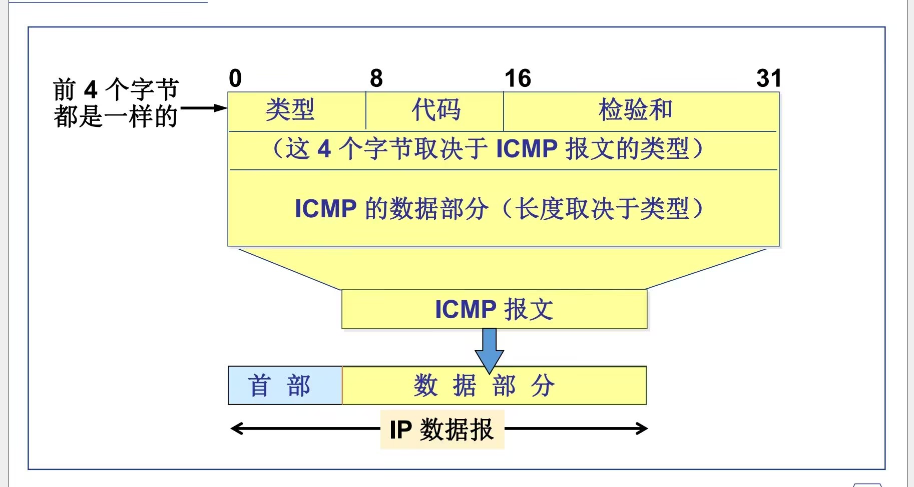
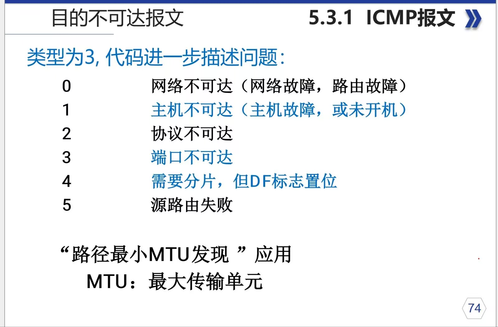
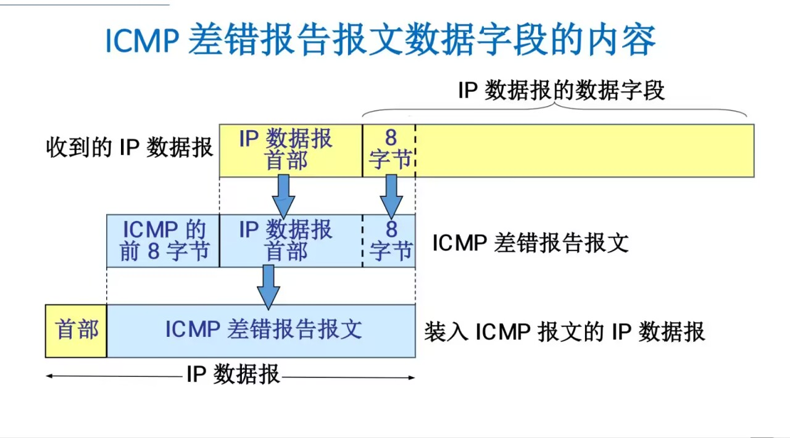

# 1. Network Layer

>   网络层是`OSI`模型中的第三层，它负责在不同网络之间（端到端）提供数据包的路由和转发。网络互联的本质是通过`IP`协议实现的，而数据传输的基本单元是`IP`数据报。本章将详细介绍网络层的核心协议与技术。

网络互连`本质`是通过`ip`实现的，`传输`是以`ip数据报`为介质。

## 1.1. IP

`IP`协议是无连接、不可靠的数据报服务。

-   **无连接 (`Connectionless`)**：发送方在发送数据前，不需要与接收方建立连接。每个数据报都是独立传输的，因此到达顺序、完整性都不能保证。
-   **不可靠 (`Unreliable`)**：`IP`协议不提供错误恢复或重传机制。如果数据报在传输中丢失或损坏，`IP`层本身不会处理，而是交由上层协议（如`TCP`）来确保可靠性。

### 1.1.1. IPv4 数据报格式

一个`IP`数据报由`首部 (Header)`和`数据 (Data)`两部分组成。首部通常为20字节，包含了路由和转发所需的所有关键信息。

-   **版本 (`Version`)** (4位): 指示`IP`协议的版本，对于`IPv4`，该值为 4。
-   **首部长度 (`IHL - Internet Header Length`)** (4位): 表示整个`IP`首部的长度，单位是 **4字节**（32位）。例如，如果该值为5，则首部长度为 5 * 4 = 20 字节。最小值为5（20字节），最大值为15（60字节）。
-   **服务类型 (`ToS - Type of Service`)** (8位): 用于指定数据报的优先级和服务质量（`QoS`）要求，例如最小延迟、最大吞吐量等。
-   **总长度 (`Total Length`)** (16位): 指示整个`IP`数据报（包括首部和数据）的总长度，单位是字节。最大长度为 `65535` 字节。
-   **标识 (`Identification`)** (16位): 该字段唯一标识一个数据报。当数据报因为过大而被分片时，所有分片都将拥有相同的标识号，以便接收方能够将它们重新组装。
-   **标志 (`Flags`)** (3位):
    -   第1位：保留，必须为0。
    -   第2位：**`DF (Don't Fragment)`**。如果设为1，则禁止路由器对该数据报进行分片。如果数据报过大而无法通过，路由器将丢弃它并返回一个`ICMP`错误消息。
    -   第3位：**`MF (More Fragments)`**。如果设为1，表示后面还有更多的分片；如果为0，表示这是最后一个分片（或未分片）。
-   **片偏移 (`Fragment Offset`)** (13位): 指示当前分片在原始数据报中的位置。偏移量以 **`8字节`** 为单位。
-   **生存时间 (`TTL - Time to Live`)** (8位): 设置数据报在网络中可以存活的最大跳数（经过的路由器数）。每经过一个路由器，`TTL`值减1。当`TTL`减为0时，路由器将丢弃该数据报，并向源主机发送一个`ICMP`超时消息。这可以防止数据报在网络中无限循环。
-   **协议 (`Protocol`)** (8位): 指示`IP`数据报的数据部分承载的是哪个上层协议。例如，`6 `代表`TCP`，`17 `代表`UDP`，1 代表`ICMP`。
-   **首部检验和 (`Header Checksum`)** (16位): 用于校验`IP`首部在传输过程中是否出错。它只对首部进行计算，不包括数据部分。
-   **源IP地址 (`Source IP Address`)** (32位): 发送方设备的`IP`地址。
-   **目的IP地址 (`Destination IP Address`)** (32位): 接收方设备的`IP`地址。
-   **选项 (`Options`)** (可变长): 用于一些特殊处理，如记录路由、时间戳等。由于选项会增加首部长度并降低处理效率，因此不常用。如果存在，首部长度字段会大于5。

### 1.1.2. IP 分片 (Fragmentation)

当一个`IP`数据报的长度超过了链路的**最大传输单元 (`MTU`)** 时，路由器就需要将其分割成多个更小的数据报，这个过程称为分片。

-   标识、标志和片偏移这三个字段共同协作，以确保分片能够在目的主机被正确地重组。
-   所有分片共享相同的标识号。
-   除了最后一个分片，其他所有分片的`MF`标志位都为1。
-   片偏移字段记录了每个分片数据在原始数据中的相对位置。

---

## 1.2. ICMP

**ICMP**：`Internet Control Message Protocol` ，因特网控制报文协议

方向：主机/路由器 -> 源站(发送方)

`代码` 提供了进一步的描述信息，在此不进一步提供描述信息，~~即代码的代码（？~~。

---

**However**, 首先想区分一下这边的四个字节vs图上的内容vs十六进制和二进制

图上的`0  8  16  31`一共有32位，指的是二进制的32位，这个`类型`是1字节，2个16进制。也就是在读数据报的时候你看到的是两个十六进制的字符。~~然而图上很喜欢使用二进制长度来表示~~

`8位二进制`=`2位十六进制`=`1字节`

---

| 类型字段 | ICMP报文类型                                    |
| -------- | ----------------------------------------------- |
| 0        | 回显应答 Echo Reply                             |
| 3        | 目的不可达 Destination Unreachable              |
| 4        | 源抑制 Source Quench                            |
| 5        | 路由重定向 Redirect (change a route)            |
| 8        | 回显请求 Echo Request                           |
| 9        | 路由器广告 Router Advertisement                 |
| 10       | 路由器请求 Router Solicitation                  |
| 11       | 数据报超时 Time Exceeded for a Datagram         |
| 12       | 数据报参数问题 Parameter Problem on a Datagram  |
| 13       | 时间戳请求 Timestamp Request                    |
| 14       | 时间戳应答 Timestamp Reply                      |
| 15       | 信息请求（废弃） Information Request (obsolete) |
| 16       | 信息应答（废弃） Information Reply (obsolete)   |
| 17       | 地址掩码请求 Address Mask Request               |
| 18       | 地址掩码应答 Address Mask Reply                 |

`ICMP` 报文分为两大类

`差错报告报文`和`提供信息的报文(询问报文)`

- 差错报告报文 (`Error Report Messages`)

	- `3` 目的不可达 `Destination Unreachable`

	- `4` 源抑制 `Source Quench`

	- `5` 路由重定向 `Redirect (change a route)`

	- `11` 数据报超时 `Time Exceeded for a Datagram`

	- `12` 数据报参数问题 `Parameter Problem on a Datagram`

- 提供信息的报文 (询问报文) (`Information Request/Inquiry Messages`)

	- `0` 回显应答 `Echo Reply`

	- `8` 回显请求 `Echo Request`

	- `9` 路由器广告 `Router Advertisement`

	- `10` 路由器请求 `Router Solicitation`

	- `13` 时间戳请求 `Timestamp Request`

	- `14` 时间戳应答 `Timestamp Reply`

	- `17` 地址掩码请求 `Address Mask Request`

	- `18` 地址掩码应答 `Address Mask Reply`

其中`3`、`11`、`0`、`8`常用

`3`、`11`是`差错报告报文`

`0`、`8`是`提供信息的报文`

### 1.2.1. 几种常用ICMP报文类型

#### 1.2.1.1. 目的不可达报文（3）

顾名思义，`目的不可达报文`就是目的不可达，`代码`部分进一步阐述

相当于`代码`那块就是`00`,`01`...这样的十六进制

> `MTU`是指一个网络接口上能够传输的最大数据包大小。
>
> `路径最小MTU`影响数据在网络中的传输，尤其在路径中包含不同的网络设备时，如果路径中的任何设备不能处理过大的数据包，它就会丢弃该数据包或将其分片。
>
> 所以`“路径最小MTU发现”应用`可以实现 ` MTU`探测 和 避免分片

#### 1.2.1.2. 超时报文（11）

`代码`说明超时的性质：

`00`  传输过程中IP `TTL（time to live）`超时

`01`   分片重装超时

> TTL超时可用于实现路由跟踪（`tracert`）
>
> 
>
> *路由跟踪的工作原理总结：*
>
> - 路由跟踪工具利用`TTL`字段逐步发送数据包，每次增加`TTL`值以遍历路径。
> - 每经过一个路由器，`TTL`值会减1，直到数据包的`TTL`变为0，路由器丢弃数据包并返回一个`ICMP`“时间超时”消息。
> - 通过收集每个中间路由器的回应，路由跟踪工具能够显示整个路径以及每跳的延迟。

#### 1.2.1.3. **回应请求与应答报文 (类型 8 和 0)**
这是我们最熟悉的`ping`命令所使用的报文。

-   **PING (`Packet InterNet Groper`)**：用于测试两台主机之间的连通性。
-   主机A向主机B发送一个`ICMP`回显请求报文（类型8）。
-   如果主机B接收到该报文，它会回复一个`ICMP`回显应答报文（类型0）。
-   `ping`是一个应用层程序直接使用网络层`ICMP`的典型例子，它绕过了传输层的`TCP`或`UDP`。

---

## 1.3. ARP (Address Resolution Protocol)

在任何局域网（如以太网）中，数据帧的传输最终依赖的是**MAC地址（物理地址）**，而不是`IP`地址。那么，当一台主机（例如 `192.168.1.100`）想要与同一网络中的另一台主机（例如 `192.168.1.50`）通信时，它如何知道对方的`MAC`地址呢？这就是`ARP`协议的作用。

**定义**：`ARP (Address Resolution Protocol)`，地址解析协议。它负责将一个已知的`IP`地址（网络层地址）解析（映射）为对应的MAC地址（数据链路层地址）。

**工作流程**：

1.  **检查`ARP`缓存**：主机 A 首先会检查自己的 **`ARP`缓存表**，看是否已经有目标`IP`地址 `192.168.1.50` 对应的`MAC`地址记录。如果存在，则直接使用该`MAC`地址封装数据帧并发送。
2.  **发送`ARP`请求**：如果在缓存中找不到记录，主机 A 会在局域网内广播一个 **`ARP`请求** 报文。这个报文的核心内容是：“**谁的`IP`地址是 192.168.1.50？请把你的`MAC`地址告诉我。**” 这个请求是广播的，意味着网络内所有设备都会收到它。
3.  **单播`ARP`响应**：网络中的所有设备都会解析这个`ARP`请求。但只有`IP`地址为 `192.168.1.50` 的主机 B 会响应。主机 B 会直接向主机 A 发送一个 **`ARP`响应** 报文（单播），内容是：“**我的`IP`地址是 `192.168.1.50`，我的`MAC`地址是` XX:XX:XX:XX:XX:XX`。**”
4.  **更新`ARP`缓存**：主机 A 收到响应后，就知道了主机 B 的`MAC`地址，并将这个映射关系（`IP -> MAC`）存入自己的`ARP`缓存表中，以备后续使用。然后，它就可以将数据发送给主机 B 了。

**`ARP`缓存**：每个主机都维护一个ARP缓存，用于存储近期解析过的`IP`地址与`MAC`地址的对应关系。缓存条目有生命周期（通常是几分钟），过期后会被删除，以确保信息的时效性。

---

## 1.4. DHCP (Dynamic Host Configuration Protocol)

当一台新设备（如笔记本电脑或手机）接入网络时，它需要一个`IP`地址才能通信。手动为每台设备配置IP地址、子网掩码、默认网关和`DNS`服务器是非常繁琐且容易出错的。`DHCP`协议就是为了自动化这个过程而设计的。

**定义**：**动态主机配置协议 (`DHCP, Dynamic Host Configuration Protocol`)** 是一个应用层协议（基于`UDP`），允许网络中的`DHCP`服务器自动地为客户端分配IP地址及其他网络配置参数。

**工作流程 (`DORA`)**：这个过程通常被称为**`DORA`**，代表四个核心步骤。

1.  **`Discover` (发现)**：客户端（新设备）在网络中**广播**一个 **`DHCP Discover`** 报文，试图找到可用的`DHCP`服务器。报文大意是：“**我需要一个`IP`地址，网络里有`DHCP`服务器吗？**”
2.  **`Offer` (提供)**：所有收到`Discover`报文的`DHCP`服务器都会从自己的地址池中选择一个可用的`IP`地址，并通过一个 **`DHCP Offer`** 报文（单播或广播）提供给客户端。报文大意是：“**你好，我这里有一个`IP`地址 `192.168.1.123` 可以给你用，同时还有这些其他的配置信息。**”
3.  **`Request (请求)`**：客户端可能会收到多个`Offer`。它会选择其中一个（通常是第一个收到的），然后**广播**一个 **`DHCP Request`** 报文，正式请求使用这个`IP`地址。广播的目的是通知所有`DHCP`服务器（包括那些也提供了Offer的服务器），它已经做出了选择。报文大意是：“**各位，我决定使用服务器X提供的`IP`地址 `192.168.1.123`。**”
4.  **`Acknowledge (确认)`**：被选中的`DHCP`服务器会发送一个 **`DHCP ACK`** 报文，确认将该`IP`地址租借给客户端，并规定了租期。此时，客户端就可以使用这个IP地址进行网络通信了。

---

## 1.5. 路由协议 (Routing Protocols)

IP协议本身只负责数据报的转发，但它并不知道如何选择最佳路径。**路由器**通过运行**路由协议**来学习网络的拓扑结构，并创建**路由表**，从而做出智能的路径选择决策。路由协议主要分为两大类：

### 1.5.1. 内部网关协议 (IGP - Interior Gateway Protocol)

IGP在一个**自治系统 (`AS - Autonomous System`)** 内部交换路由信息。一个`AS`可以是一个公司、一所大学或一个互联网服务提供商（`ISP`）的网络。

-   **RIP (`Routing Information Protocol`)**
    -   **类型**：距离矢量协议 (`Distance-Vector`)。
    -   **工作原理**：RIP路由器周期性地与邻居交换整个路由表。它使用“**跳数 (`Hop Count`)**”作为度量值来衡量路径的好坏，即经过的路由器数量越少，路径越优。
    -   **特点**：实现简单，但有明显缺点，如最大跳数限制（15跳）、收敛速度慢、容易产生路由环路等。现在已基本被`OSPF`取代。
-   **OSPF (`Open Shortest Path First`)**
    -   **类型**：链路状态协议 (`Link-State`)。
    -   **工作原理**：`OSPF`路由器不交换路由表，而是交换**链路状态通告 (`LSA`)**。每个路由器都收集网络中所有的`LSA`，从而在本地构建一个完整的网络拓扑图。然后，它使用**`Dijkstra`算法**计算出到达每个目的地的最短路径。
    -   **特点**：收敛速度快，无路由环路，支持可变长子网掩码（`VLSM`），支持区域划分以实现更好的扩展性。是当今企业网络中最主流的`IGP`协议。

### 1.5.2. 外部网关协议 (EGP - Exterior Gateway Protocol)

`EGP`用于在不同的自治系统（`AS`）之间交换路由信息，是构成整个互联网的骨架。

-   **BGP (`Border Gateway Protocol`)**
    -   **定义**：边界网关协议是目前唯一在使用的`EGP`。它不仅仅是寻找最短路径，更重要的是，它是一个“**路径矢量协议**”，能够根据管理员设定的策略（如费用、安全、政治因素等）来选择最佳路由。
    -   **特点**：极其稳定和可扩展，是互联网的核心路由协议，负责连接全球成千上万个自治系统。

---

## 1.6. IPv6

随着物联网的兴起和互联网的蓬勃发展，`IPv4`的地址空间（约43亿个）已完全耗尽。`IPv6`作为其继任者，提供了海量的地址空间和诸多改进。

**主要优势**：

1.  **巨大的地址空间**：`IPv6`使用128位地址，理论上可提供` 2^128` 个地址，这个数字足以满足未来数百年内任何可以想象到的需求。
2.  **简化的首部格式**：`IPv6`的首部是固定的40字节，移除了`IPv4`中不常用或冗余的字段（如`IHL`、标识、标志、片偏移、首部检验和），使得路由器处理数据包的效率更高。
3.  **不再由路由器分片**：`IPv6`要求发送方主机在发送前完成“路径`MTU`发现”（`PMTUD`），确保数据包大小不超过路径中的最小`MTU`。路由器不再进行分片，大大减轻了路由器的负担。
4.  **增强的安全性**：`IPsec`（IP安全协议）被设计为`IPv6`的强制组成部分（尽管后来变为可选），为网络层提供了端到端的加密和认证，安全性远超`IPv4`。
5.  **支持无状态地址自动配置 (`SLAAC`)**：`IPv6`主机可以根据路由器通告的前缀和自身的`MAC`地址等信息，自动生成全局唯一的`IP`地址，无需`DHCP`服务器介入即可上网。
6.  **改进的邻居发现协议 (`NDP`)**：`IPv6`使用**邻居发现协议 (`NDP`)**，它基于`ICMPv6`，取代了`IPv4`中的`ARP`和`ICMP`路由器发现等功能，实现了地址解析、路由器发现、重复地址检测（`DAD`）等，更加高效和强大。

---

## 1.7. IGMP (Internet Group Management Protocol)

当数据需要发送给一组特定的、感兴趣的主机而不是单个主机（单播）或所有主机（广播）时，就需要**组播 (`Multicast`)**。`IGMP`协议就是用于管理这种组播组成员关系的。

**定义**：IGMP (`Internet Group Management Protocol`)，因特网组管理协议。它允许主机通知其本地路由器，表示自己希望加入或离开某个特定的组播组。

**工作原理**：

-   **加入组**：当一个主机上的某个应用希望接收特定组播组（例如一个视频流）的数据时，主机会向其本地路由器发送一个`IGMP`**成员关系报告**报文。
-   **维护关系**：路由器会周期性地发送`IGMP`**查询**报文，询问本地网络上是否还有成员对某个组播组感兴趣。仍在组内的成员会回复报告报文。
-   **离开组**：当主机不再希望接收数据时，它会发送一个`IGMP`**离开组**报文。

`IGMP`只负责在主机和本地路由器之间进行通信。路由器之间则需要运行专门的组播路由协议（如`PIM`）来构建组播数据的分发路径。

---

## 1.8. NAT (Network Address Translation)

`NAT`是为了延缓`IPv4`地址耗尽而设计出的一种关键技术。它允许一个机构内部的众多计算机使用**私有`IP`地址**上网，但在与外部互联网通信时，共享一个或少数几个**公有`IP`地址**。

**定义**：**网络地址转换 (`NAT`)** 工作在路由器或防火墙上，负责在私有网络和公有网络之间转换`IP`数据报的源/目的地址和端口号。

**私有`IP`地址段** (不会在公网路由):

-   `10.0.0.0` 到 `10.255.255.255` (A类)
-   `172.16.0.0` 到 `172.31.255.255` (B类)
-   `192.168.0.0` 到 `192.168.255.255` (C类)

**工作原理与类型**：

1.  **静态NAT (`Static NAT`)**：
    -   将一个私有`IP`地址**一对一**地映射到一个公有IP地址。
    -   主要用于内部服务器（如Web服务器）需要被外部网络稳定访问的场景。
2.  **动态NAT (`Dynamic NAT`)**：
    -   维护一个公有`IP`地址池。当内部主机需要访问互联网时，从地址池中**临时分配**一个未使用的公有`IP`地址给它。
    -   当通信结束时，该公有`IP`地址被回收，可供其他主机使用。
3.  **PAT (`Port Address Translation`) / NAPT**：
    -   这是目前**最常用**的`NAT`形式，也称为`NAPT`（网络地址端口转换）。它将多个私有`IP`地址映射到**同一个公有IP地址**的不同**端口**上。
    -   **流程**：当内部主机 `192.168.1.100 `使用端口 `50000 `访问外部服务器时，`NAT`路由器会将源地址和端口转换为 (公有IP, 新端口号)，例如 (`202.100.1.1`, `60001`)，并记录这个映射关系。当外部服务器响应数据到 (`202.100.1.1`, `60001`) 时，路由器根据记录将数据包的目的地址和端口改回 (`192.168.1.100`, `50000`)，并发送给内部主机。
    -   **优点**：极大地节约了公有`IP`地址，仅用一个公有`IP`就能让成百上千台设备同时上网。
    -   **缺点**：破坏了端到端的连接模型，可能导致某些`P2P`应用或`VoIP`协议出现问题。

---

## 1.9. IPsec (Internet Protocol Security)

**`IPsec`** 是一套协议簇，用于在网络层为`IP`通信提供高质量、可互操作的、基于密码学的安全保障。它能提供数据来源认证、数据完整性、数据机密性（加密）和防重放攻击等服务，是构建**`VPN` (虚拟专用网络)** 的核心技术。

**两种工作模式**：

1.  **传输模式 (`Transport Mode`)**：
    -   **工作方式**：只对IP数据报的**数据部分（`Payload`）** 进行加密或认证。原始的IP头部保持不变，只插入了`IPsec`头部。
    -   **用途**：主要用于两台主机之间的**端到端**安全通信。
2.  **隧道模式 (`Tunnel Mode`)**：
    -   **工作方式**：将**整个原始`IP`数据报（包括头部和数据）** 都进行加密和认证，然后将其封装在一个新的IP数据报中。
    -   **用途**：主要用于两个网络（如公司总部和分部）之间的**网关到网关**安全通信，由网络边缘的`VPN`网关来处理。这是构建`VPN`最常见的方式。

**核心协议**：

-   **AH (`Authentication Header`)**：只提供**数据完整性**和**身份验证**，但不提供加密。它确保数据在传输中未被篡改，但传输内容是明文的。
-   **ESP (`Encapsulating Security Payload`)**：提供**数据完整性**、**身份验证**和**数据机密性（加密）**。这是目前应用最广泛的IPsec协议。

---

## 1.10. VRRP (Virtual Router Redundancy Protocol)

在局域网中，如果作为默认网关的路由器发生故障，整个网络的主机将无法访问外部网络，这形成了一个**单点故障**。`VRRP`就是为了解决这个问题而设计的网关冗余协议。

**定义**：**虚拟路由器冗余协议 (`VRRP`)** 是一种容错协议，可以将多台物理路由器组织成一个“**虚拟路由器**”，从而对外提供一个高可用的默认网关。

**工作原理**：

1.  **虚拟路由器**：在一个`VRRP`组中，多台物理路由器共享一个**虚拟`IP`地址**和**虚拟`MAC`地址**。网络中的所有客户端都将这个虚拟`IP`地址配置为它们的默认网关。
2.  **`Master`和`Backup`**：在任何时刻，`VRRP`组中只有一台路由器处于 **`Master `(主)** 状态，它实际拥有虚拟IP地址并负责转发数据包。组内其他路由器则处于 **`Backup` (备)** 状态。
3.  **心跳检测**：`Master`路由器会周期性地发送`VRRP`通告报文（心跳），向`Backup`路由器宣告自己处于活动状态。
4.  **故障切换**：如果`Backup`路由器在一定时间内没有收到`Master`的心跳报文，它会认为`Master`已经出现故障。此时，优先级最高的`Backup`路由器会自动切换为新的`Master`，接管虚拟`IP`地址和`MAC`地址，并开始转发数据。
5.  **无缝切换**：这个切换过程对客户端是完全透明的，客户端无需进行任何更改，从而保证了网络连接的连续性。

---

## 1.11. MPLS (Multiprotocol Label Switching)

`MPLS`是一种高性能的电信级网络技术，它在传统的IP路由（第三层）和数据链路层交换（第二层）之间工作，常被称为“**2.5层**”技术。

**定义**：**多协议标签交换 (`MPLS`)** 通过给数据包预先分配简短、固定长度的“**标签（`Label`）**”，并根据标签进行转发，而不是像传统路由那样在每一跳都查找复杂的IP路由表。

**工作原理**：

1.  **标签分发**：`MPLS`网络中的路由器（称为`LSR` - 标签交换路由器）会通过`LDP`（标签分发协议）等协议，预先为网络中的IP前缀（路由）建立标签映射关系，形成**标签转发信息库 (`LFIB`)**。
2.  **入口打标 (`Push`)**：当一个IP数据包进入`MPLS`网络时，入口路由器（`Ingress LER`）会进行一次常规的`IP`路由查找，然后给这个数据包压入一个或多个`MPLS`标签，形成一个带标签的数据包。
3.  **标签交换 (`Swap`)**：在`MPLS`网络内部，核心的`LSR`路由器不再查看`IP`头部。它们只需读取最外层的标签，在`LFIB`中进行极速查找，然后“交换”（替换）标签，并将数据包转发到下一个`LSR`。
4.  **出口弹标 (`Pop`)**：当数据包到达`MPLS`网络的出口路由器（`Egress LER`）时，标签被移除（弹出），恢复成原始的`IP`数据包，然后继续进行标准的`IP`转发。

**主要优势**：

-   **高速转发**：基于标签的精确匹配交换比基于`IP`地址的最长前缀匹配查找要快得多。
-   **流量工程 (`Traffic Engineering`)**：`MPLS`可以预先设定数据流的路径（建立`LSP` - 标签交换路径），而不必完全遵循`IGP`计算出的最短路径。这使得网络管理员可以精细地控制流量，以优化带宽利用率或绕过拥塞点。
-   **VPN支持**：`MPLS`是构建大规模、高性能`VPN`（特别是`MPLS` `L3VPN`）的基础技术，被全球各大`ISP`广泛采用。

仍在咕咕咕中
