## start from OAuth 2.0

直接从OAuth 2.0看起吧

OAuth 1 早已过时 [RFC 5849](https://www.rfc-editor.org/info/rfc5849/)

所以我们直接从 OAuth 2.0 看起 [RFC6749](https://www.rfc-editor.org/info/rfc6749/)

### what is OAuth 2.0

在开始之前，以下要意识到:

- OAuth 是 授权框架
- OAuth 协议 是 授权协议
- OAuth 2.0 是 授权协议
- OAuth 2.0 框架 是 授权框架 

(嗯)

OAuth 2.0 框架能让第三方应用以有限的权限访问 HTTP 服务，可以通过构建资源
拥有者与 HTTP 服务间的许可交互机制，让第三方应用代表资源拥有者访问服务，或者
通过授予权限给第三方应用，让其代表自己访问服务

#### 授权访问

OAuth 协议的设计目的:

*让最终用户通过OAuth 将他们在受保护资源上的部分权限**委托**给客户端应用*

受保护资源依赖授权服务器向客户端颁发专用的安全凭据 OAuth 访问令牌

> 两个基本要素：
> 获取令牌
> 使用令牌

Core: 委托授权 Delegated Authorization

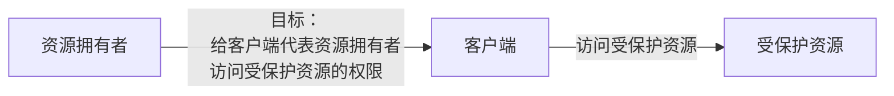

那如何可以做到这个授权？

~~没有什么是加一层中间件不能解决的，如果有，那就再加一层~~

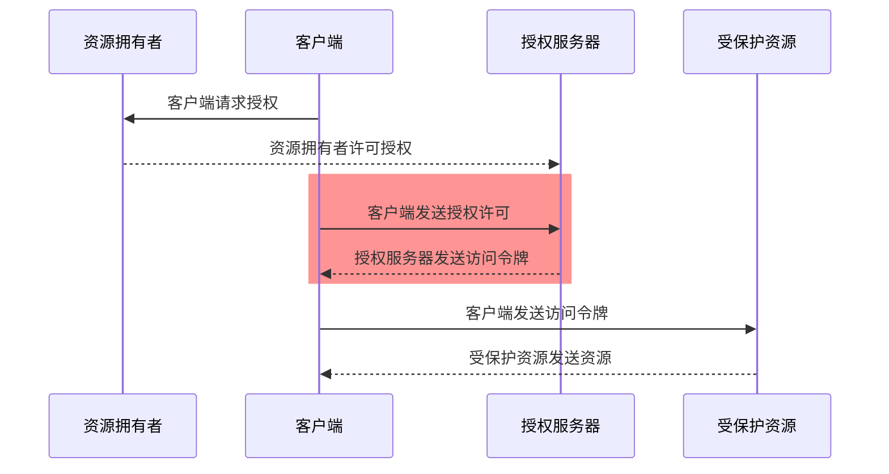

它提供了一种方法，让客户端可以请求用户将部分权限委托给自己
同时在此过程中，没有将资源拥有者的凭据暴露给客户端

当然，这只是OAuth 工作原理的一般性概述，OAuth有多种令牌获取方式

#### 角色与端点

前面图里已经出现了资源拥有者、客户端、授权服务器、受保护资源四个角色

角色之间通信走三个明确定义的 HTTP 端点

- **Authorization Endpoint**：Client 把资源拥有者推送此端点，走重定向 只支持 GET
- **Token Endpoint**：Client 使用 authorization grant 换 access token
- **Redirection Endpoint**（callback / redirect_uri）

OAuth 把客户端分成两种
[Client type](https://datatracker.ietf.org/doc/html/rfc6749#section-2.1)

- **Confidential Client**
- **Public Client**

### Grant Types

grant type 授权许可类型

#### Authorization Code Grant

1. Client 把用户重定向到 Authorization Endpoint
2. 用户登录 + 同意授权
3. 授权服务器通过 Redirection Endpoint 把 authorization code 返回 Client
4. 客户端使用 authorization code 通过 Token Endpoint 换 access token （On AS）

#### Implicit Grant

早年给纯前端单页应用设计的捷径

跳过 Token Endpoint 换码，授权服务器把 access token 直接塞进 Redirect URL 的 fragment（`#access_token=xxx`）

节省了一次网络请求

但是

token 直接暴露在 URL、浏览器历史、Referer 头中，且没有 refresh token

#### Resource Owner Password Credentials

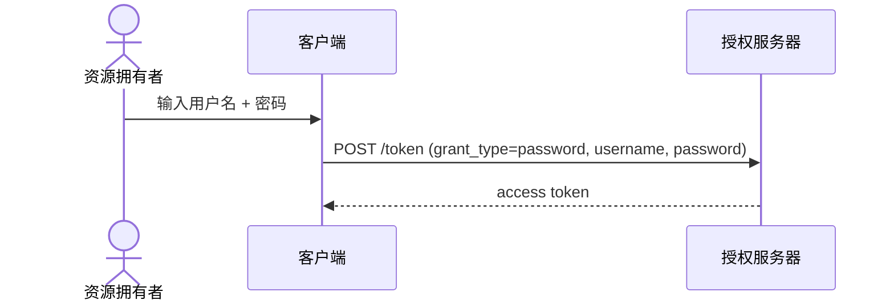

我去，你怎么直接把用户密码都丢过去了，旮旯oauth里面不是这样的！

OAuth 本来就是为了避免这件事才存在的，ROPC 却是把它明面化

唯一还算合理的场景是同组织自己的 app，跨过浏览器直接认证

#### Client Credentials Grant

> only for Credential Client

前面几种都假设有user

但 machine to machine（M2M）场景根本没有用户

一个后端服务要访问另一个后端服务的 API，那怎么办？

*资源拥有者什么的，不需要了*

客户端可直接使用 client_id + client_secret去 Token Endpoint 换 token：

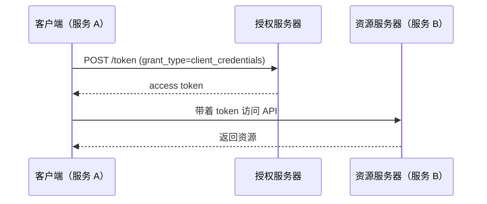

#### Refresh Token 和 scope

access token 短命，但过期了不代表用户要重新登录一遍

客户端可以使用 **refresh token** 直接去 Token Endpoint 换新的 access token

:::note
正因为refresh token可以无条件换新access token，refresh token的泄漏会比access token严重一些，但不多（意味深）
:::

**scope**：客户端在最开始请求授权时，可声明需要的权限 scope（eg. `scope=read:email write:posts`），资源拥有者同意的也只是这部分范围，最终发下来的 access token 权限就定好了

#### state

客户端跳到 Authorization Endpoint 之前生成会一个随机值进 `state`，授权服务器完成后校验 `state`

*防CSRF*

### 优缺点

OAuth 2.0 非常善于获取用户的委托决策，并通过网络传递出去。它允许多方参与安全决策 过程，尤其是在运行期间让最终用户参与决策。它是由多个可移动的组件构成的协议，但是在很 多方面它都比其他方案更简单、更安全

单个授权服务器可以很轻松地保护多个资源服务器，并且很可能有许多不同类型的客户端想要访问特定 API。一台授权服务器甚至可以有多个不同的客户端信任等级。这样的架构尽可能将复杂性从客户端转移到了服务端

OAuth 令牌提供了比密码略复杂的机制，因此在使用得当的情况下，安全性比密码高的多。 <- 那如何使用得当就是开发的重要问题了

OAuth 2.0 的可扩展性和模块化是其最大的优势之一，因为这使得该协议适用于各种环境。 然而，正是这种灵活性导致不同的实现之间存在基本的兼容性问题。

同时，某些自定义选项可能会被错用或使用不当，导致实现不安全
甚至即使系统按照规范正确实现了OAuth，也不意味着生产环境下就是安全的

### OAuth 2.0 CANNOT

1. OAuth 没有定义 `HTTP` 协议之外的情形

bearer令牌的OAuth 2.0 不提供消息签名，因此需要 `TLS` 类的传输机制来保护信息 
[RFC7628: A Set of Simple Authentication and Security Layer (SASL) Mechanisms for OAuth](https://datatracker.ietf.org/doc/html/rfc7628)

当然现在不乏非TLS链接之上的尝试

2. OAuth 不是身份认证协议

你说的对，虽然可以用它构建身份认证，但确实不是

OAuth 事务本身并不透露关于用户的信息
如果说它多个地方用到了身份认证(eg. 资源拥有者和客户端软件要向授权服务器进行身份认证),这种内嵌身份认证的行为并不会让OAuth变成身份认证协议

3. OAuth 没有定义用户对用户的授权机制

尽管它在根本上是一个用户向软件授权的协议

OAuth 假设资源拥有者能够控制客户端。要使资源拥有者向另一个用户授权，仅使用 OAuth 是不行的
但是[User Managed Access协议](https://www.rfc-editor.org/info/rfc6749/)可以

4. OAuth 没有定义授权处理机制

OAuth 提供了传达授权委托已发生的方法，但没有定义授权内容，只是传达已发生

是*服务 API* 定义了使用权限范围、令牌等 OAuth 组件 的操作权限

5. OAuth 没有定义令牌格式

OAuth 协议声明了令牌内容对客户端完全不透明，但授权服务器和受保护资源仍然需要理解令牌

也因此，这个层面的互操性要求催生了 JSON Web Token 格式和 [令牌内省格式](https://datatracker.ietf.org/doc/html/rfc7662)

## OAuth 2.1

[Oauth 2.1](https://oauth.net/2.1/) / [draft-ietf-oauth-v2-1](https://datatracker.ietf.org/doc/draft-ietf-oauth-v2-1/)

> 2.1 现在还是 IETF draft，不是正式 RFC

Oauth 2.1 将 OAuth 2.0 核心协议 + Bearer Token 用法 + PKCE 三份文档合并，**没有新增任何端点**

很大一部分直接继承自 [RFC 9700](https://www.rfc-editor.org/info/rfc9700/)（OAuth 2.0 Security Best Current Practice

### 减法

没错，2.1 < 2.0

> Core: 收窄选择面

### What changed in Oauth 2.1

1. authorization code flow 必须带 PKCE,同时彻底删除了 PKCE 的 `plain` 模式

PKCE 本来是给移动端 native app 挡 authorization code 被截获用的 [RFC 7636](https://www.rfc-editor.org/info/rfc7636/)，2.1 把它扩大到了所有客户端，机密客户端也不例外

多了三个参数：`code_verifier`、`code_challenge`、`code_challenge_method`

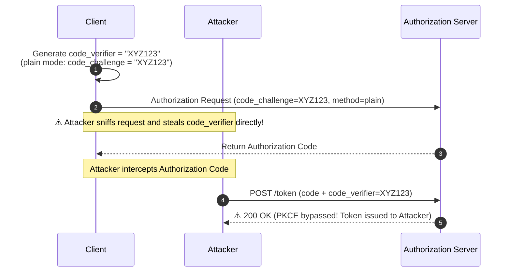

code 被截走也没用，🈚️ `code_verifier`

2. implicit grant 整个被移除

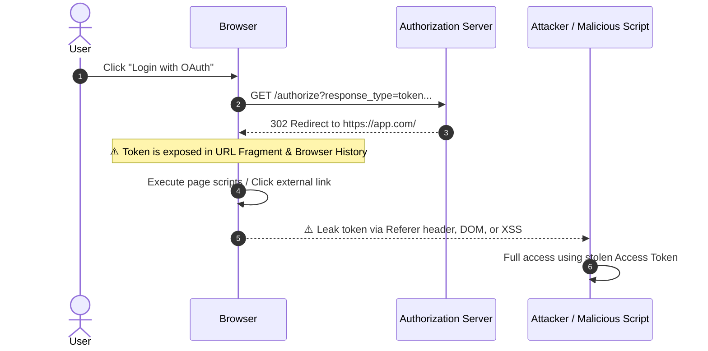

3. ROPC（Resource Owner Password Credentials）被移除

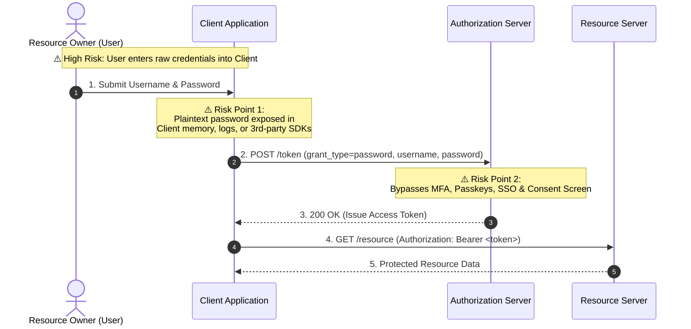

4. `redirect_uri` 必须逐字符精确匹配

5. bearer token 不允许放进 query string

塞进 URL 意味着它会出现在浏览器历史、服务器访问日志、Referer 头，甚至转发链路上任何一层的日志系统里，这条从"建议"被提升成了硬性要求，token 只能走 Header 或者 body

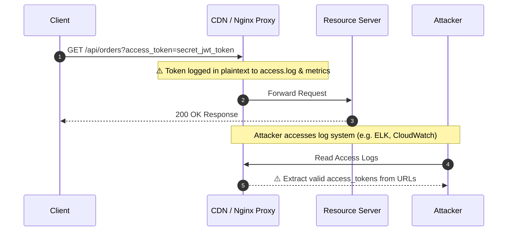

6. refresh token 必须 rotation，或者做成 sender-constrained

用一次就必须换一个新的（rotation），或者把它跟某个客户端强绑定（sender-constrained，例如 DPoP [RFC 9449](https://www.rfc-editor.org/info/rfc9449/) 或 mTLS）

> 边界情况：用户开两个 tab，几乎同时触发 refresh，这时候直接吊销整个 family 会把正常用户也一起踢出去
> 实践里会留一个短暂的 grace period，让「rotation 之后的短时间内，旧 token 再次使用」被判定成无害的并发，而不是当成 replay 处理

sender-constrained 更硬，DPoP 要求客户端每次请求都用自己的私钥签一段 proof；

mTLS 更重，需要客户端证书

多数场景用不上这么重的方案，rotation 已经能覆盖掉大部分威胁模型

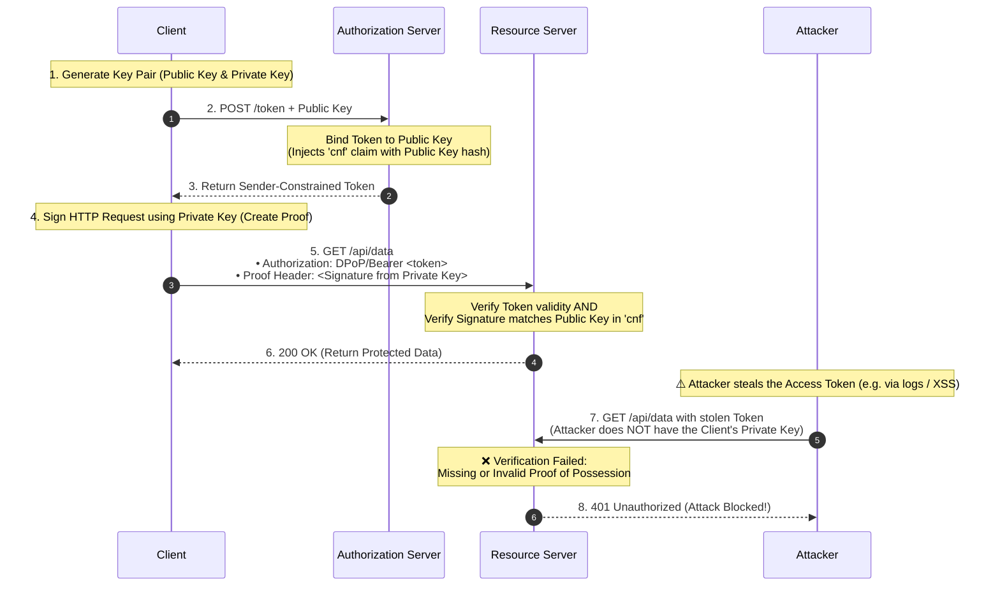

## OAuth 端点

2.1 虽然本身不新增端点，但这不代表 OAuth 里只有 Authorization Endpoint 和 Token Endpoint 两个

还有:

- **Pushed Authorization Requests / PAR**（[RFC 9126](https://datatracker.ietf.org/doc/html/rfc9126/)）
- **Token Revocation**（[RFC 7009](https://datatracker.ietf.org/doc/html/rfc7009/)
- **Token Introspection**（[RFC 7662](https://datatracker.ietf.org/doc/html/rfc7662/)
- **Device Authorization Grant**（[RFC 8628](https://datatracker.ietf.org/doc/html/rfc8628/)
- **Dynamic Client Registration**（[RFC 7591](https://datatracker.ietf.org/doc/html/rfc7591/)

## OpenID Connect (OIDC)

OAuth 不是 身份认证协议

OAuth 只解决 Authorization，不解决 Authentication

因此 OpenID Connect 出现了

> OpenID Connect 1.0 is a simple identity layer on top of the OAuth 2.0 protocol.
> —— [OIDC Core 1.0](https://openid.net/specs/openid-connect-core-1_0.html)

OIDC 复用 OAuth 的授权流程和端点，只在 Token Endpoint 返回结果里多添加了**ID Token**，以及 `UserInfo Endpoint`

### ID Token vs Access Token

- **Access Token**：OAuth 固有，for **资源服务器**，证明客户端权限，格式对客户端不透明
- **ID Token**：OIDC，固定是 **JWT** 格式，for **客户端**，证明登录身份

### How to use OIDC

客户端授权请求中 `scope` 带上 `openid`（eg. `scope=openid profile email`）

授权服务器则在 Token Endpoint 多返回 `id_token` 字段

### UserInfo Endpoint

ID Token 里的 claims 是精简版

为更完整的用户资料，OIDC定义了`UserInfo`端点

客户端使用 access token 在此端点换取信息

### Discovery

OIDC 提供商（eg. Google、Auth0）在 `/.well-known/openid-configuration` 固定路径提供 JSON，列出自己的 Authorization Endpoint、Token Endpoint、UserInfo Endpoint、支持的 scope、签名算法等等

```bash
$ curl https://link.sast.fun/v2/.well-known/openid-configuration

{"authorization_endpoint":"https://link.sast.fun/v2/oauth/authorize","claim_types_supported":["normal"],"claims_parameter_supported":false,"claims_supported":["sub","iss","aud","exp","iat","nonce","name","picture","preferred_username","role","email","email_verified","updated_at"],"code_challenge_methods_supported":["S256"],"grant_types_supported":["authorization_code","refresh_token"],"id_token_signing_alg_values_supported":["EdDSA"],"issuer":"https://link.sast.fun/v2","jwks_uri":"https://link.sast.fun/v2/.well-known/jwks.json","request_parameter_supported":false,"request_uri_parameter_supported":false,"response_modes_supported":["query"],"response_types_supported":["code"],"revocation_endpoint":"https://link.sast.fun/v2/oauth/revoke","scopes_supported":["openid","profile","email","admin:read","admin:write","user:read","user:write"],"subject_types_supported":["public"],"token_endpoint":"https://link.sast.fun/v2/oauth/token","token_endpoint_auth_methods_supported":["none","client_secret_post"],"userinfo_endpoint":"https://link.sast.fun/v2/userinfo"} 
```

### 标准 Claims

OIDC 定义了一套标准 claims（声明），分散在三个来源：

1. **ID Token**：授权完成时直接返回，包含最基本的身份断言
2. **UserInfo Endpoint**：需要单独请求，返回更完整的用户资料
3. **Scope 控制**：不同 scope 决定哪些 claims 会被包含

#### Standard Claims Set

OIDC Core 定义的标准 claims 分几类：

**必需 / 核心 claims**（in ID Token）：
- `sub`：Subject Identifier，用户唯一标识符，同 OP（OpenID Provider）下永远不变
- `iss`：Issuer，签发者，OP URL
- `aud`：Audience，受众，通常是客户端的 `client_id`
- `exp`：Expiration Time，过期时间戳
- `iat`：Issued At，签发时间戳

**profile scope** 对应的 claims：
- `name`：全名
- `family_name` / `given_name`：姓 / 名
- `middle_name`：中间名
- `nickname`：昵称
- `preferred_username`：首选用户名
- `profile`：个人资料页 URL
- `picture`：头像 URL
- `website`：个人网站
- `gender`：性别
- `birthdate`：生日（YYYY-MM-DD 格式）
- `zoneinfo`：时区（如 `Asia/Shanghai`）
- `locale`：语言环境（如 `zh-CN`）
- `updated_at`：资料最后更新时间戳

**email scope** 对应的 claims：
- `email`：邮箱地址
- `email_verified`：邮箱是否已验证（boolean）

**address scope** 对应的 claims：
- `address`：JSON 对象，包含 `formatted`（完整地址）、`street_address`、`locality`（城市）、`region`（省/州）、`postal_code`、`country`

**phone scope** 对应的 claims：
- `phone_number`：电话号码（E.164 格式，如 `+86 138...`）
- `phone_number_verified`：电话是否已验证

#### 可选 claims

- `nonce`：客户端在授权请求里传的随机值 *防重放攻击* Note:(重放攻击)[https://en.wikipedia.org/wiki/Replay_attack]
- `auth_time`：用户真实认证的时间戳
- `acr`：Authentication Context Class Reference，认证上下文等级（eg. `urn:mace:incommon:iap:silver` 表示多因素认证）
- `amr`：Authentication Methods References，认证方式数组（eg. `["pwd", "otp"]` 表示密码 + OTP）
- `azp`：Authorized Party，实际使用该 token 的客户端 ID（多 RP 场景下跟 `aud` 可能不同）

#### Custom Claims

标准之外的自定义 claims 没有命名空间限制
但其实还是讲究点更好吧（

- 避免跟标准 claims 重名
- 使用 URL 作为命名空间前缀避免冲突
- 或者约定俗成的短前缀（eg. `org_role`、`tenant_id`）

#### ID Token vs UserInfo 的 claims 分布

不是所有 claims 都会同时出现在两个地方：

- **ID Token**：体积有限，通常只放最核心的（`sub`、`iss`、`aud`、`exp`、`iat`，加上 `nonce` 和少量身份字段如 `email`）
- **UserInfo**：完整版

#### Claim 可信度

- **ID Token 里的 claims**：有签名保护，客户端可以离线验证 for 第三方或者缓存
- **UserInfo 里的 claims**：通过 HTTPS 从 OP 获取，无签名

安全关键的决策永远不只依赖 token 里的 claims snapsho ，后端必须从数据库重新读

*token 里的值只是用来路由请求或者前端显示*

## JWT 结构与验证

既然 ID Token 是 JWT，那顺手的事

### JWT 三段式

一个 JWT 是三段 Base64URL 编码：

```
eyJhbGciOiJFZERTQSIsInR5cCI6IkpXVCIsImtpZCI6ImxpbmstdjItYWN0aXZlIn0.
eyJzdWIiOiIxMjM0NTYiLCJpc3MiOiJodHRwczovL2xpbmsuc2FzdC5mdW4vdjIiLCJhdWQiOiJjbGllbnRfaWQiLCJleHAiOjE3MDAwMDAwMDAsImlhdCI6MTcwMDAwMDAwMCwibm9uY2UiOiJhYmMxMjMifQ.
6F8kT9VnX3p5ZrQw2J4Ks8YbL1MvN3uP7tR5eX9Gh2Qm4Wp3Yt7Zl6Kj8Hn9Vm2
```

三段分别是：

1. **Header**（`eyJ...`）：描述签名算法和密钥 ID
2. **Payload**（`eyJ...`）：实际的 claims
3. **Signature**（`6F8...`）：用私钥对前两段的签名

Base64URL 解码 Header：

```json
{
  "alg": "EdDSA",
  "typ": "JWT",
  "kid": "link-v2-active"
}
```

- `alg`：签名算法
- `kid`：Key ID，告诉验证方该用 JWKS 里的何公钥

Base64URL 解码 Payload：

```json
{
  "sub": "123456",
  "iss": "https://link.sast.fun/v2",
  "aud": "client_id",
  "exp": 1700000000,
  "iat": 1700000000,
  "nonce": "abc123"
}
```

### 验证流程

客户端收到 ID Token ，继续验证

1. **拆分三段** 前两段 Base64URL 解码
2. **检查 Header**：
   - `alg` 必须是接受的算法
   - `kid` 指出公钥
3. **获取公钥**：
   - 从 `/.well-known/jwks.json` 获取 JWKS
   - 找到 `kid` 匹配的公钥
4. **验证签名**：
   - 用公钥验证第三段签名
5. **验证 claims**：
   - `iss`：=== OP issuer
   - `aud`：=== 自己的`client_id`
   - `exp`：> 当前时间
   - `iat`：不能太早（防止重放很久以前的 token）
   - `nonce`：=== 生成时的值

**验证顺序**：签名 → `exp` → `iss`/`aud`/`nonce`

### kid 和 JWKS

`kid` ——> Key ID

康康 Link 的 JWKS：

```json
{
  "keys": [
    {
      "kty": "OKP",
      "use": "sig",
      "kid": "link-v2-active",
      "crv": "Ed25519",
      "alg": "EdDSA",
      "x": "BFj6m10rdWe_1VZ6bMB7FTU034NNMUueRBuw8-Ah_B0"
    }
  ]
}
```

- `kid`: `link-v2-active` 
- `kty`: `OKP` 表示 Octet Key Pair（[RFC 8037](https://datatracker.ietf.org/doc/html/rfc8037/)）
- `crv`: `Ed25519` 椭圆曲线
- `x`: 公钥坐标，Base64URL 编码的 32 字节

验证方使用 `x` 去验签名
私钥`d`永远不会出现在 JWKS 里

### Access Token 是不是 JWT？

> 不一定

access token 可以是

- **自包含 JWT**：资源服务器离线验证，不用回调授权服务器
- **不透明令牌**（opaque token）：资源服务器必须调 Token Introspection 端点查询授权服务器验证

## Something else

### PKCE 实现细节

前面提到 2.1 强制 PKCE

PKCE 的核心是让授权码跟一个客户端生成的随机值绑定

即使授权码被截获，攻击者也得不到 token

#### S256 变换

PKCE 有两种 `code_challenge_method`：

- `plain`：`code_challenge = code_verifier`
- `S256`：`code_challenge = BASE64URL(SHA256(code_verifier))`（2.1 强制）

Q：为什么 `plain` 不安全？
A：因为 `code_challenge` 会出现在授权请求 URL 里

#### PKCE 完整流程

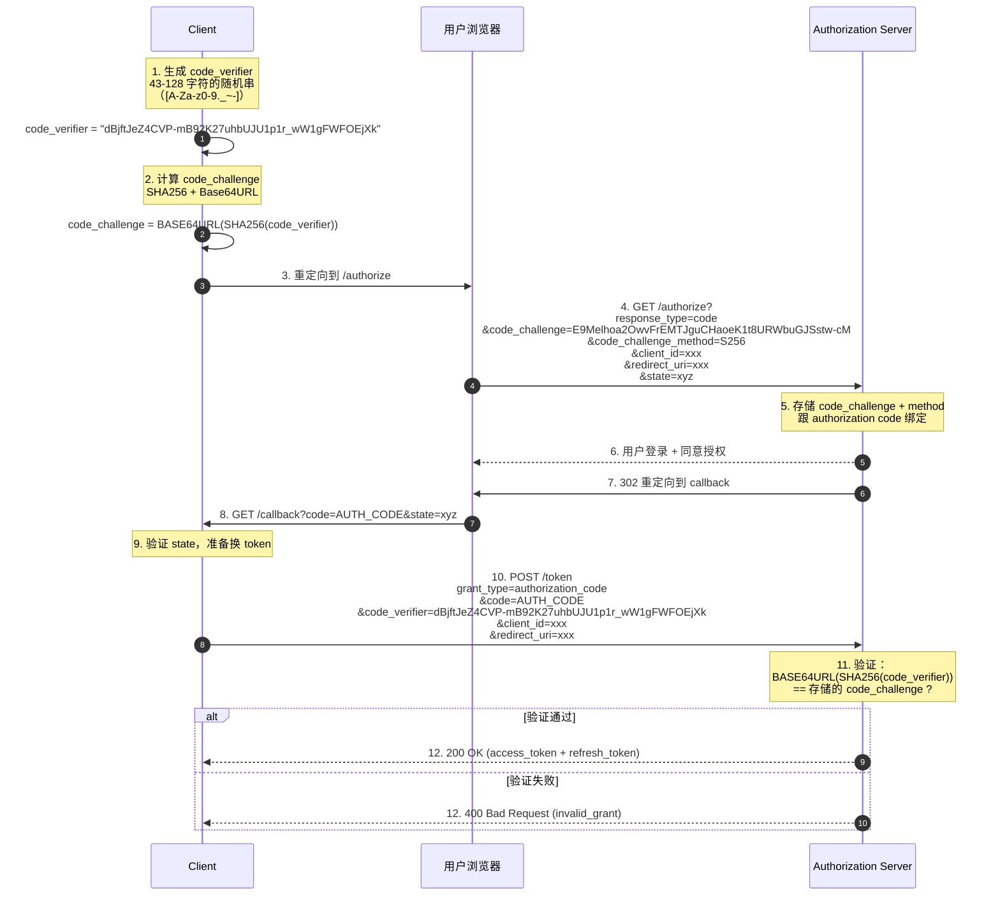

### Pushed Authorization Requests (PAR)

传统授权请求把所有参数拼在 URL 上

```
GET /authorize?response_type=code&client_id=xxx&redirect_uri=https://...&scope=openid+profile+email&state=xyz&nonce=abc&code_challenge=...&code_challenge_method=S256
```

可是，这真的完全合理吗？

绝大部分情况下其实是没问题的
但还是会有问题（我去，不早说）

1. **URL 长度限制**：浏览器和代理对 URL 有长度限制，而复杂的 scope 或 OIDC 可能会弄炸
2. **参数暴露**：URL 会出现在浏览器历史、服务器日志、Referer 头，`state`/`nonce` 还是有可能泄漏的
3. **参数篡改**：可以修改 URL 参数（eg. 把 `scope` 扩大）

> 我说，遇事不决就套一层中转

于是有了Pushed Authorization Requests

PAR 的思路：把参数用后端 POST 推到授权服务器，得到限时 `request_uri`，再用此 URI 授权

其实和短链思路一致的啊

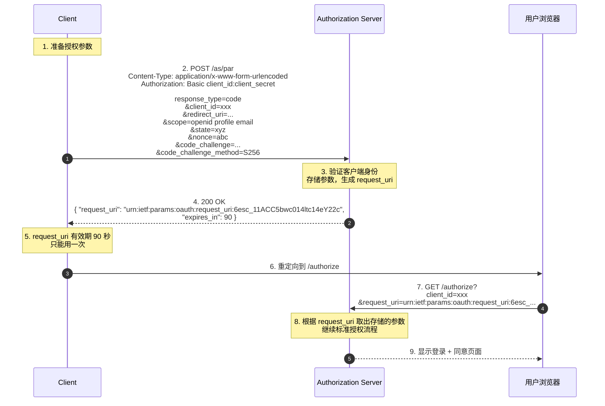

如果是面向公众的 OAuth 提供商，PAR 是值得实现的

### Token Introspection 与 Opaque Token

前面说过 access token 可以是 JWT 也可以是 Opaque token

但如果是后者，资源服务器怎么知道它有效？

答案是 **Token Introspection**（[RFC 7662](https://datatracker.ietf.org/doc/html/rfc7662/)）

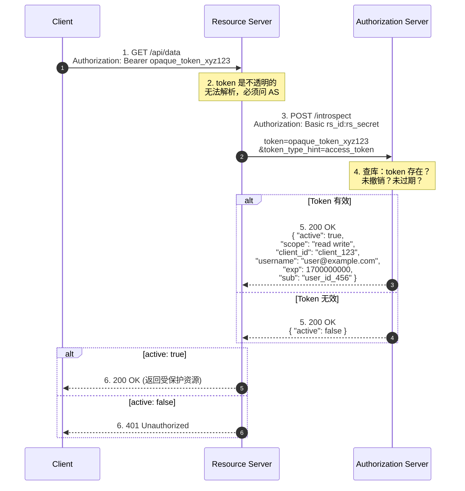

有了 Token Introspection ，就可以方便很多

- **all in 授权服务器**：一切皆由 AS (Authorization Server) 实时查询返回
- **支持即时撤销**：用户退出，AS 标记 token 已撤销，下一次 introspection 就会返回 `active: false`
- **资源服务器必须认证**：通常用 `client_secret`来验证 introspection 端点

#### JWT vs Opaque ：

| Dimension | JWT | Opaque Token |
|------|-----|--------------|
| 资源服务器负载 | 低（离线验证，仅签名） | 高（每次请求都要调 introspection） |
| 即时撤销 | 难（过期前一直有效，除非资源服务器也查库） | 易（AS 标记撤销，introspection 即 false） |
| 信息泄露风险 | 高（Base64） | 低（opaque token 不携带信息，只是随机串） |
| 跨服务传递 | 易（资源服务器 A 可以把 JWT 转发给 B过） | 难（每个资源服务器都要回调 AS） |

如果是分布式架构，opaque token + introspection 可能就是更好的选择

### DPoP: 密钥绑定的 Token

前面部分提到 refresh token 要么 rotation，要么 sender-constrained

DPoP（Demonstrating Proof of Possession，[RFC 9449](https://www.rfc-editor.org/info/rfc9449/)）是 sender-constrained 的一种实现

#### DPoP 思路

将 token 和 Client 的**非对称密钥对**绑定：

1. 客户端生成一对公私钥
2. 请求 token 时，将公钥提供至授权服务器
3. 授权服务器在 token 中 `cnf`（confirmation）claim 里记录公钥指纹
4. 客户端每次用 token 访问资源时，都用私钥签一段 proof（包含当前请求的 HTTP method、URL、时间戳）
5. 资源服务器验证 proof 的签名是否匹配 token 里的公钥

#### 完整流程

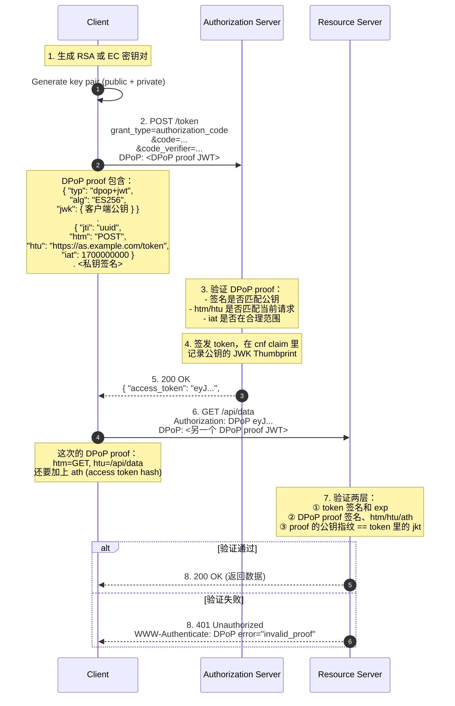

**DPoP proof 的结构**：

Header:
```json
{
  "typ": "dpop+jwt",
  "alg": "ES256",
  "jwk": {
    "kty": "EC",
    "crv": "P-256",
    "x": "...",
    "y": "..."
  }
}
```

Payload (请求 `/token` 时):
```json
{
  "jti": "unique-uuid",
  "htm": "POST",
  "htu": "https://as.example.com/token",
  "iat": 1700000000
}
```

Payload (请求资源时):
```json
{
  "jti": "another-uuid",
  "htm": "GET",
  "htu": "https://rs.example.com/api/data",
  "iat": 1700000100,
  "ath": "fUHyO2r2Z3DZ53EsNrWBb0xWXoaNy59IiKCAqksmQEo"  // BASE64URL(SHA256(access_token))
}
```

**每次请求的 proof 都是新的**，因为 `jti`、`iat`、`htm`、`htu` 都会变，所以即使攻击者录下一次请求的完整 HTTP 报文（包括 DPoP proof），重放到另一个端点也会失败（`htu` 不匹配）

**DPoP 的优势**：

- **彻底防住 token 盗用**
- **防重放**
- **无需服务端状态**

**DPoP 的成本**：

- 客户端复杂度大增：每次请求都要签一个 JWT
- 移动端/浏览器环境管理私钥很麻烦
- 资源服务器要验证两层（token 签名 + proof 签名），延迟增加

### Token 绑定与 mTLS

DPoP 用非对称密钥绑定 token，还有一种更底层的方案：**mTLS**（mutual TLS）

传统 HTTPS 只验证服务端证书（客户端信任服务端），mTLS 要求客户端也提供证书（服务端也验证客户端），这样 TCP 连接本身就绑定了客户端身份

#### mTLS 绑定 OAuth token

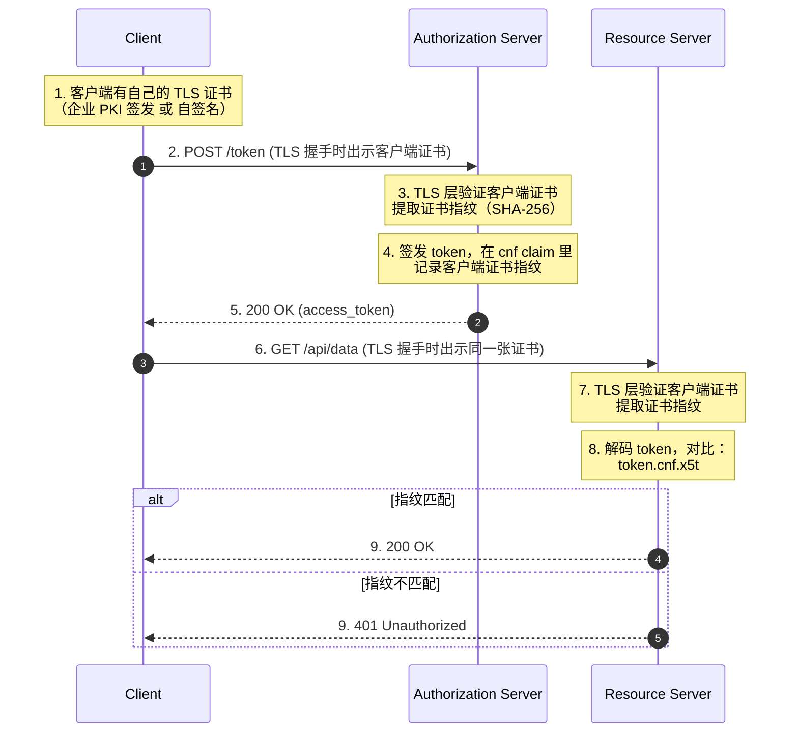

**mTLS 的优势**：

- **比 DPoP 更底层**：绑定发生在 TLS 层
- **性能更好**：TLS 握手只在连接建立时做一次
- **防中间人**

**mTLS 的劣势**：

- **证书管理复杂**：每个客户端都要有证书，签发、分发、轮换、吊销都是成本
- **移动端/浏览器不友好**：浏览器环境拿不到客户端证书，移动端要自己实现证书存储
- **负载均衡/反向代理要特殊处理**：Nginx、Cloudflare 默认会终结 TLS，客户端证书到不了后端，要配置 `ssl_client_certificate` 透传

### Device Flow: 无浏览器设备的授权

Device Authorization Grant（[RFC 8628](https://datatracker.ietf.org/doc/html/rfc8628/)）设计给"没有浏览器或输入不方便"的设备

典型场景：

- 智能电视上登录 Netflix
- CLI 工具（`gh auth login`、`docker login`）
- 树莓派、IoT 设备

#### 工作流程

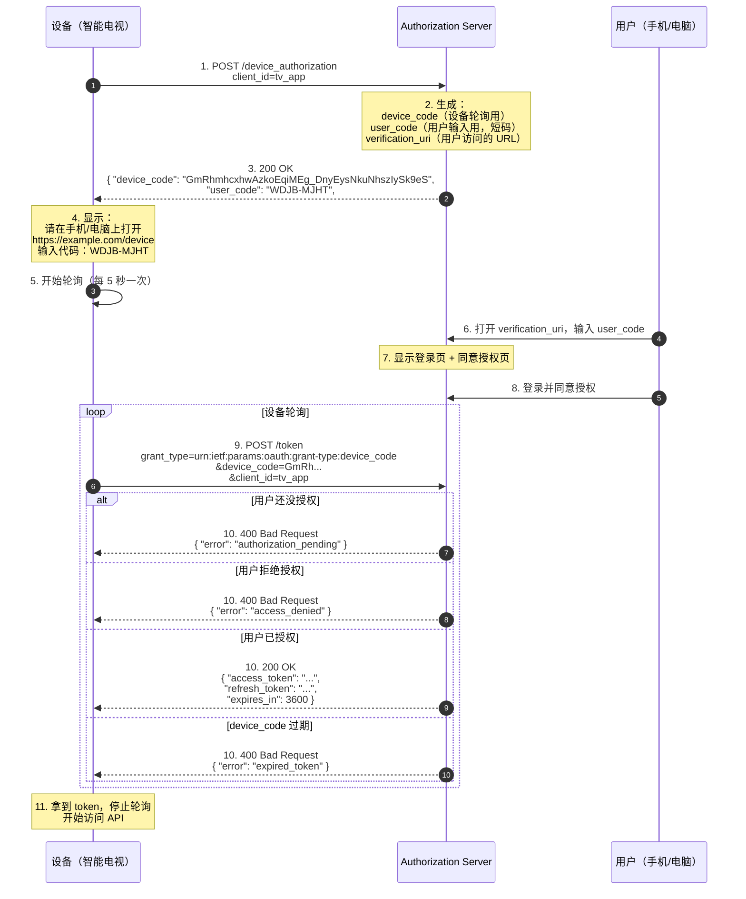

**Device Flow 的安全性**：

- `user_code` 很短，容易被猜测，授权服务器要限制尝试次数（5 次错误后锁定）
- `device_code` 是高熵随机值，轮询端点不需要客户端认证（device 没有 `client_secret`）
- 用户在自己的手机/电脑上输入密码，设备永远看不到密码
- `verification_uri` 可以是完整 URL（如 `https://example.com/device?user_code=WDJB-MJHT`），用户点链接就行，不用手动输入代码

说不定以后有link cli就会做了

### 跨域与 CORS

OAuth 流程常常有不可逾越的**跨域问题**

#### 问题场景

假设：

- 授权服务器：`https://auth.example.com`
- 前端应用：`https://app.example.com`

前端 JS 直接调 `/token` 换授权码：

```javascript
// That's bad...
fetch('https://auth.example.com/token', {
  method: 'POST',
  headers: { 'Content-Type': 'application/x-www-form-urlencoded' },
  body: 'grant_type=authorization_code&code=...'
})
```

浏览器会发 CORS preflight（`OPTIONS` 请求），如果授权服务器没有返回正确的 CORS 头，请求会被浏览器拦截

#### solutions

**方案 1：授权服务器返回 CORS 头**

```http
Access-Control-Allow-Origin: https://app.example.com
Access-Control-Allow-Methods: POST
Access-Control-Allow-Headers: Content-Type
```

但是 `/token` 端点是给所有客户端用的，`Allow-Origin` 该填谁的域名？
`*` 不安全，多个又麻烦

**方案 2：BFF 模式（Backend For Frontend）**

前端不直接调授权服务器，通过自己的后端中转：

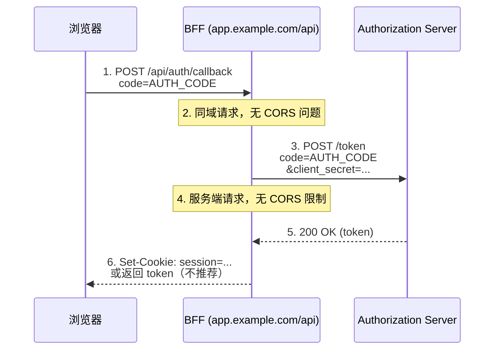

**BFF 的好处**：

- 前端不直接接触 `client_secret`（如果是机密客户端）
- 前端不直接接触 `refresh_token`（可以存在 BFF 的 session 里）
- 授权服务器不需要配置 CORS

Link 里我们就用的 BFF 模式 zwz——前端收到授权码后，调 `/oauth/exchange-code`（登录码换 token），端点同域

### ID Token 中的`aud` 与 `azp`

`aud` 前面说过，但 OIDC 里有个特殊情况：**一个 ID Token 可以有多个受众**

比如，用户授权了三个客户端（A、B、C）共享同一个 ID Token，`aud` 是个数组：

```json
{
  "iss": "https://op.example.com",
  "sub": "user123",
  "aud": ["client_a", "client_b", "client_c"],
  "azp": "client_a",
  "exp": 1700000000
}
```

每个客户端都要验证 `aud` **包含**自己的 `client_id`
但如果你是 `client_b`，你还要检查 `azp`（Authorized Party）是否是可信的——`azp` 

## 新兴标准与实践

### RFC 9068: JWT Access Token Profile

OAuth 2.0 不定义 token 格式，但实践中 JWT 成了事实标准。[RFC 9068](https://www.rfc-editor.org/rfc/rfc9068.html)是第一个正式标准化"JWT 做 access token"的 RFC，定义了一套统一的 claims 结构

#### Why RFC 9068

在 RFC 9068 之前，每家 OP 的 JWT access token 都是自己定的格式：

- 有的用 `scope`，有的用 `scp`
- 有的用 `client_id`，有的用 `azp`，有的用 `cid`
- 资源服务器拿到一个 JWT access token，不知道哪个 claim 是权限范围

RFC 9068 统一了这些字段，让资源服务器可以用同一套逻辑验证来自不同 OP 的 JWT access token

#### 标准 Claims

| Claim | 必需 | 说明 |
|-------|------|------|
| `iss` | ✓ | 签发者（OP 的 URL） |
| `exp` | ✓ | 过期时间 |
| `aud` | ✓ | 受众（资源服务器的标识符，可以是数组） |
| `sub` | ✓ | 主体（用户标识符） |
| `client_id` | ✓ | 客户端 ID（**固定字段名**） |
| `iat` | ✓ | 签发时间 |
| `jti` | ✓ | Token ID |
| `scope` | — | 权限范围（**空格分隔的字符串**），client credentials grant 必需 |
| `auth_time` | — | 用户真实认证时刻 |
| `acr` / `amr` | — | 认证上下文 / 认证方式 |

#### example

```json
{
  "iss": "https://op.example.com",
  "sub": "user123",
  "aud": "https://api.example.com",
  "client_id": "my_client",
  "scope": "openid profile email",
  "exp": 1700003600,
  "iat": 1700000000,
  "jti": "550e8400-e29b-41d4-a716-446655440000"
}
```

### RFC 9207: OAuth 2.0 Authorization Server Issuer Identification

**授权服务器在 redirect 回客户端时，必须带上 `iss` (issuer) 参数**

#### Mix-Up Attack solution

假设你的应用同时支持两个 OAuth 登录：Google 和 Facebook

1. 用户点"用 Google 登录"，客户端生成 `state=abc`，重定向到 Google 的 `/authorize`
2. **攻击者中间人篡改重定向**，把 URL 改成 Facebook 的 `/authorize`，但 `state` 和 `redirect_uri` 还是客户端的
3. 用户在 Facebook 授权，Facebook 把授权码发回客户端的 `redirect_uri?code=xyz&state=abc`
4. 客户端看到 `state=abc` 匹配，以为是 Google 的授权码，拿着它去 Google 的 `/token` 换 token
5. **Google 拒绝**，但攻击者已经达到目的：客户端把 Facebook 的授权码泄露给了 Google 的 `/token` 请求

RFC 9207 要求授权服务器在 redirect 时带上 `iss` 参数：

```
https://client.example.com/callback?code=xyz&state=abc&iss=https://facebook.com
```

客户端收到后，对比 `iss` 跟发起授权时记录的授权服务器 URL 是否一致：

### JWT Access Token 的撤销：`jti` 与黑名单

RFC 9068 要求 JWT access token 必须有 `jti`，就是为了解决"JWT 自包含 = 无法撤销"的问题

#### JWT 的撤销困境

JWT 是自包含的（self-contained）：资源服务器拿到 JWT，验证签名通过、`exp` 未过期，就认为有效

但这也有一个问题：如果用户改密码了、或者管理员封号了，JWT 在过期前还是能用，因为资源服务器根本不查数据库

#### Link 方案

Link 的 JWT access token 虽然是自包含的，但 **资源服务器每次都会查库**：

```go
func (a *Authenticator) RequireAdminAuth(ctx context.Context, header string) (Principal, error) {
    // 1. 验证 JWT 签名、exp、aud
    claims := verifyJWT(header)
    
    // 2. 从数据库读 token 元数据
    tokenMeta := db.QueryOne("SELECT revoked_at FROM oauth_access_tokens WHERE jti = ?", claims.JTI)
    if tokenMeta.RevokedAt != nil {
        return nil, ErrTokenRevoked
    }
    
    // 3. 从数据库读用户当前状态
    user := db.QueryOne("SELECT role, state, token_version FROM user WHERE id = ?", claims.Sub)
    if user.TokenVersion != claims.TokenVersion {
        return nil, ErrTokenVersionMismatch  // 改密后的旧 token
    }
    if user.State == "is_deleted" {
        return nil, ErrAccountClosed
    }
    
    // 4. 验证权限
    if user.Role != "admin" && user.Role != "lecturer" {
        return nil, ErrForbidden
    }
    
    return Principal{UserID: claims.Sub, Role: user.Role}, nil
}
```

1. **`revoked_at` 黑名单**：改密、登出、管理员封号时，立即写 `oauth_access_tokens.revoked_at`，下次请求直接拒绝
2. **`token_version` 全局版本号**：改密/降权/关户时递增 `user.token_version`，JWT 里的旧版本号全部失效
3. **`state` 实时状态**：每次请求都从数据库读 `user.state`，封号（`is_deleted`）立即生效

**如果 AS 和 RS 分离**：

- RS 可以用 Redis 缓存 `jti` 的撤销状态，TTL 设成 JWT 的剩余有效期
- 改密/封号时，AS 写数据库的同时写 Redis `SET jti:xxx "revoked" EX 3600`
- RS 验证 JWT 时先查 Redis，miss 才查数据库

### RFC 9396: OAuth 2.0 Rich Authorization Requests (RAR)

传统 OAuth 的 `scope` 是一个扁平的字符串列表：

```
scope=read:email write:posts delete:posts
```

但有些场景需要更细粒度的权限：

- "读取 2024 年的订单，但不能读 2023 年的"
- "只能访问 `/api/users/me`，不能访问 `/api/users/{id}`"
- "只能在工作日 9:00-18:00 访问"

RFC 9396允许客户端在授权请求时发送 **结构化的权限描述**，而不是仅仅是 scope 字符串

#### RAR 的格式

客户端在 `/authorize` 时，除了 `scope`，还可以发 `authorization_details`（JSON 数组）：

```json
{
  "authorization_details": [
    {
      "type": "payment",
      "actions": ["initiate", "cancel"],
      "locations": ["https://api.example.com/payments"],
      "max_amount": 1000,
      "currency": "USD"
    },
    {
      "type": "account_information",
      "actions": ["read"],
      "accounts": ["account-123", "account-456"]
    }
  ]
}
```

授权服务器在签发 access token 时，把用户同意的部分写进 token（可以是 JWT 的 claim，也可以是 opaque token 的关联元数据）

资源服务器收到 token 后，解析 `authorization_details`，判断这次请求是否在授权范围内

#### Why RAR

传统 `scope` 局限

RAR 的 `authorization_details` 可以表达任意结构：

- `type` 是授权类型（自定义，资源服务器定义）
- 其他字段由 `type` 决定（比如 `payment` 类型有 `max_amount`，`account_information` 类型有 `accounts`）

### Discovery 与 JWKS 的完整性检查

OIDC 的 Discovery 文档是标准入口，客户端拿到 `/.well-known/openid-configuration` 就能知道所有端点


```bash
$ curl -s https://link.sast.fun/v2/.well-known/openid-configuration | jq .
```

```json
{
  "issuer": "https://link.sast.fun/v2",
  "authorization_endpoint": "https://link.sast.fun/v2/oauth/authorize",
  "token_endpoint": "https://link.sast.fun/v2/oauth/token",
  "userinfo_endpoint": "https://link.sast.fun/v2/userinfo",
  "jwks_uri": "https://link.sast.fun/v2/.well-known/jwks.json",
  "revocation_endpoint": "https://link.sast.fun/v2/oauth/revoke",
  "scopes_supported": ["openid", "profile", "email", "admin:read", "admin:write", "user:read", "user:write"],
  "response_types_supported": ["code"],
  "grant_types_supported": ["authorization_code", "refresh_token"],
  "subject_types_supported": ["public"],
  "id_token_signing_alg_values_supported": ["EdDSA"],
  "token_endpoint_auth_methods_supported": ["none", "client_secret_post"],
  "claims_supported": ["sub", "iss", "aud", "exp", "iat", "nonce", "name", "picture", "preferred_username", "role", "email", "email_verified", "updated_at"],
  "code_challenge_methods_supported": ["S256"],
  "response_modes_supported": ["query"],
  "claim_types_supported": ["normal"],
  "request_parameter_supported": false,
  "request_uri_parameter_supported": false,
  "claims_parameter_supported": false
}
```

[OIDC Discovery 1.0](https://openid.net/specs/openid-connect-discovery-1_0.html) 规定了字段 **REQUIRED**，**RECOMMENDED**， **OPTIONAL**

#### JWKS 响应检查

```bash
$ curl -s https://link.sast.fun/v2/.well-known/jwks.json | jq .
```

```json
{
  "keys": [
    {
      "kty": "OKP",
      "crv": "Ed25519",
      "kid": "link-v2-active",
      "use": "sig",
      "alg": "EdDSA",
      "x": "BFj6m10rdWe_1VZ6bMB7FTU034NNMUueRBuw8-Ah_B0"
    }
  ]
}
```

### OIDC 客户端编编编

假设我们要写一个第三方应用，用 Link 登录

#### Step 1: 读取 Discovery 文档

```javascript
const discovery = await fetch('https://link.sast.fun/v2/.well-known/openid-configuration').then(r => r.json());

console.log(discovery.authorization_endpoint);  // https://link.sast.fun/v2/oauth/authorize
console.log(discovery.token_endpoint);          // https://link.sast.fun/v2/oauth/token
console.log(discovery.userinfo_endpoint);       // https://link.sast.fun/v2/userinfo
```

**从 Discovery 得知**：

- ✓ 支持授权码流（`response_types_supported: ["code"]`）
- ✓ 必须 PKCE（`code_challenge_methods_supported: ["S256"]`）
- ✓ 支持 refresh token（`grant_types_supported` 包含 `refresh_token`）
- ✗ 不支持 `client_secret_basic`（`token_endpoint_auth_methods_supported` 只有 `none` 和 `client_secret_post`）

#### Step 2: 生成 PKCE 参数

```javascript
// 生成 43-128 字节的随机 code_verifier
function generateCodeVerifier() {
  const array = new Uint8Array(32);  // 32 字节 = 43 字符 base64url
  crypto.getRandomValues(array);
  return base64urlEncode(array);
}

// S256: code_challenge = BASE64URL(SHA256(ASCII(code_verifier)))
async function generateCodeChallenge(verifier) {
  const encoder = new TextEncoder();
  const data = encoder.encode(verifier);
  const hash = await crypto.subtle.digest('SHA-256', data);
  return base64urlEncode(new Uint8Array(hash));
}

const codeVerifier = generateCodeVerifier();
const codeChallenge = await generateCodeChallenge(codeVerifier);

// 存到 sessionStorage，等 callback 回来时用
sessionStorage.setItem('pkce_verifier', codeVerifier);
```

#### Step 3: 重定向到授权端点

```javascript
const state = generateRandomString();  // 防 CSRF
const nonce = generateRandomString();  // 防 ID Token 重放

sessionStorage.setItem('oauth_state', state);
sessionStorage.setItem('oauth_nonce', nonce);

const authUrl = new URL(discovery.authorization_endpoint);
authUrl.searchParams.set('response_type', 'code');
authUrl.searchParams.set('client_id', 'my-app-client-id');
authUrl.searchParams.set('redirect_uri', 'https://my-app.com/callback');
authUrl.searchParams.set('scope', 'openid profile email');
authUrl.searchParams.set('state', state);
authUrl.searchParams.set('nonce', nonce);
authUrl.searchParams.set('code_challenge', codeChallenge);
authUrl.searchParams.set('code_challenge_method', 'S256');

window.location.href = authUrl.href;
```

#### Step 4: 处理 Callback

```javascript
// 用户授权后，Link 重定向到 https://my-app.com/callback?code=xxx&state=yyy

const urlParams = new URLSearchParams(window.location.search);
const code = urlParams.get('code');
const state = urlParams.get('state');

// 验证 state
if (state !== sessionStorage.getItem('oauth_state')) {
  throw new Error('State mismatch (CSRF detected)');
}

// 换 token
const codeVerifier = sessionStorage.getItem('pkce_verifier');
const tokenResponse = await fetch(discovery.token_endpoint, {
  method: 'POST',
  headers: { 'Content-Type': 'application/x-www-form-urlencoded' },
  body: new URLSearchParams({
    grant_type: 'authorization_code',
    code: code,
    redirect_uri: 'https://my-app.com/callback',
    client_id: 'my-app-client-id',
    client_secret: 'my-secret',  // 如果是机密客户端
    code_verifier: codeVerifier,
  }),
});

const tokens = await tokenResponse.json();
console.log(tokens);
// {
//   access_token: "eyJhbGciOi...",
//   token_type: "Bearer",
//   expires_in: 3600,
//   refresh_token: "...",
//   id_token: "eyJhbGciOi...",
//   scope: "openid profile email"
// }
```

#### Step 5: 验证 ID Token

```javascript
// 1. 拆分 JWT
const [headerB64, payloadB64, signatureB64] = tokens.id_token.split('.');
const header = JSON.parse(base64urlDecode(headerB64));
const payload = JSON.parse(base64urlDecode(payloadB64));

// 2. 从 JWKS 获取公钥
const jwks = await fetch(discovery.jwks_uri).then(r => r.json());
const key = jwks.keys.find(k => k.kid === header.kid);
if (!key) throw new Error('kid not found in JWKS');

// 3. 验证签名（用 Web Crypto API）
const publicKey = await crypto.subtle.importKey(
  'jwk',
  key,
  { name: 'EdDSA', namedCurve: 'Ed25519' },
  false,
  ['verify']
);

const signatureValid = await crypto.subtle.verify(
  'EdDSA',
  publicKey,
  base64urlDecode(signatureB64),
  new TextEncoder().encode(headerB64 + '.' + payloadB64)
);

if (!signatureValid) throw new Error('Signature verification failed');

// 4. 验证 claims
if (payload.iss !== discovery.issuer) throw new Error('iss mismatch');
if (payload.aud !== 'my-app-client-id') throw new Error('aud mismatch');
if (payload.exp < Date.now() / 1000) throw new Error('ID Token expired');
if (payload.nonce !== sessionStorage.getItem('oauth_nonce')) throw new Error('nonce mismatch');

// 5. 提取用户信息
console.log('User ID:', payload.sub);
console.log('Name:', payload.name);
console.log('Email:', payload.email);
```

#### Step 6: 调用 UserInfo（可选）

```javascript
// ID Token 里的 claims 是精简版，如果需要完整资料，调 UserInfo
const userinfo = await fetch(discovery.userinfo_endpoint, {
  headers: { Authorization: `Bearer ${tokens.access_token}` },
}).then(r => r.json());

console.log(userinfo);
// {
//   sub: "250",
//   name: "Sean",
//   email: "woshinailong@sast.fun",
//   email_verified: true,
//   picture: "https://sast-link-1309205610.cos.ap-shanghai.myqcloud.com/avatar/9.jpg",
//   preferred_username: "zs",
//   role: "admin",
//   updated_at: 1700000000
// }
```

#### Step 7: Refresh Token

```javascript
// Access Token 过期后（1 小时），用 Refresh Token 换新的
const refreshResponse = await fetch(discovery.token_endpoint, {
  method: 'POST',
  headers: { 'Content-Type': 'application/x-www-form-urlencoded' },
  body: new URLSearchParams({
    grant_type: 'refresh_token',
    refresh_token: tokens.refresh_token,
    client_id: 'my-app-client-id',
    client_secret: 'my-secret',  // 如果是机密客户端
  }),
});

const newTokens = await refreshResponse.json();
// {
//   access_token: "eyJhbGciOi...",  // 新的
//   token_type: "Bearer",
//   expires_in: 3600,
//   refresh_token: "...",  // 新的（rotation）
//   scope: "openid profile email"
// }

// 旧 refresh_token 已经被撤销，下次必须用新的
```

#### Step 8: Logout

```javascript
// Link 的 logout 不是标准 OIDC RP-Initiated Logout，而是内部端点
// 如果你持有的是 Link 的 access token（内部 session），可以调：
await fetch('https://link.sast.fun/v2/auth/logout', {
  method: 'POST',
  headers: { Authorization: `Bearer ${tokens.access_token}` },
});

// 如果是第三方应用，只需要清空本地 token，不需要通知 Link
sessionStorage.removeItem('access_token');
sessionStorage.removeItem('refresh_token');
```
