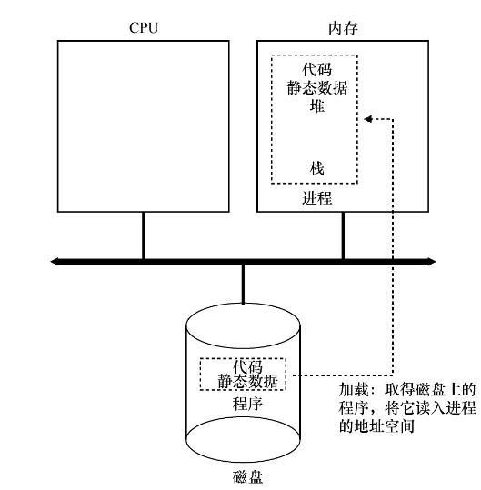
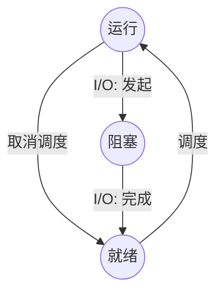
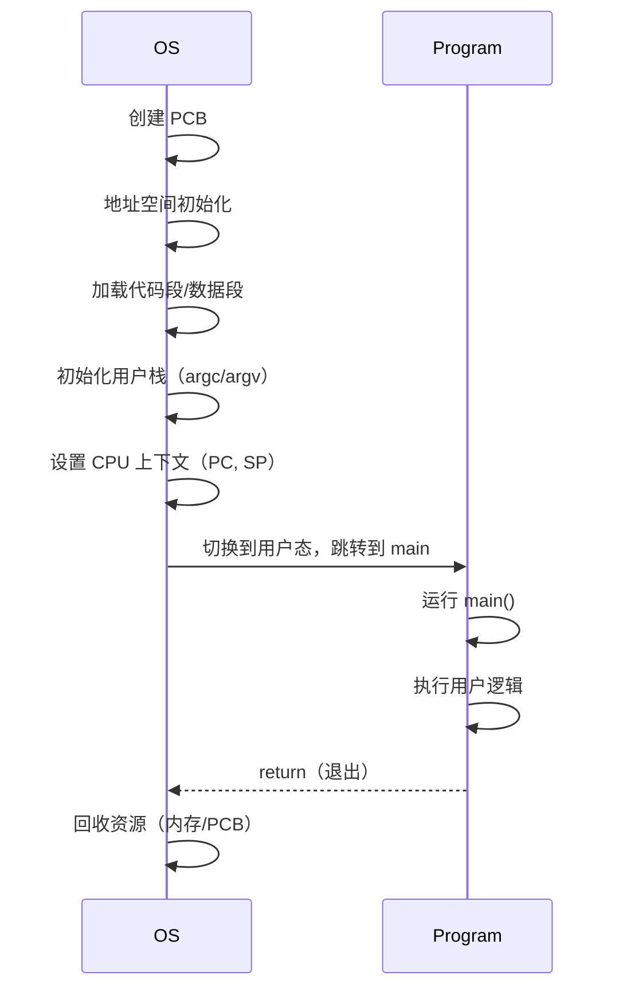

## starter

*What is an Operating System?*
这个问题困扰了我很久,直到我终于下定决心好好阅读OSTEP这本书

:::tip
一切内容以[OSTEP](https://pages.cs.wisc.edu/~remzi/OSTEP/)表述为准
本文章以及后序文章皆为学习记录,而非教学
:::

## CPU visualization

### Process

电脑的物理CPU是有限的,但操作系统通过虚拟化CPU来创造出有无数CPU可用的情况,
通过让一个进程只运行一个 时间片,然后切换到其他进程,这是**时分共享(time sharing)**CPU技术,潜在开销是性能损失 <-CPU共享导致进程运行变慢

要实现CPU虚拟化,需要**机制(mechanism)**-> 低级的方法或协议,实现所需功能(eg. 上下文切换 content switch)
还需要**策略(policy)**->做某种决定的算法(eg. 调度策略 scheduling policy)

#### The Abstraction: A Process

> 进程(Process) : 操作系统为正在运行的程序提供的抽象

因此一个进程其实就只是一个正在运行的程序

> 进程的机械状态(machine state) : 程序在运行时可读取或更新内容

机械状态由两部分组成:
第一个是内存 <-指令&正在运行的程序读取和写入的数据
可以被进程访问到的内存是**地址空间(address space)** ,是该进程的一部分

第二个是寄存器 <-指令明确读取或更新寄存器
*有些非常特殊的寄存器构成了机械状态的一部分*(eg. 程序计数器 Program Counter, 栈指针 stack pointer, 帧指针 frame pointer...)

#### Process API

现代操作系统必须以某种形式提供以下API

- 创建(create) : 新建进程的方法
- 销毁(destroy) ： 强制销毁进程的接口
- 等待(wait) : 等待进程停止运行
- 其他控制(miscellaneous control) : 有可能有的其他控制方法
- 状态(status) : 调接口获得进程的状态信息

#### Process Creation: A Little More Detail

在这是程序如何转化为进程

- 1.将代码和所有静态数据加载到内存中,加载到进程的地址空间

程序会以某种可执行格式驻留在磁盘上(或者在基于闪存的SSD上)



现代操作系统惰性(lazily)执行加载,即仅在程序执行期间需要加载的代码或数据片段,才会加载
在内存虚拟化时会说加载机制,你先别急

- 2.为程序的运行时栈(run-time stack 或 stack)分配一些内存
- 3.为程序的堆(heap)分配一些内存
- 4.执行一些其他初始化任务,特别是I/O相关任务

做完这些事情之后,OS将CPU的控制权转移给新创建的进程中,程序开始执行

#### Process State

进程可以处于以下3种状态之一:

- 运行(running)
- 就绪(ready)  <-并不在此时运行,但是进程已经准备好了
- 阻塞(blocked) <- 一个进程执行了某种操作,直到发生其他事件时才会准备运行

当然还可以处于初始(initial) 和 最终(final / zombie in UNIX)状态



:::note
Process Control Block(PCB):
进程控制块,存储关于进程的个体结构
:::

### Interlude: ProcessAPI

#### The fork() System Call

```c
#include <stdio.h>
#include <stdlib.h>
#include <unistd.h>
int main(int argc, char *argv[]) {
  printf("hello (pid:%d)\n", (int) getpid());
  int rc = fork();
  if (rc < 0) {
    // fork failed
    fprintf(stderr, "fork failed\n");
    exit(1);
  } else if (rc == 0) {
    // child (new process)
    printf("child (pid:%d)\n", (int) getpid());
  } else {
    // parent goes down this path (main)
    printf("parent of %d (pid:%d)\n",
    rc, (int) getpid());
  }
  return 0;
}
```

wsl跑了一下

```bash
$ gcc p1.c -o p1
$ ./p1
hello (pid:990)
parent of 991 (pid:990)
child (pid:991)
```

fork()创建子进程,从创建的位置开始运行,而非main()
fork()结束后,父进程和子进程都在内存内,输出结果取决于CPU调度程序(Scheduler)
因为无法预测操作系统的调度策略,所以程序的输出顺序时不确定的(non-deterministic)
在后序多进程程序(multi-threaded program)和并发(concurrency)时会更加明显

#### The wait() System Call

wait()系统调用会在子进程运行结束后才返回

```c
#include <stdio.h>
#include <stdlib.h>
#include <unistd.h>
#include <sys/wait.h>

int main(int argc, char *argv[])
{
    printf("hello world (pid:%d)\n", (int) getpid());
    int rc = fork();
    if (rc < 0) {
        // fork failed; exit
        fprintf(stderr, "fork failed\n");
        exit(1);
    } else if (rc == 0) {
        // child (new process)
        printf("hello, I am child (pid:%d)\n", (int) getpid());
  sleep(1);
    } else {
        // parent goes down this path (original process)
        int wc = wait(NULL);
        printf("hello, I am parent of %d (wc:%d) (pid:%d)\n",
         rc, wc, (int) getpid());
    }
    return 0;
}
```

```bash
$ ./p2
hello world (pid:1350)
hello, I am child (pid:1351)
hello, I am parent of 1351 (wc:1351) (pid:1350)
```

父进程调用wait(),延迟执行,直到子进程执行完毕。当子进程结束时,wait()才返回父进程,使得程序输出结果变稳定了

#### Finally, The exec() System Call

它也是创建进程 API 的一个重要部分,可以让子进程执行与父进程不同的程序

```c
#include <stdio.h>
#include <stdlib.h>
#include <unistd.h>
#include <string.h>
#include <sys/wait.h>

int main(int argc, char *argv[])
{
    printf("hello world (pid:%d)\n", (int) getpid());
    int rc = fork();
    if (rc < 0) {
        // fork failed; exit
        fprintf(stderr, "fork failed\n");
        exit(1);
    } else if (rc == 0) {
        // child (new process)
        printf("hello, I am child (pid:%d)\n", (int) getpid());
        char *myargs[3];
        myargs[0] = strdup("wc");   // program: "wc" (word count)
        myargs[1] = strdup("p3.c"); // argument: file to count
        myargs[2] = NULL;           // marks end of array
        execvp(myargs[0], myargs);  // runs word count
        printf("this shouldn't print out");
    } else {
        // parent goes down this path (original process)
        int wc = wait(NULL);
        printf("hello, I am parent of %d (wc:%d) (pid:%d)\n",
         rc, wc, (int) getpid());
    }
    return 0;
}
```

```bash
$ ./p3
hello world (pid:605)
hello, I am child (pid:606)
  35  120 1024 p3.c
hello, I am parent of 606 (wc:606) (pid:605)
```

#### Why? Motivating The API

构建shell时好用
fork()和 exec()的分离,让 shell 可以方便地实现很多有用的功能

```c
#include <stdio.h>
#include <stdlib.h>
#include <unistd.h>
#include <string.h>
#include <fcntl.h>
#include <assert.h>
#include <sys/wait.h>

int main(int argc, char *argv[])
{
    int rc = fork();
    if (rc < 0) {
        // fork failed; exit
        fprintf(stderr, "fork failed\n");
        exit(1);
    } else if (rc == 0) {
  // child: redirect standard output to a file
  close(STDOUT_FILENO); 
  open("./p4.output", O_CREAT|O_WRONLY|O_TRUNC, S_IRWXU);

  // now exec "wc"...
        char *myargs[3];
        myargs[0] = strdup("wc");   // program: "wc" (word count)
        myargs[1] = strdup("p4.c"); // argument: file to count
        myargs[2] = NULL;           // marks end of array
        execvp(myargs[0], myargs);  // runs word count
    } else {
        // parent goes down this path (original process)
        int wc = wait(NULL);
        assert(wc >= 0);
    }
    return 0;
}
```

:::devil1
僵尸进程和孤儿进程怎么产生的?
fork()出的子进程先结束,父进程未调用wait(),父进程就成为僵尸进程,占用PID;
父进程先死，子进程还在运行
:::
但幸运的是我们的init会一直wait()循环,有时候这个孤儿进程反而是很好被利用的点

### Mechanism: Limited Direct Execution

通过时分共享(time sharing)CPU，实现了虚拟化

但构建该虚拟化机制，面临着要*保持控制权的同时获得高性能*的挑战

#### Basic Technique: Limited Direct Execution

受限直接执行(limited direct execution)

有受限那当然就有直接运行协议:



但是这个方法在虚拟化CPU的时候会有问题

咕咕咕 ing
最近很忙
