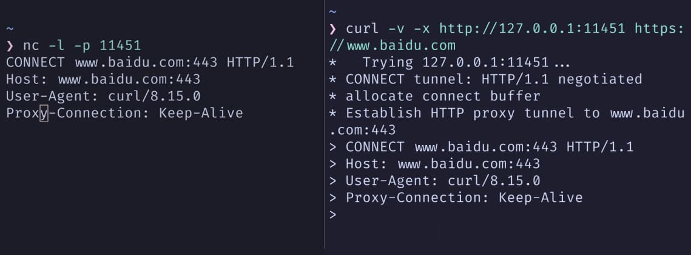

> 免责声明：只做入门梳理  
> 细节、实现和部署以官方文档为准
>
> 2025 SAST运维组第三次授课文档

## 代理出现的原因

> 在「直连」模型里，终端拿到目标 IP 和端口后直接发起 TCP 连接。操作系统完成三次握手，应用就开始收发 HTTP 报文

这个模型一旦落到真实网络，就很快不够用了

所以聪明的人们又有好点子了：引入了一个「中间点」，专门负责代替一端发起连接、转发数据、统一做控制和观测。这一层就是代理服务器
for example：

- 本机调试接口时，希望完整看清 HTTP/HTTPS 请求头、响应头、Body，并能修改后重放。通常会起一个本地代理（如 mitmproxy），把浏览器的 HTTP 代理指向 127.0.0.1:xxxx，再由这个「中间人」接管所有请求
- 线上服务对外只有一个 `https://example.com` 域名，背后是多台应用和多种服务。在入口放一层 Nginx 或 Caddy，把客户端所有请求收下来，再按路径或 Host 等信息分发到不同后端

### 常见使用场景

我们可以对代理用途做一个抽象

**出口控制**场景。学校希望所有出网流量都经过一台或一组出口，便于统一做访问控制、审计、带宽管理。终端直连外网会被路由或防火墙丢弃，只有经由 HTTP/SOCKS 出口代理的流量才能成功

**终端统一配置**场景。桌面环境里有浏览器、Git、命令行工具、IDE 插件等多个组件都需要访问外网，通过本机一个 HTTP/SOCKS 端口集中过滤和分流，会比逐个配置简单，也便于后续切换策略

**网站入口**场景。对外只暴露有限几个域名和入口端口，入口代理根据 Host/Path 等做路由和负载均衡，把请求分发到多台后端，还可以统一完成 TLS 终止、压缩、缓存和安全控制

**API 管控**场景。面对大量对外 API，入口需要根据调用方身份做鉴权、限流、审计、灰度，这通常比「每个微服务自己实现一套」更可控，API 网关就在这一层演化出来

**服务间通信**场景。微服务拆分之后，服务之间调用本身就是一张网。用 sidecar 代理统一承接出站和入站，配合控制面下发路由、重试、限流和 mTLS 策略，就形成了 Service Mesh

## 代理的几个角度

### 代理人

从「站在哪一侧」来看，我们可以区分三个角色：

#### 正向代理

部署在客户端一侧，终端主动把目标信息交给它，由代理代表终端去访问外部服务，
出口 HTTP/SOCKS 代理、浏览器配置的 HTTP 代理、Clash-Verge 提供的本地混合端口，都是正向代理的典型形态

#### 反向代理

部署在服务端一侧，对外表现为「服务本体」
客户端只认识反向代理暴露的 IP 和域名，后面的具体服务拓扑被隐藏在内网。Nginx、Caddy、Envoy 放在网站入口时扮演的就是反向代理角色

#### 透明代理

终端和服务端都未显式配置代理，由网络设备或操作系统利用 NAT/TProxy/TUN 等手段，把匹配条件内的连接重定向到代理进程

运营商透明 HTTP 缓存、Mesh 的 TProxy 模式、终端 TUN 透明代理都属于这一类

### 部署位置

同一套代理软件，部署位置不同，角色和关注点都会变化

- 终端本机 : 终端代理，负责这台机器或这组用户的流量，常见能力是按域名/IP/进程做分流和出站选择
- 出口网关 : 出口代理，面对的是整个子网/VPC 的出网行为，更关心访问控制、审计和带宽
- 公网入口 : 网站或 API 入口代理，重点是 TLS、路由、负载均衡、安全与观测
- 服务实例旁边 : sidecar，在 Mesh 中负责服务间东西向流量
- 边缘节点 : CDN 边缘或边缘计算节点的 HTTP 代理，靠近用户做缓存、压缩和安全防护

### 协议层级

从协议栈层级看，大致有两档：

1.面向 L3/L4 的代理和负载均衡组件，只关心 IP+端口+协议，按照五元组转发流量，必要时做 NAT。典型是四层负载均衡或基于 REDIRECT/TPROXY 的透明代理

2.面向 L7 的应用代理，会解析 HTTP/gRPC/WebSocket 等应用协议，根据 Host、Path、Method、Header 甚至 Body 做路由、限流、鉴权、改写和缓存。Nginx/Caddy/Envoy、各类 API 网关，基本都属于这一类

终端代理通常两层都涉及,底层通过 TUN/TPROXY 接管 IP 层，之后还原到 TCP/UDP 连接，再根据 L7 语义做策略

### 代理协议类型

「客户端和代理之间用什么协议说话」是另一个维度

#### HTTP/HTTPS 代理

客户端把完整 URL 或 CONNECT 请求发给代理，代理根据 HTTP 报文中的 Host/Path 等信息去访问目标。适合 Web 场景、按 URL 维度做控制，是浏览器常用的代理方式

#### SOCKS 代理

先进行简单握手，告知代理目标地址，之后代理仅负责转发 TCP/UDP 流量，不关心上层协议。SOCKS5 还支持 UDP ASSOCIATE，用于转发 DNS 或游戏类 UDP 流量

#### DNS 代理

接收 DNS 查询报文，统一做缓存、转发和过滤。终端代理通常内置 DNS 模块，配合 fake-IP / redir-host 等模式一起工作

#### 各种专用协议代理

数据库中间件可以读懂 MySQL/PostgreSQL 协议，消息队列 Proxy 能读懂 Kafka/Redis 协议......
这些在概念上仍然是代理，只是面向特定协议做更深入处理
~~没想到吧这些都算代理~~

## 出口代理和终端代理

### 基本拓扑

典型出口代理拓扑大概长这样

```text
Client ── TCP1 ──> Proxy ── TCP2 ──> Server
```

Client 和 Proxy 之间是一条 TCP 连接；Proxy 和 Server 之间是一条独立的 TCP 连接
两条连接的建立、关闭、重试等可以完全由 Proxy 控制

当网络路由配置成「所有访问外网的流量只能走 Proxy 那一跳」时，出口代理一旦失效，就会形成**网络黑洞**：终端能解析 DNS，也能 ping 内网，访问外网 HTTP/HTTPS 则全部超时，只能看到 SYN 发出却没有任何应答

终端代理可以看作是把这一套逻辑搬到本机
->应用不直接连目标，而是先连本机的 HTTP/SOCKS 端口，之后由本机代理根据配置做下一步转发

### 显式出口代理

显式出口代理要求应用「事先知道自己在走代理」，并且按代理协议把目标信息发给代理
> 应用先连代理 → 告诉代理真实目标 → 代理再去连目标

浏览器里配置 HTTP 代理地址后，访问 `http://host/` 时，请求不会直接发到 `host:80`，而是先发到代理，例如

```http
GET http://host/path HTTP/1.1 
Host: host
```

访问 HTTPS 时，请求同样先发到代理，先走一条 CONNECT 隧道

```http
CONNECT host:443 HTTP/1.1 
Host: host:443
```

代理确认后返回 `200 Connection established`，之后客户端才在这条连接上完成 TLS 握手，收发加密后的 HTTPS 报文

我们还是使用`curl`来看看区别
> 已知在我的本地已经使用`clash-verge`开起了系统代理，混合端口为`7897`

```shell
$ curl -v https://www.baidu.com
* Host www.baidu.com:443 was resolved.
*   Trying [2409:8c20:6:1794:0:ff:b080:87f0]:443...
...#省略略略略
* Connected to www.baidu.com (2409:8c20:6:1794:0:ff:b080:87f0) port 443
> GET / HTTP/1.1
> Host: www.baidu.com
```

```shell
$ curl -v -x http://127.0.0.1:7897 https://www.baidu.com
*   Trying 127.0.0.1:7897...
* CONNECT tunnel: HTTP/1.1 negotiated
* Establish HTTP proxy tunnel to www.baidu.com:443
> CONNECT www.baidu.com:443 HTTP/1.1
> Host: www.baidu.com:443
...#省略省省省
< HTTP/1.1 200 Connection established
...#省省省省略
* Connected to 127.0.0.1 (127.0.0.1) port 7897
> GET / HTTP/1.1
> Host: www.baidu.com

```

我们可以很明显看出什么东西~~(吗~~:

1. curl 先连的是 `127.0.0.1:7897`，也就是 Clash-Verge 的混合端口，不是百度

2. 建立 TCP 后，curl 发了一条 HTTP 请求：`CONNECT www.baidu.com:443 HTTP/1.1`  
    这一步是在“跟代理说话”
    “请你帮我去连 `www.baidu.com:443`，给我开一条隧道”
3. Clash-Verge 接受这条 CONNECT，自己去连百度，连上后回一个 `HTTP/1.1 200 Connection established`
4. 从这一刻开始，这条 TCP 连接里后续的内容，就是 TLS 握手和加密后的 HTTP 数据了  
    curl 的视角是「我连着 127.0.0.1:7897，隧道另一头是 `www.baidu.com:443`」

这就是显式出口代理的本质

玩玩看呗
现在一个终端里起一个监听

```shell
nc -l -p 11451
```

然后我们去另一个终端发一个请求

```shell
curl -v -x http://127.0.0.1:11451 https://www.baidu.com
```

然后这个请求就没有出网了，这只是假代理看看两边连接


### 透明出口代理

透明出口代理目标是「不动应用配置」，通过网络层把流量转到代理进程

在网关上，可通过 iptables REDIRECT 或 TProxy 将匹配的 TCP/UDP 流量重定向到本地代理端口。REDIRECT 通过修改数据包目的地址实现，TProxy 则通过更换 skb 上绑定的 socket，实现不改包头的透明截获

在终端上，TUN 模式通过创建虚拟网卡并修改默认路由，让所有出网 IP 包先到虚拟网卡，再由用户态代理读出、解析并决定下一跳；TProxy/redir 模式则在本机防火墙层挂钩需要代理的连接

嗯还是我们的百度
> 已知在我的本地已经用`clash-verge`开起了**TUN 模式**，混合端口为`7897`

```shell
$ curl -v https://www.baidu.com
* Host www.baidu.com:443 was resolved.
* IPv6: (none)
* IPv4: 198.18.0.23
...
* Connected to www.baidu.com (198.18.0.23) port 443
...
* Server certificate:
*  subject: ... CN=baidu.com
...
< HTTP/1.1 200 OK
...

```

在应用眼中它是`curl -v https://www.baidu.com`
但是实际路径是`curl → 透明代理（Clash TUN/fake-ip）→ 真正的 www.baidu.com`

> 在 TUN + fake-ip 模式下，系统的 DNS 和路由被重写，应用解析到的是 fake-ip，连接打到本机虚拟网段；
> 代理根据fake-ip 反查出原始域名，再自己去连真实的远端地址，完成一整套“对应用透明”的出站代理
>
> - 这张表fake-ip是**动态的内存表**
> - fake-ip 子网里的 IP 是**会被复用的，不是“一次分配就永远属于某个域名”**

透明代理容易产生问题的原因在于：它修改的是系统范围的路由/防火墙行为，一旦规则写错或代理不工作，受影响的是整张链路，而不是单个应用

```text
Tip:
  应用
     ↘-系统路由/防火墙（iptables/nftables/TUN/TProxy..）
         ↘-本机某个代理端口（Clash/Squid/Nginx..）
             ↘-真实目标服务器
```

### 终端代理角色

终端代理在一台机器上主要干三件事：接入口、接系统、做决策

第一件是给应用一个「能**配置的入口**」
最常见就是本地 HTTP/SOCKS 端口：浏览器、Git、curl、各种 SDK，可以显式把代理写成 `http://127.0.0.1:7897`，流量先打到终端代理，再由它转出去

第二件是**接管系统级流量**
这时候应用自己不认代理，终端代理要靠「系统手段」把连接拦过来：

> TUN 是虚拟一块网卡，把默认路由指向它，所有 IP 包先进这块网卡，由代理进程在用户态读出来；  
> TProxy 是在内核的防火墙层做钩子，应用以为自己在连目标 IP，iptables/nftables 把连接标记之后，直接“挂”到代理监听的 socket 上，代理再通过 `SO_ORIGINAL_DST` 等接口拿回原始目的地址

从应用视角看，这两种方式都是直连；
从代理视角看，多了一条 inbound 叫 TUN 或 TProxy，可以拿到**整个系统**的连接

第三件是**做规则和出口选择**
终端代理拿到一条连接后，会根据域名、IP、端口、入站来源（是 HTTP、SOCKS 还是 TUN 进来的）去匹配规则，最后得出一个结论：这条连接直连、走哪个上游节点，还是直接拒绝

Clash Core 的配置文件把这三块拆得很清楚：

- inbounds：有哪些入口（HTTP/SOCKS/TUN/TProxy等）
- proxies：有哪些可用的出站（直连、各类节点、上游代理）
- proxy-groups：怎么把多个出站组合成一个策略（首选、测速、负载均衡）
- rules：一条连接应该落到哪个策略组

这就是一个完整的终端代理模型：  
应用不管你怎么折腾路由和 TProxy，最终只要有一个稳定的**本机出入口**和一套可预期的**规则**，就能在这台机器上跑起来

## HTTP 代理和 SOCKS 代理

前面在**代理协议类型**里已经给 HTTP/HTTPS 代理 和 SOCKS 代理做过一次整体介绍，这里只补一点协议细节

### re:HTTP 代理

可以直接参考前面百度,再写就太乱了
> HTTP 代理的控制面就是 HTTP 报文本身

HTTP 代理的特点是可以看到 Host（以及在非 CONNECT 场景下的 Path），很适合做按域名/路径分流、缓存与访问控制

### re:SOCKS 代理

SOCKS 代理工作在传输层之上，协议本身与应用层无关
SOCKS 代理不关心上层协议，只做**目标地址 ↔ 字节流**转发

以 SOCKS5 为例，握手过程基本是：

1. 客户端与代理建立 TCP 连接，声明支持的认证方式；  
2. 代理选择一种认证方式；  
3. 客户端发送请求指定目标地址和端口（CONNECT、BIND 或 UDP ASSOCIATE）；  
4. 代理尝试建立与目标的连接，成功后回复状态码；  
5. 之后双向数据流不再包含 SOCKS 协议，变为普通 TCP/UDP 转发

嗯还是百度
> 已知在我的本地已经使用`clash-verge`开起了系统代理，混合端口为`7897`

```shell
 $ curl -v --socks5 127.0.0.1:7897 https://www.baidu.com
*   Trying 127.0.0.1:7897...
* Host www.baidu.com:443 was resolved.
* IPv6: ...
* IPv4: 36.152.44.132, 36.152.44.93
* SOCKS5 connect to 36.152.44.132:443 (locally resolved)
* SOCKS5 request granted.
* Connected to 127.0.0.1 (127.0.0.1) port 7897
...
> GET / HTTP/1.1
> Host: www.baidu.com

```

- curl 把「目标 = 36.152.44.132:443」封在 SOCKS5 的 CONNECT 请求里发给 127.0.0.1:7897；
- Clash-Verge 收到后自己去连 36.152.44.132:443，连通了就回一个 “granted”

从 `curl` 的角度看，它一直连的是本机 7897；  
从`clash-verge` 的角度看，它帮你在另一端连上了 36.152.44.132:443，把两边的字节流对接起来

> 也正因为 SOCKS5 不关心上层协议，它可以被拿来当通用隧道

### 差异与适用场景

HTTP代理具备HTTP协议语义，可以读取 `Host/Path/Method/Headers`，适合专门处理 Web 流量,做路径路由、缓存、Header 注入、重写等工作，*反向代理基本都属于这一类*

SOCKS 代理对应用层协议透明，更适合作为**通用隧道**，在终端层统一承载各种协议的出站流量

终端代理通常会同时开启 HTTP 和 SOCKS 入站端口，并将它们统一抽象为**到一个目标地址的连接**，之后由同一套规则引擎和出站选择逻辑处理

## 终端代理和系统流量

### 终端代理架构

终端代理可抽象为三段：

- 入站 : 接收来自应用或系统的流量，包括 HTTP/SOCKS 监听端口，以及 TUN/TPROXY 等系统级入口
- 规则 : 基于域名、IP、端口、入站来源甚至进程信息，匹配出一个策略或策略组
- 出站 : 根据策略决定如何发起下游连接，是直连、某个上游节点、另一个代理，还是直接拒绝

大部分终端代理的配置文件，基本都是围着这三块展开：先定义有哪些入口，再列出可以用的出口，最后写一堆规则，把每一条连接从某个入口，导到某个出口或出口集合

### 入站和出站

> 入站部分包含本机监听的各种端口和虚拟接口

#### HTTP 入站

监听某个端口同时提供 HTTP 代理服务，供浏览器、curl 等直接使用

#### SOCKS 入站

监听 SOCKS5，用于承载非 HTTP 协议或需要 UDP 配合的应用

#### TUN/TProxy 入站

通过虚拟网卡或内核透明代理拦截系统发出的 IP 包或 TCP 连接，实现系统级透明代理

> 出站则是各种「下一跳」描述

#### 直连（DIRECT）

由代理进程直接发起到目标服务器的连接

#### 上游代理

将连接转发给另一层 HTTP/SOCKS/专用协议代理

#### 节点集群

描述多个可选出口，后续由策略组在其中选择

### 规则和策略组

规则是「匹配条件 → 策略组」的有序列表

典型规则条件包括：

- 域名匹配（全匹配、后缀匹配、关键词匹配）
- IP 匹配（CIDR 段、GeoIP 区域）
- 端口、入站来源等

策略组则可以是：

- select：手动选择一个候选出口。
- url-test/load-balance：自动测速或负载均衡，在多个出口之间选择
- special：DIRECT/REJECT 等特殊行为

终端代理主界面的「规则/全局/直连」模式切换，本质上是选择不同规则集或绕过规则，将所有连接强行落到某个策略上

如果你很闲，就可以自己去看看clash-verge的配置文件

```yaml
mixed-port: 7897
tun:
  auto-detect-interface: true
  auto-route: true
  device: Mihomo
  dns-hijack:
  - any:53
  mtu: 1500
  stack: system
  strict-route: false
  enable: false
external-controller-unix: /tmp/verge/verge-mihomo.sock
proxies:
- name: xxxxxxxx
  type: trojan
  server: xxxxxxxxxxx
  port: 9120
  password: xxxxxxxxxxxx
  udp: true
  sni: xxxxxxxxxx
  skip-cert-verify: true
proxy-groups:
- name: xxxx
  type: select
  proxies:
  - xxxx
rules:
- DOMAIN,xxxxxxxxxxxxxxxxxx,DIRECT
- DOMAIN-SUFFIX,xxxxxxx,xxxx
- DOMAIN-SUFFIX,xxxx,xxxx
- DOMAIN-SUFFIX,xxxxxxxxxxxxxxxxxx,xxxx
- DOMAIN-SUFFIX,xxxxxxxxxxxxxx,xxxx
- DOMAIN-SUFFIX,xxxxxxxxxxxxxx,xxxx
- DOMAIN-SUFFIX,xxxxxxxxxxx,xxxx
```

However *注意隐私安全*

### 系统级透明模式

系统级透明模式通过 TUN 或 TProxy 将整个系统产生的流量导入代理

- TUN 模式下，操作系统路由表会把默认路由指向**虚拟网卡**，代理进程从 TUN 设备读取 IP 包并还原出 TCP/UDP 流
- TProxy 模式下，应用认为自己在直连目标 IP，内核根据 iptables 规则把数据包绑定到代理进程监听的 socket，代理再根据 SO_ORIGINAL_DST 或 IP_TRANSPARENT 等机制获得原始目的地址

这两种模式一旦配置错误，会直接表现为**整机无法出网、DNS 查询回环、代理自身连接被错误重定向**等典型故障，需要结合路由表、iptables 和代理日志一起排查

***不要乱搞UwU***

### DNS 协作

终端代理若按域名分流，仅依赖 IP 会遇到多租户 CDNs、共享 IP 等问题；因此通常会参与 DNS 解析过程

常见协作方式包括：

- 本地 DNS 服务器。代理监听本机 53 端口，拦截系统 DNS 查询，自己转发给上游 DNS，缓存「域名 → IP」映射，并在后续连接中通过 IP 反查域名，保证规则可以按域名生效
- fake-IP 模式。代理维护一段本地虚拟 IP 段，对每个域名分配一个固定 fake IP，返回给系统。系统发往 fake IP 的连接被代理拦截，代理借 fake IP 找回原始域名，从而精确按域名路由

## 反向代理和网站入口

### 拓扑与角色

反向代理处于客户端与后端服务之间，对客户端暴露统一入口，对后端屏蔽外部细节

典型拓扑是：

```text
Client → Nginx / Caddy → app1 / app2 / static / …
```

入口只监听 80/443 或少数一些端口，负责 TLS 握手、路由、负载均衡、日志和基础安全；后端服务则运行在内网，使用私有地址和端口

### 路由与负载均衡

Nginx 使用 `proxy_pass` 配合 `upstream` 模块完成反向代理与负载均衡

Caddy 使用 `reverse_proxy` 指令完成类似功能，对简单场景配置更为简洁[Caddy Web Server](https://caddyserver.com/docs/caddyfile/directives/reverse_proxy)

> 文档是大家的老师，也不必把文档背下来的对吧

#### nginx

[nginx: download](https://nginx.org/en/download.html)
maybe U should find yourself(?
[Beginner’s Guide](https://nginx.org/en/docs/beginners_guide.html)
毕竟nginx老资历很权威，所以我只能带大家简单入门

```shell
# 跳了安装，一定不是我嫌麻烦

$ sudo systemctl start nginx.service

$ sudo systemctl enable nginx.service # 开机自启,看需不需要咯

# $ sudo systemctl status nginx.service  
# 可以用这个命令看看服务情况
```

看网上有个[排序可视化](https://github.com/aoverb/sorting)挺好玩的，那顺手用nginx部署一下

```shell
cd /var/www/html
sudo git clone https://github.com/aoverb/sorting.git
```

当然得用npm先把项目构建一下

```shell
$ cd /var/www/html/sorting
$ sudo npm install

$ sudo npm run build

$ ls /var/www/html/sorting
dist
eslint.config.js
index.html
LICENSE
node_modules
package.json
package-lock.json
pnpm-lock.yaml
postcss.config.cjs
public
README.md
src
tailwind.config.cjs
vite.config.js
```

这边构建出来的结果在/dist目录
ok了之后就可以去看看nginx了

```shell
$ cd /etc/nginx/
$ ls
conf.d
default.d
fastcgi.conf
fastcgi.conf.default
fastcgi_params
fastcgi_params.default
koi-utf
koi-win
mime.types
mime.types.default
nginx.conf
nginx.conf.default
scgi_params
scgi_params.default
uwsgi_params
uwsgi_params.default
win-utf
```

这里面主要要知道是

- nginx.conf  芝士nginx的核心配置，里面有一行`include /etc/nginx/conf.d/*.conf;`
- conf.d 目录 很明显吧新的服务最好都应该在这写
- mime.types [MIME 类型（IANA 媒体类型） - HTTP \| MDN](https://developer.mozilla.org/zh-CN/docs/Web/HTTP/Guides/MIME_types)

后面我们就来写点配置吧

```shell
cd /etc/nginx/conf.d/

sudo nano /etc/nginx/conf.d/sorting.conf
```

什么？你第一次用nano？
只要记得`ctrl S` 保存和`ctrl X` 退出就行了

```txt
server {
    listen 11451;

    server_name _;

    root /var/www/html/sorting/dist;

    index index.html;
    location / {
        try_files $uri $uri/ /index.html;
    }
    access_log /var/log/nginx/sorting_access.log;

    error_log /var/log/nginx/sorting_error.log;
}
```

nginx有检查语法的工具

```shell
$ sudo nginx -t
nginx: the configuration file /etc/nginx/nginx.conf syntax is ok
nginx: configuration file /etc/nginx/nginx.conf test is successful
```

然后我们就可以重载nginx了

```shell
sudo systemctl reload nginx
```

然后访问 [http://localhost:11451](http://localhost:11451) 就可以了
简单看看这些都是什么

- `server { ... }`：虚拟主机（Virtual Host）配置块
- `listen  11451`：监听端口与地址绑定
- `server_name  _`：服务器名称匹配规则
- `root /var/www/html/sorting/dist`：根目录路径映射
- `index index.html`：默认索引文件

🤓☝️
你会疑惑，刚才的不是web静态服务器吗
我不会npm run dev吗？
为什么要用nginx?

>你说的对，但是《Nginx》是由 Igor Sysoev 自主研发的一款全新高性能 HTTP 和反向代理服务器。软件运行在一个被称作「Linux」的开源世界，在这里，被 nginx.conf 选中的配置将被授予「Worker Process」，导引高并发之力。你将扮演一位名为「运维工程师」的神秘角色，在自由的部署中邂逅 proxy_pass、try_files、gzip 等性格各异、能力独特的指令们，和他们一起击败 **C10K** 强敌，找回失散的 **200 OK** ——同时，逐步发掘「Web 服务」的真相。

是不是差点忘了这一块正在讲反向代理（
🤔 那 来点怪东西？

```shell
sudo nano /etc/nginx/conf.d/gateweiii.conf
```

看看gateway

```txt
server {
    listen 80;

    server_name gugugaga.gugugaga.gugugaga;

    location / {
        proxy_pass http://127.0.0.1:11451;
        proxy_set_header Host $host;
        proxy_set_header X-Real-IP $remote_addr;
        proxy_set_header X-Forwarded-For $proxy_add_x_forwarded_for;
    }

    add_header X-Proxy-By "SAST嘿壳,低调的嘿壳有多恐怖";

}

```

当然还需要一点小巧思

```shell
$ sudo nano /etc/hosts
# 加上这一句
# 127.0.0.1   gugugaga.gugugaga.gugugaga
```

然后我们就可以去访问我们的 [http://gugugaga.gugugaga.gugugaga](http://gugugaga.gugugaga.gugugaga)
你会发现居然是一样的东西
没错这就是反代

玩闹归玩闹，来看看门道

- `proxy_pass http://127.0.0.1:11451;`  
这句话告诉 Nginx：凡是匹配到这个 server 的请求，全部**转发**给本地的 11451 端口处理

反向代理是所有流量的**总入口**

1. **安全隔离**：外人不知道你后端跑的是什么，也不知道具体端口
2. **负载均衡**：可以开 10 个 sorting 服务（端口 11451-11460），Nginx 可以用 upstream 指令把流量轮询分发给它们，变身集群架构
3. **统一入口**：你可以在同一个 80 端口下，用 /api 转发给 Python，用 /web 转发给 Node.js，用 /static 留给自己处理静态资源,总的来说就是想干啥干啥

一个比较全面的配置文件可能像这样
这边没准备好好项目只能让ai给大会模拟一个了
~~磕一个orz~~

```txt
# =========================================================
# 1. 定义后端池 (Upstream) - 方便以后扩展多台服务器
# =========================================================
upstream my_backend_api {
    # 这里可以是 127.0.0.1，也可以是内网其他服务器 IP
    # keepalive 保持长连接，提升性能
    server 127.0.0.1:3000;
    keepalive 64;
}

# =========================================================
# 2. HTTP 跳转 HTTPS (80 -> 443)
# =========================================================
server {
    listen 80;
    listen [::]:80;
    server_name www.s3loy.tech s3loy.tech;

    # 只要有人访问 80，直接返回 301 永久重定向到 https
    return 301 https://www.s3loy.tech$request_uri;
}

# =========================================================
# 3. 主服务器配置 (HTTPS / 443)
# =========================================================
server {
    listen 443 ssl http2;      # 开启 HTTP/2
    listen [::]:443 ssl http2;
    server_name www.s3loy.tech;

    # -----------------------------------------------------
    # SSL 证书配置 (Certbot 会自动帮你填这些)
    # -----------------------------------------------------
    # ssl_certificate /etc/letsencrypt/live/www.s3loy.tech/fullchain.pem;
    # ssl_certificate_key /etc/letsencrypt/live/www.s3loy.tech/privkey.pem;
    
    # SSL 优化参数
    ssl_protocols TLSv1.2 TLSv1.3;  # 只允许安全的协议
    ssl_ciphers HIGH:!aNULL:!MD5;
    ssl_session_cache shared:SSL:10m;
    ssl_session_timeout 10m;

    # -----------------------------------------------------
    # 安全响应头 (Security Headers) - 防 XSS/点击劫持等
    # -----------------------------------------------------
    add_header Strict-Transport-Security "max-age=31536000; includeSubDomains" always; # 强制浏览器记住一年内只能用 HTTPS
    add_header X-Frame-Options SAMEORIGIN;           # 也就是不让别人把你的网站嵌在 iframe 里
    add_header X-Content-Type-Options nosniff;       # 防止 MIME 类型嗅探
    add_header X-XSS-Protection "1; mode=block";     # 开启 XSS 过滤

    # -----------------------------------------------------
    # 性能优化 (Gzip 压缩)
    # -----------------------------------------------------
    gzip on;
    gzip_types text/plain text/css application/json application/javascript text/xml;
    gzip_min_length 1000; # 小于 1k 的文件不压缩（因为压了也省不了多少）

    # -----------------------------------------------------
    # 静态前端资源 
    # -----------------------------------------------------
    root /var/www/html/sleepinggggg;
    index index.html;

    location / {
        # 单页应用 (SPA) 必备配置：
        # 找不到文件就退回到 index.html，让前端路由接管
        try_files $uri $uri/ /index.html;
    }

    # -----------------------------------------------------
    # 静态资源缓存 (图片/JS/CSS)
    # -----------------------------------------------------
    location ~* \.(js|css|png|jpg|jpeg|gif|ico|svg)$ {
        expires 30d; # 缓存 30 天
        add_header Cache-Control "public, no-transform";
    }

    # -----------------------------------------------------
    # 后端 API 转发
    # -----------------------------------------------------
    location /api/ {
        proxy_pass http://my_backend_api; # 转发给上面的 upstream
        
        # 转发时携带真实的客户端信息，不然后端拿到的 IP 全是 127.0.0.1
        proxy_set_header Host $host;
        proxy_set_header X-Real-IP $remote_addr;
        proxy_set_header X-Forwarded-For $proxy_add_x_forwarded_for;
        proxy_set_header X-Forwarded-Proto $scheme;
    }
}
```

证书那边可提前下载certbot
然后用`sudo certbot --nginx`去一键配置

> 什么，你说你想知道证书具体是什么和怎么申请？
> 那你学完教我zwz 反正没那么复杂

### 常见组件

反向代理常见组件及其特点：

- Nginx / OpenResty。成熟、高性能的 HTTP 反向代理和负载均衡器，配置灵活，配合 ngx_http_upstream_module 支持多种负载均衡算法和健康检查，也可以通过 Lua 脚本扩展复杂逻辑
- Caddy。配置简洁，默认采用安全合理的 TLS 设置，reverse_proxy 指令支持多种负载均衡策略和健康检查，适合快速搭建反向代理和小型网关
- HAProxy。偏重 L4/L7 负载均衡，在金融、电信等高性能场景广泛使用。配置以后端池和前端监听为中心，适合做高可靠入口
- Envoy / Traefik。更偏云原生生态，具备丰富的 L7 过滤器和动态配置接口，是很多 API 网关和 Service Mesh 数据平面的基础

## API 网关

### 要解决的问题

当后端服务和对外 API 数量增加之后，入口层面的问题不再只是「路由和负载均衡」

> 需要:
> 根据调用方身份做鉴权和权限控制；  
> 对不同 API 和不同调用方实施限流、配额和计费；  
> 在多版本共存时按用户或流量比例做灰度和金丝雀发布；  
> 集中记录调用日志和审计信息，便于追踪和合规。

散落在每个微服务中实现这些功能，会带来重复工作和一致性问题。API 网关就是在反向代理基础上，把这些 API 相关的横切关注点挪到统一入口

### 主要能力

典型 API 网关在 L7 代理之上叠加了几类能力：

1. 鉴权与认证。支持 JWT、OAuth2/OpenID Connect、API Key 等认证方式
2. 细粒度访问控制。按调用方、租户、路径、方法等维度控制访问权限
3. 限流与配额。按 IP、用户、API 限制请求速率和总调用次数，支持滑动窗口等算法
4. 协议转换。接收外部 HTTP+JSON 请求，内部转换为 gRPC 或自研 RPC 协议
5. 灰度与路由策略。按 Header、Cookie、用户特征或百分比分配流量到不同版本服务
6. 审计日志与监控。记录详细调用信息，配合 metrics 和 tracing 工具，形成完整观测体系

开源网关（如 Kong、APISIX 等）一般以 Nginx 或 Envoy 为核心，在其上插入 Lua/插件链与控制面，实现上述能力

### 与反向代理的关系

API 网关可以看作是**带 API 语义和策略系统的反向代理**

反向代理关注的是**从路径/Host 到某个后端实例**的映射，以及性能与可靠性问题

API 网关在此基础上增加了**调用方是谁、能访问什么、何时访问、如何计费和审计**等维度，在架构图中往往作为对外统一入口，后面再通过反向代理或直连访问微服务集群

## Service Mesh

### 出现背景

微服务拆分之后，服务间调用形成一张庞大网，问题逐渐开始变化了：

- 每个服务都需要对下游调用做重试、超时、熔断、负载均衡
- 服务之间需要统一的 mTLS，加密和认证不能依赖各语言的实现细节
- 需要在不修改应用代码的情况下，对服务间流量做路由和灰度

>这些需求本质上是网络层和基础设施层的职责

Service Mesh 就是在服务实例旁边部署 sidecar 代理，加上集中控制面，把网络治理能力从业务代码中抽离

### 控制面和数据面

Mesh 体系结构一般分为控制面和数据面

控制面负责：

- 保存和下发服务发现信息；  
- 下发路由、重试、超时、熔断策略；  
- 管理和分发证书，实现 mTLS；  
- 收集 metrics、日志和 trace

数据面由大量 sidecar 代理组成，每个服务实例旁边一个，如 Envoy。应用所有入站和出站流量都经过本地 sidecar：

```text
Service A ↔ sidecar A ↔ sidecar B ↔ Service B
```

sidecar 根据控制面下发的配置，对请求做负载均衡、TLS 握手、流量控制和观测

### Sidecar 职责

Sidecar 在本地承担的职责包括：

- 对出站流量执行服务发现、负载均衡、路由、重试和熔断策略；
- 对入站流量执行鉴权、限流，并注入 tracing Header 和 metrics；
- 与控制面交互，接收动态配置和证书更新

> 可以把它看作每个服务进程前的一个「反向代理 + 出口代理」组合，只不过配置来源统一于控制面

### 与网关和反向代理的关系

From/To 角度看，各层职责可以简化为：

> 入口 API 网关和反向代理处理「外部客户端 → 系统」的南北向流量
> Service Mesh sidecar 处理「系统内服务之间」的东西向流量

典型调用链路是：

```text
Client → API 网关 / 入口反代 → Service A sidecar → Service A
                                 ↓
                              Service B sidecar → Service B
```

底层组件可能都是 Envoy，只是部署位置和控制面不同

## 代理的实现和性能

### 并发模型

#### 阻塞模型

早期代理常见模式是阻塞 I/O，每个连接由一个线程或进程负责处理，调用阻塞 read/write。实现简单直观，但线程数随着连接数线性增长，在线程调度、内存占用和上下文切换上成本较高

#### 事件驱动模型

现代高性能代理普遍采用事件驱动模型：将 socket 设置为非阻塞，用 epoll/kqueue 等多路复用接口统一等待可读/可写事件，在少量 worker 线程中循环处理就绪事件

Nginx 的 worker 进程就是典型事件循环，每个 worker 维护自己的事件队列和连接集合。HAProxy、Envoy 等也采用类似思想

#### 协程模型

在事件驱动基础上引入协程（用户态线程）可以在不牺牲性能的前提下，以同步代码风格编写逻辑。Go 语言的 goroutine、Rust 的 async/await 等都可以用来实现高并发代理

协程模型下，I/O 等待通过调度器挂起协程，释放线程去处理其他任务，实现「少量线程 + 大量并发连接」的组合

### 通用数据路径

从一条 HTTP 请求的角度看，一个典型 L7 代理内部的数据路径可以概括为：

1. 监听端口接收 TCP 连接，必要时完成 TLS 握手；
2. 读取请求，解析协议（HTTP/HTTP2/HTTP3 等），构建内部请求结构；
3. 根据 Host/Path/Method/Header 或其他元数据，匹配路由和规则，选择上游集群和具体实例；
4. 与上游建立或复用连接（HTTP keepalive，HTTP/2 多路复用等），发送请求；
5. 在上下游之间转发响应数据，按需执行 Header/Body 改写、压缩、缓存等操作；
6. 根据协议和配置决定是否复用连接、是否启用 HTTP pipelining/多路复用或关闭连接

无论是出口代理、反向代理还是 sidecar，只要工作在 L7，这条路径都是基本骨架

### 性能优化方向

性能优化常围绕几个方面展开：

#### 连接管理

尽量启用 keepalive、连接池、HTTP/2/HTTP/3 等机制减少建立/拆除连接的开销；控制连接池大小和 Idle 超时时间，避免过多空闲连接占用资源

#### 数据拷贝

使用 sendfile、splice 等系统调用减少用户态–内核态之间的拷贝次数；合理设置缓冲区大小，避免大量小包或过大缓冲空间浪费

#### 内核参数

调优文件描述符上限、端口范围、接收/发送缓冲区、连接队列长度、TIME_WAIT 回收策略等，以支持更高并发和更平滑的连接复用

#### 规则与插件链路

对热点路径上的规则匹配和插件调用进行简化，避免昂贵的正则或高复杂度逻辑带来的延迟和抖动

Nginx 的 worker_connections、keepalive、proxy_buffering，Envoy 的 connection pool 和 circuit breaker 配置，终端代理的 TCP keepalive 与并发限制，都是这一层的体现

### 安全要点

代理位于数据路径中，是高价值的控制。

出口代理若暴露在公网且无认证，很容易被当作开放代理，用于发送垃圾邮件或构建 DDoS 反射链，进而导致整个出口 IP 段被列为黑名单

反向代理若未正确处理 Host、X-Forwarded-For/X-Real-IP 等 Header，可能被利用绕过访问控制或构造 SSRF 通道，访问原本仅允许内网访问的管理接口

中间人 HTTPS 代理场景下，自建 CA 证书和私钥的安全性至关重要，一旦泄漏，不仅可用于伪造任意站点，还可以解密之前被捕获的历史流量（在未使用前向保密套件时）。

> 设计代理拓扑时需要明确信任边界：谁可以访问代理，代理可以访问哪些内外网段，管理接口与数据平面接口是否隔离，日志与监控是否泄漏敏感信息

### 可观测性与调试

代理的可观测性直接影响排障效率

入口代理层通过 access_log 和结构化日志记录请求路径、状态码、耗时、上游信息，可用于定位问题是出在入口、后端还是网络

metrics 维度可以通过连接数、QPS、各类错误率和延迟直方图暴露系统状态；tracing 维度则通过在入口和各个服务跳数上注入追踪 ID，将一次请求从代理到后端的全路径打通

> *终端代理层的日志可以记录规则命中情况、出站选择、连接错误等信息，对调试分流问题特别重要*

调试代理相关问题时常用的思路是：

1. 先验证直连路径是否正常（终端到目标不经代理是否通）；  
2. 再验证代理到目标是否正常（在代理机器上 curl 或本机显式指定代理）；  
3. 结合代理日志和抓包，看流量是否按照预期路径经过代理，并命中正确规则；  
4. 在透明代理场景中，结合路由表、iptables/TProxy/TUN 状态，排查是否存在错误重定向或路由环路
