:::warning
本文只讨论公开论文、协议标准、公开泄漏分析里已经出现过的机制
:::

## 序

> 代理流量有特征,所以会被发现

说点大家不知道的

但随着时间的演变,技术也都在不断改进

- 代理协议一直在换壳
- 审查系统也一直在换抓手

**协议怎么变,审查就怎么跟着变。**

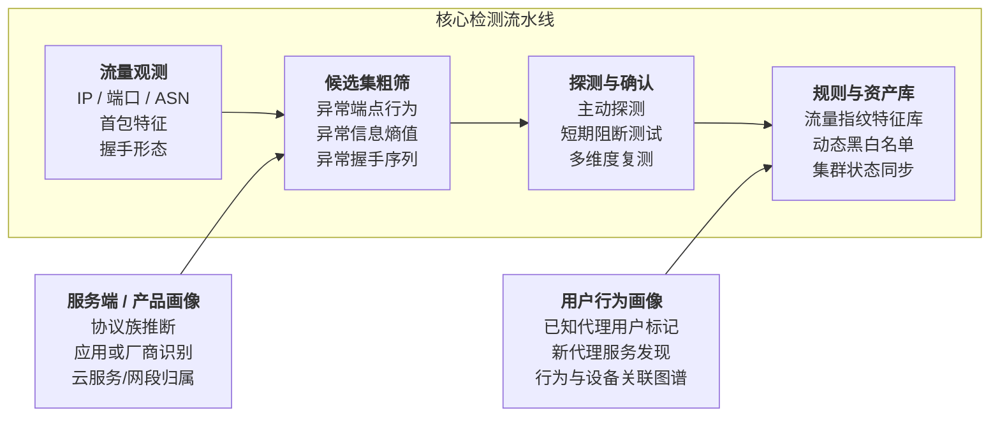

## 密文之前

你是如何看待“流量被检测”的

有个大系统坐在那里,把你的密文拆开、看懂、分类、下结论

现实世界里当然也有更重的检查,但大规模系统要稳定运行下去,机制通常都很朴素：

1. 挑出可疑目标
2. 决定是否多花成本
3. 讲确认过的沉淀成规则、指纹、名单、画像
4. 减少后续处理时间

所以“被检测”在很多时候更接近这些状态：

- 进了候选集
- 被打了主动探针
- 被触发短时残余封锁
- 被归进某种协议 / 某个产品 / 某家服务商的指纹库
- 被挂到用户画像或服务器画像里

这就带来一个很关键的事实：**payload 黑下来以后,shape 还在**

网络上依旧能看到很多东西：

- `IP / Port / AS`
- 第一包长度
- 第一包像不像正常协议
- 握手字段顺序如何
- 有没有很稳定的实现习惯
- 包长分布和时序是否合理
- 这个端点以前有没有上过名单
- 这个用户以前有没有被标过

于是问题就变成了：**代理到底把哪一层藏住了,又把哪一层留在了外面**

## 从零开始的打代理生活: 显式代理和固定端点

很早期的代理其实挺诚实的

显式 `HTTP proxy` 会有 `CONNECT`,`SOCKS5` 会有自己的 greeting,目标端点也常常很固定

如果一个代理服务长期挂在某个云厂商、某个热门端口、某个已经被重点盯住的网段上,它先天就比普通业务更容易进候选集

这一步看起来土,实际很有用

因为“端点发现”本来就是最便宜的一层筛选

早期的 `Tor` 也绕不过这个问题

:::note
[What is Tor](https://zh.wikipedia.org/wiki/Tor)
源于“The Onion Router”（洋葱路由）的英语缩写,实现匿名通信的自由软件
:::

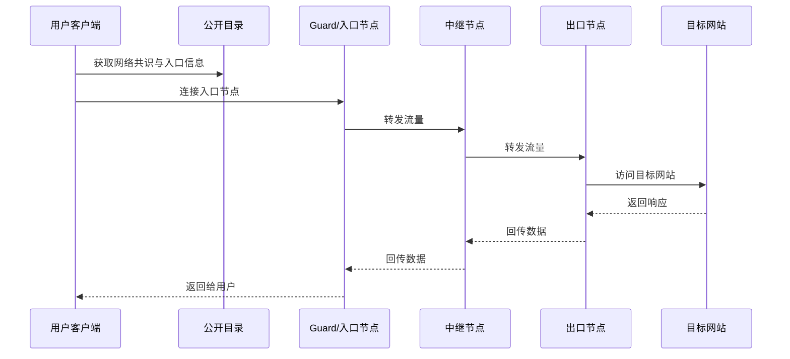

这一阶段的关键问题很直接：入口一旦可枚举,就可以被集中封锁
2012 年 Phil Winter 和 Stefan Lindskog 的研究已经把这个阶段描述得很清楚：早期 GFW 可以通过字符串匹配和 IP 封锁,直接打掉一批 Tor 入口
参考：[How the Great Firewall of China Is Blocking Tor](https://www.usenix.org/sites/default/files/conference/protected-files/winter_foci12_slides.pdf)

所以这条演进线非常自然：

入口公开 → 容易被封
开始“藏入口”（Bridge）
再进一步给流量加外壳（如 TLS 封装）
对抗焦点从“明文特征”转向“握手指纹、实现细节、时序与主动探测”

## re:从零开始的打代理生活: TLS 握手

`Tor bridge` 的思路很直接：

既然公开 relay 容易被一锅端,那就把入口做小、做散、做私有

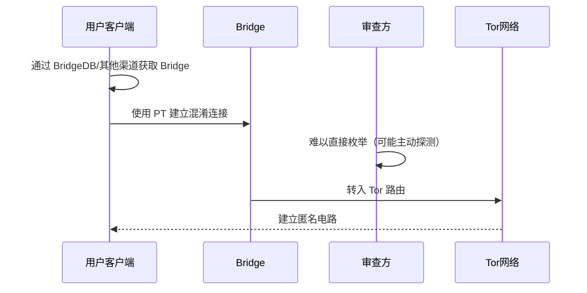

随后也被检测方通过握手特征与主动探测反制

入口虽然藏起来了,握手还是要干的

2012 年那组测量里,一个经典发现就是：

当时 GFW 可以根据 `TLS ClientHello` 里的特定模式,把疑似 Tor 连接先挑出来；接着再从中国境内不同 IP 发起回连,对对应的 bridge 做主动探测。探测成功,`IP:port` 就会进入封锁流程

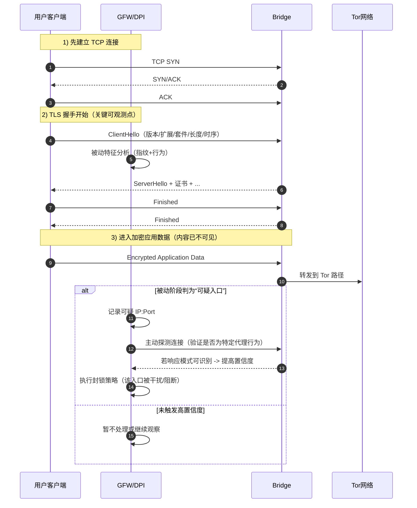

这就是后来很多检测链的母版：

- 先被动观察
- 再主动探测

被动观察便宜,适合大规模运行

主动探测需要的成本高,但此时目标已经缩小了

而且主动探测很吃实现细节

代理服务端只要在某些探针输入下,反应得足够稳定,足够像某个实现,那就会留下证据

## rere: 细节

再往后,大家当然也会想：

>干脆装成别的协议行不行？

装成 `HTTP`

装成 `Skype`

装成“一个普通网站”

甚至干脆装成随机噪声

这个思路当年非常自然,问题在于,协议伪装这件事真做起来很难
2013年的`The Parrot is Dead: Observing Unobservable Network Communications`这篇论文主要击穿了“模仿某个白名单协议即可隐身”的假设：抗审查系统若仅复制报文格式,而无法完整复制目标协议在状态机、错误处理、边界条件和双端协同行为上的语义细节,仍会被识别
[The Parrot is Dead](https://dedis.cs.yale.edu/dissent/papers/parrot-abs/)

但我们可以先看看parrot系统

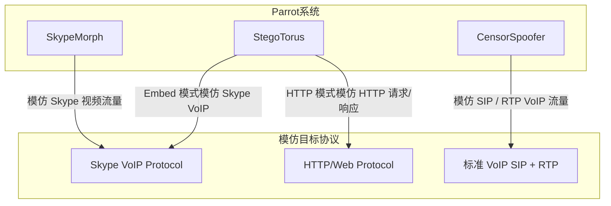

那parrot如何死的

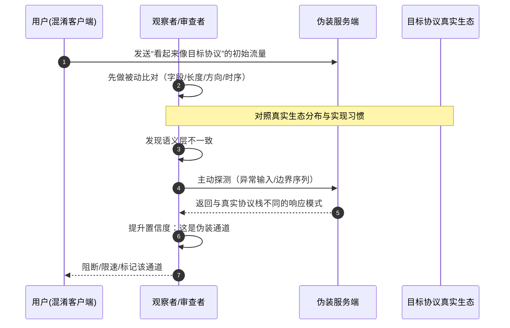

字段顺序、错误处理、边界条件、重传习惯、时序、分片、客户端和服务端配套行为,这些都得像

2015 年的 `Seeing through Network-Protocol Obfuscation` 又把这个问题往前推了一截
[Seeing through Network-Protocol Obfuscation](https://pages.cs.wisc.edu/~akella/papers/ccsfp653-wangA.pdf)

作者把各种混淆协议丢进更真实的流量背景里去测,最后得到的感觉很统一：

你以为自己在“看起来像别人”

系统眼里更像“长得像,行为有点歪”

so,审查点慢慢从“抓某个固定明文特征”转向：

- 实现
- 时序
- 错误输入时返回结果
- 被动观察和主动探测是否出问题

抗审查系统的难点不再只是“把字节伪装得像”,而是“把整个通信过程伪装得像”。

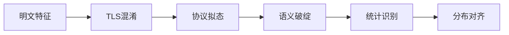

这使得对抗重心从“协议拟态”转向“分布拟态”：不仅要像某个协议,还要长期稳定地落在真实生态流量分布里,并在被动观察与主动探测下都不露馅

## rerere: 首包变黑

再后来,事情会继续往一个方向卷：**让第一个包尽量别说人话**

`Shadowsocks`、`VMess`、`Obfs4` 这一类东西给人的第一印象就是黑。

首包更像随机数,字段不再像老老实实的应用层协议,很多显式特征被压下去了

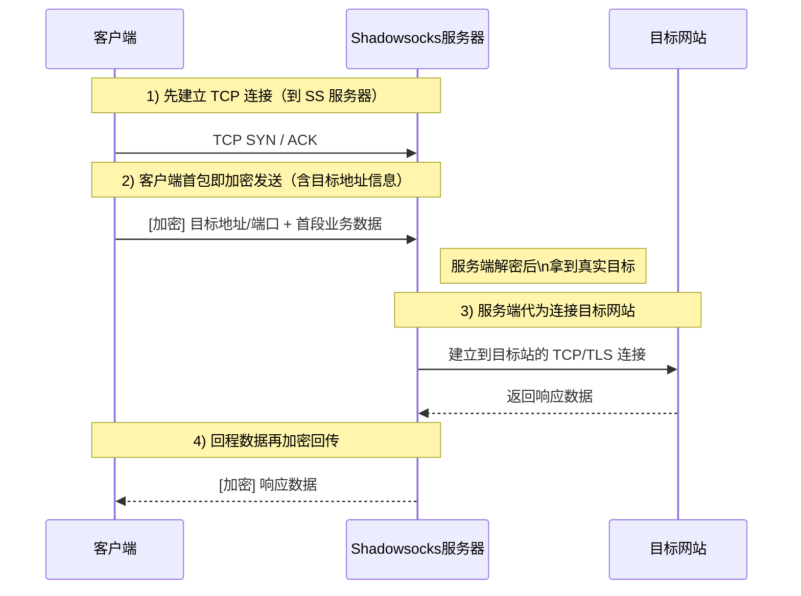

看起来很安全对吧

可这一步把另一个问题放大了：

***黑***

什么黑,五彩斑斓的黑吗

在普通互联网里,大量正常协议哪怕已经加密,开头仍旧会留下很多“像正常业务”的痕迹

- `TLS` 会有自己的握手结构
- `HTTP` 会留下可打印字符
- 一部分 App 会有稳定的长度模式

而 fully encrypted first packet 往往更像“一坨高熵东西”,这反而能进候选集

:::note
Shannon entropy（香农熵）可用于衡量首包字节分布的“随机性”

设首包字节序列为 $X$,长度为 $N$,字节取值范围为 $0..255$,对每个字节值 $b$,

其出现频率为 $p_b=\frac{count(b)}{N}$,

熵定义为 $H(X)=-\sum_{b=0}^{255}p_b\log_2 p_b$

- 单位：bits/byte
- 取值范围：0 到 8
  - 越接近 8：字节分布越接近随机（高熵）
  - 越接近 0：分布越集中、结构性越强（低熵）

在流量分析里,熵通常与首包长度、方向和时序等特征一起使用,而不是单独作为判定条件
:::

2020 年关于 `Shadowsocks` 的 IMC 论文把这个阶段拆得很细。  
[How China Detects and Blocks Shadowsocks](https://gfw.report/publications/imc20/en/)

研究者观察到：

- 系统会先根据首包长度和熵去圈疑似目标
- 然后再对服务器发多类主动探针
- 探针命中之后,封锁才跟上来

到这里你会发现一件很妙的事：

协议设计者在努力把明文特征压下去

审查系统就在努力把“高熵首包本身”变成特征

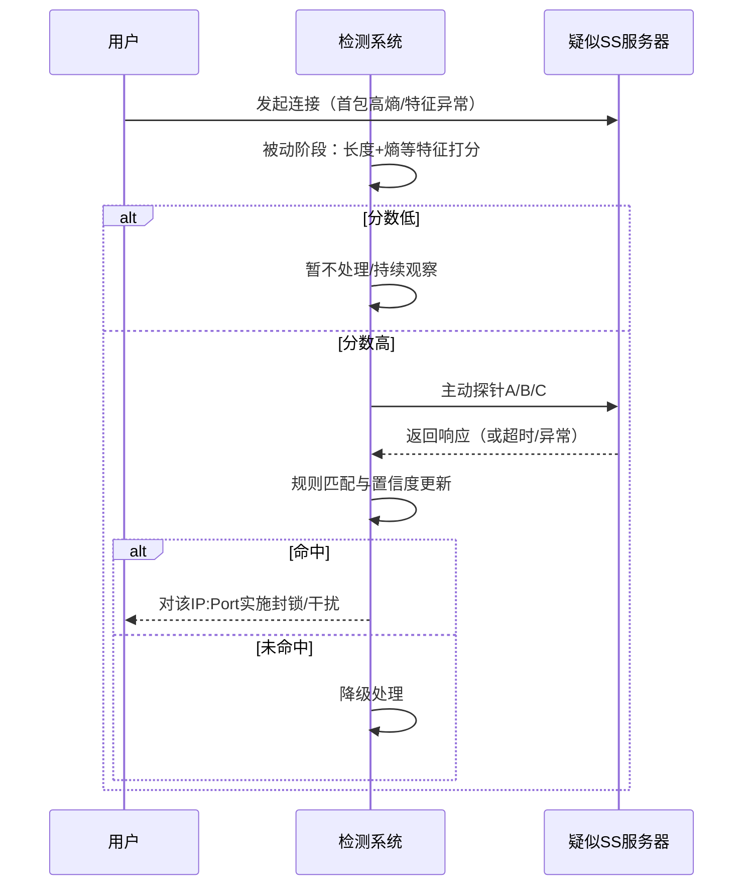

接着时间来到 **2021 年 11 月 6 日**

USENIX Security 2023 那篇论文测到,GFW 开始对多类 fully encrypted traffic 做纯被动实时封锁,影响到 `Shadowsocks`、`VMess`、`Obfs4` 等协议。  
[USENIX Security 2023](https://gfw.report/publications/usenixsecurity23/en)

最有意思的点在于它的思路：**把正常流量尽量放走,把剩下那撮很黑、又不太像常见协议的东西留下**

论文总结出来的几条规则很有味道：

- 前几个字节如果像 `HTTP / TLS`,那就放行
- 可打印字符很多,放行
- 长段连续 printable,放行
- bit 分布很怪,像正常文本或正常协议,放行

剩下那些既黑、又不像常见握手、又不在豁免里的首包,就危险了

这一步非常值得思考

因为它说明了一个现实：全加密没有让问题消失,它只是把视线推到了更靠前的地方

## rererere: QUIC

很多人看到 `QUIC` 会有一个错觉：

基于 `UDP`,握手更新,`HTTP/3`

看起来更现代,也更难摸

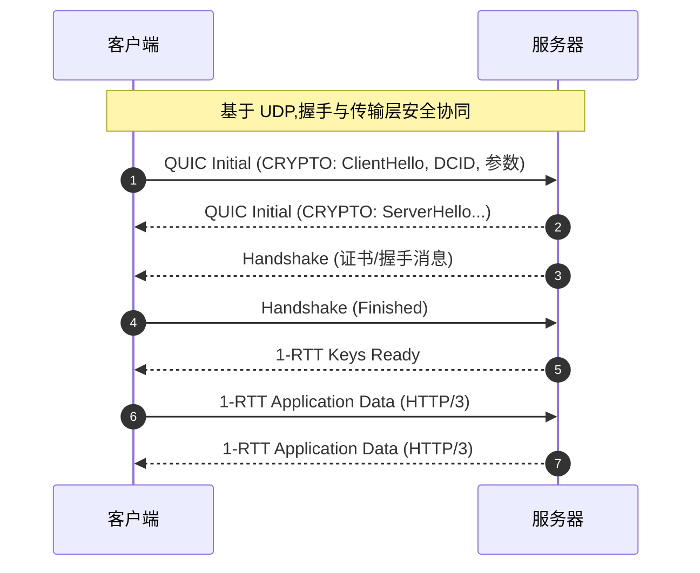

事情没有这么轻松
[China's Great Firewall is now blocking QUIC with the SNI field](https://gfw.report/publications/usenixsecurity25/en/)

研究者观测到,从 **2024 年 4 月 7 日** 开始,GFW 已经能解出 `QUIC Initial` 里封装的 `TLS ClientHello`,再根据里面的 `SNI` 去做封锁

这件事听起来像“QUIC 被拆了”,实际原因写在 `RFC 9001` 里
[RFC 9001](https://datatracker.ietf.org/doc/html/rfc9001)
RFC 9001 定义的是“QUIC 如何使用 TLS 1.3”,按其设计,QUIC Initial 并不提供对路径观察者的强机密性；其密钥材料可由链路上可见参数推导,因此 Initial 中封装的 TLS ClientHello 可被恢复并用于策略匹配,而真正的强保密发生在后续 Handshake/1-RTT 阶段

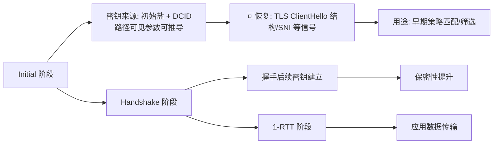

`Initial` 阶段使用的密钥本来就能由路径观察者推导

于是协议一换,审查点也更新：

- 以前盯 `TCP` 首包
- 现在盯 `QUIC Initial`
- 以前看应用层明文
- 现在看加密握手前半段里仍可恢复出来的结构

## rerererere: 产品和人

如果只看学术论文,故事讲到 `Tor -> 混淆 -> fully encrypted -> QUIC` 这里,已经够完整了

`Geedge / MESA leak` 之所以很有冲击力,是因为它把“论文里测出来的现象”往“真实产品栈可能怎么做”推了一大步
[GFW Report 中文分析](https://gfw.report/blog/geedge_and_mesa_leak/zh/)

[InterSecLab 报告](https://interseclab.org/research/the-internet-coup/)

:::warning
理性看待,仅学术分析
:::

### 1. 检测对象开始从“协议”变成“产品”

泄漏分析里提到 `AppSketch` 指纹库,提到买 VPN 账号、养带 VPN App 移动设备、做静态逆向和动态流量分析

我们的审查对象中还有：

- 某款 App 的握手习惯
- 某家服务商的证书与 `JA3 / JA4`
- 某种客户端和服务端组合出来的行为特征

### 2. 确认结果会被沉淀成长期资产

泄漏里出现的 `Maat`、`SAPP`、`Stellar` 这些组件,看起来都更像平台层

也就是说,命中过的样本、写下来的规则、同步出去的指纹,并不会随着一次封锁结束就散掉

它们会留下来

然后下一次处理得更快

### 3. 认人

GFW Report 对泄漏材料的分析里有个点非常扎眼：

某些系统已经能把流量往用户身份上归因,甚至把某个体标成“已知 VPN 用户”

何意味
意味何

意味着链条方向开始反过来了

早一点的时候,大家更熟悉的是：

> 先发现服务器,再去看谁连它

现在逐渐能想象的是：

> 先盯住高风险用户,再沿着他的后续连接去捞新的服务器、新的服务商、新的产品

于是后面的研究也开始往图分析、关系建模、行为聚类上走
[Identifying VPN Servers through Graph-Represented Behaviors](https://openreview.net/forum?id=tnljBcXhmz)

## so why

写到这边,答案其实已经很明显了

代理流量会被检测出来
更接近下面这件事：

**代理为了真的可用,必须在网络上留下很多稳定结构。**

比如：

- 它得存在于某个端点上
- 它得握手
- 它得兼容客户端
- 它得对错误输入有反应
- 它得维持某种稳定时序
- 它得被用户持续使用
- 它得在一段时间里反复出现

要服务,就得稳定

一稳定,指纹就有了

于是整个演进过程读下来,会有一种很强的感觉：**payload 越往后缩,审查点就越往前挪**

从端点,到握手,到首包,到 `Initial`,再到产品画像和用户画像,线路一直在变,枪口也一直在变

## ending

说到最后,我们只是以学习态度进行分析

当然s3不能保证所有内容覆盖到

谢谢喵,谢谢喵
