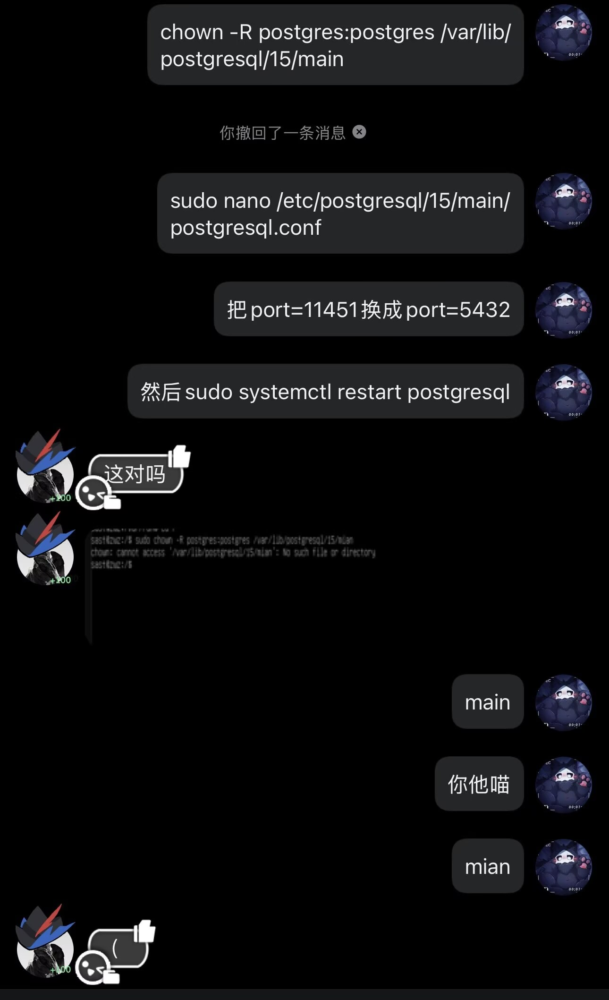

## 序

大家出题都幸苦了zwz，当然做题的也不容易

因为时间比较少，WoC的pdf版本和仓库稍微有一点不同，不过这不会太影响结果

如果出现表述不一致的情况给大家磕一个


## Task 1

```txt
在GNU/linux或服务器上使⽤docker-compose在本地搭建Gitea
验证标准: 在宿主机能够通过 ssh -p <port> git@localhost -T 验证连接，或成功执⾏ git clone
ssh: /git@localhost:<port>/ .
```

如果一开始想到搜索Gitea，也许你就可以直接把这题秒了
[使用 Docker 安装 \| Gitea Documentation](https://docs.gitea.com/zh-cn/installation/install-with-docker)

docker-compose想怎么装怎么装

## Task 2 & 4 & 6

Task2 和 6 是 fermata学长出的，Task5 是 2εr00иe 出的

因为一开始出题的时候沟通不到位出了两道内核题目，所以出现了这样看起来有点缝合怪的感觉，给大家磕一个

### Task 2

```txt
完成[SAST Rust 内核模块](https://github.com/f3rmata/woc2026-hello-from-skm) 的编译和运⾏
[加分项] CI/CD: 配置 GitHub Actions（或 GitLab CI），实现代码 Push 后⾃动构建 Docker
镜像并推送⾄镜像仓库 (Docker Hub / GHCR)
```

编译很好玩吧，依赖没问题跑就是了

然后就是CI/CD，能跑就行（

### Task 4

```txt
0001在Task2的内核放置了⼀个dev1ce作为⼩礼物
并留下了⼀个暗号 : 0x1337
你能在dmesg⾥找到她留下的秘密吗?
请使⽤insmod /lib/modules/magic.ko
```

你们太会梭了
源码等我有时间再放出来

### Task 6

```txt
此题是Task 2的附加题

在GitHub - f3rmata/woc2026-hello-from-skm 中使用DebugFS添加一个数据统计功能,并为仓库提交pr来进行验收
```

其实我也没做UwU
不过ai很好用吧，给人一种自己什么都能会的虚假感悟

## Task 3

```txt
s3在臭臭的地⽅找到了⼀个⾹⾹的PostgreSQL
据说⾥⾯藏了宝藏？但是好像跑不起来
附件: linux-WoC.ova
name:sast
password:123456
```

还记不记得这个组有个名字是运维组（
那为什么没人试图把psql修好进去（（

不过能做出来都没关系，非预期总是ctf最悲哀的部分，但也是最有趣的地方


```bash
$ sudo nano /etc/sudoers.d/sast
sast ALL=(ALL) NOPASSWD: ALL, !/usr/bin/su, !/usr/bin/bash

$ sudo apt install postgresql -y

$ su - postgres

$ psql
```

```sql
postgre=# CREATE DATABASE owo_db;
postgre=# \c owo_db

CREATE TABLE flag1 (
    flag TEXT
);

postgre=# INSERT INTO flag1 VALUES ('flag{W0w_');
postgre=# CREATE USER sast WITH PASSWORD '123456';
postgre=# GRANT CONNECT ON DATABASE owo_db TO sast;
postgre=# GRANT USAGE ON SCHEMA public TO sast;
postgre=# GRANT SELECT ON flag1 TO sast;

```

```sql
CREATE TABLE flag2 (flag text);
ALTER TABLE flag2 SET (autovacuum_enabled = false);
ALTER TABLE flag2 SET (toast.autovacuum_enabled = false);

INSERT INTO flag2 VALUES ('w3lcOme_2_SAST!}');
DELETE FROM flag2;
INSERT INTO flag2 VALUES ('Oh...The flag was deleted by admin..BUT WAIT?Autovacuum was disabled?');


```

```bash
$ nano /etc/postgresql/15/main/postgresql.conf

# port = 5432
port = 11451
```

```bash
$ exit 
$ systemctl stop postgresql

$ chown -R 1145:1145 /var/lib/postgresql/15/main
$ chmod 700 /var/lib/postgresql/15/main

```

来看看出题思路吧

灵感来源于数据迁移，如果从一个服务器的postgresql直接搬到另外一个服务器上的话，两个用户名都是postgres，但实际对应的id并不一样，会出现登陆不上的情况，这就是这个1145用户的来源

Autovacuum was disabled

所以Delete 之后不会被自动删除，会滞留在硬盘内部，也就是你们梭的底子）



solution

```bash
chown -R postgres:postgres /var/lib/postgresql/15/main

sudo nano /etc/postgresql/15/main/postgresql.conf

# 把port=11451换成port=5432

sudo systemctl restart postgresql
```

然后psql就修好了
```bash
sudo -u postgres 
```
进去

```bash
# \c owo_db
# SELECT * FROM flag1
```
`SELECT * FROM flag` 2的时候发现那句话，搜索一下可以发现有办法解决

`SELECT pg_relation_filepath('flag2');` 会告诉你我们要去哪里找

/var/lib/postgresql/15/main/base/16388

在末尾能找到

把两段flag拼接获得结果 
`flag{W0w_w3lcOme_2_SAST!}`

## Task 5

```txt
s3 精神状态堪忧，梦游时总想执⾏ sudo rm -rf /workshop/PPProject *。作为运维组的正义使者，
你需要利⽤ eBPF 技术，在内核层拦截该操作
推荐使⽤:
Rust Aya
Go cilium/ebpf
附加题的附加题：
那如果s3把⽂件夹先mv⾛再去删除呢？
如何通过 eBPF 监控并阻⽌针对该⽬录的 rename 操作
也许代码层⾯实现会⽐较困难，可以在验收的时候聊聊
```

靠你们自己研究了，我只负责出题xwx

用C其实是最合理的吧，不过想怎么实现都行啊